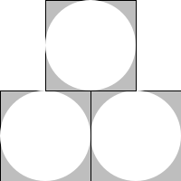

# {{ page.title }}

_Decompose a computational problem into smaller sub-problems amendable to implementation with functions._

Consider the following image that contains three "squared circles".

Each white circle is in a 100x100 grey box with a black outline.  There
are two grey boxes in the bottom row and one in the top row, centered above
the other two.

Make sure to use decomposition to break down this image into meaningful sub-images.  Your code should reflect the structure of this image.

_Hint_: to achieve the outline effect, overlay two squares, one with `'outline` and the other with `'solid`.

Make sure to check the results in DrRacket!

