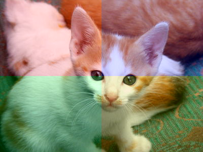
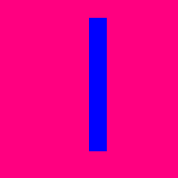
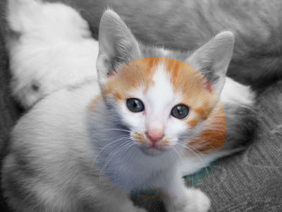

_Warning! The `csc151` library has been updated for this mini-project. Make sure that you have the latest version._

_Warning! This mini-project was newly created in Spring 2025. There will likely be infelicities. (Please let Sam know if there are confusing parts or if any part seems to be taking a long time.)_

You will create only one file for this mini-project, [`conditional-transformations.rkt`](../code/mps/conditional-transformations.rkt). You should begin your project with [this starter code](../code/mps/conditional-transformations.rkt).

You will submit that file along with some image from part four.

Background
----------

As you may recall from the last mini-project, we can create basic image transformations (image filters, in the parlance of most image-editing programs) by applying a color transformation at each pixel. We do that with `(pixel-map color-transformation image)`.

In that project, we focused on mathematical approaches to transforming pixels. However, we can also take advantage of conditionals for transformations. Here's one approach, taken from a recent lab.

```racket
;;; (rgb->4gray c) -> rgb?
;;;   c : rgb?
;;; Convert c to black, white, or a gray.
;;; * Returns `gray0` if the brightness of `c` is less than 25;
;;; * Returns `gray1` if the brightness of `c` is at least 25 but less than 50;
;;; * Returns `gray2` if the brightness of `c` is at least 50 but less than 75;
;;; * Returns `gray3` if the brightness of `c` is at least 75.
(define rgb->4gray
  (lambda (c)
    (brightness->4gray (rgb-brightness c))))

;;; (brightness->4gray b) -> rgb?
;;;   b : real? (between 0 and 100)
;;; Convert b to black, white, or a gray.
;;; * Returns `gray0` if `b` is less than 25;
;;; * Returns `gray1` if `b` is at least 25 but less than 50;
;;; * Returns `gray2` if `b` is at least 50 but less than 75;
;;; * Returns `gray3` if `b` is at least 75.
(define brightness->4gray
  (lambda (b)
    (cond
      [(< b 25)
       gray0]
      [(< b 50)
       gray1]
      [(< b 75)
       gray2]
      [else
       gray3])))
```

Here's what we get when we use `rgb->4gray` with `pixel-map` and our standard kitten image.


In part one of this assignment, you'll consider other conditional color transformations and their use in building image filters.

But what if we want to consider more than just the individual pixels. What if we care about what part of the image we're working with?

The `image-compute` procedure focuses only on positions of pixels, and provides an alternate mechanism for building images. Here's the documentation for that procedure.

```racket
;;; (image-compute pos2color width height description) -> image?
;;;   pos2color : procedure?
;;;   width : exact-positive-integer?
;;;   height : exact-positive-integer?
;;;   description : string?
;;; Creates a new `width`-by-`height` bitmap by applying `pos2color` to
;;; each (col,row) coordinate to determine the color at that position.
```

What should `pos2color` look like? It's a procedure that takes two integers (in the range 0 to `(- width 1)` and 0 to `(- height 1)`, respectively) and generates an RGB color from that pair of numbers. Here's one such procedure.

```racket
;;; (sample-pos2color-01 x y) -> rgb?
;;;   x : exact-nonnegative-integer?
;;;   y : exact-nonnegative-integer?
;;; Compute a color based on x and y.
(define sample-pos2color-01
  (lambda (x y)
    (cond
      [(< x 50)
       (rgb 0 0 255)]
      [(< y 25)
       (rgb 0 0 255)]
      [(>= x 100)
       (rgb 0 0 255)]
      [(>= y 75)
       (rgb 0 0 255)]
      [else
       (rgb 255 0 0)])))
```

Here's a sample call to `image-compute` with that procedure.

```racket
> (image-compute sample-pos2color-01 200 200 "some image")
```

Can you predict what image that will create? Give it a try and see.

Now, let's try a slightly different version of that procedure.

```racket
;;; (sample-pos2color-02 col row) -> rgb?
;;;   col : exact-nonnegative-integer?
;;;   row : exact-nonnegative-integer?
;;; Compute a color based on x and y.
(define sample-pos2color-02
  (lambda (col row)
    (cond
      [(< x 50)
       (rgb 0 0 y)]
      [(< y 25)
       (rgb 0 0 y)]
      [(>= x 125)
       (rgb 0 0 y)]
      [(>= y 100)
       (rgb 0 0 y)]
      [else
       (rgb 255 0 0)])))
```

Can you predict the image you'll get from the following?

```
> (image-compute sample-pos2color-02 256 256 "some image")
```

Try it and see.

Let's try one very different one.

```racket
;;; (sample-pos2color-03 x y) -> rgb?
;;;   x : exact-nonnegative-integer?
;;;   y : exact-nonnegative-integer?
;;; Compute a color based on x and y.
(define sample-pos2color-03
  (lambda (x y)
    (if (< (+ (sqr (- x 100)) (sqr (- y 75))) (sqr 50))
        (rgb (* x 2) (* x 2) 0)
        (rgb 0 0 (- 255 y)))))
```

You can probably guess that we're going to ask you to predict and try one more image.

```drracket
> (image-compute sample-pos2color-03 256 256 "some image")
```

Note that we could also have written this last one as something like the following. That could be helpful if we wanted to write a procedure to make similar images, but vary the values we use (instead of 100, 75, 50, and such).

```racket
(image-compute (lambda (x y)
                 (if (< (+ (sqr (- x 100)) (sqr (- y 75))) (sqr 50))
                     (rgb (* x 2) (* x 2) 0)
                     (rgb 0 0 (- 255 y))))
               256 256
               "some image")
```

Where are we? We know how to transform images by conditionally changing colors . We know how to make somewhat interesting images by considering the position of each pixel. Let's put the two ideas together and consider some instances in which we conditionally transform each pixel based on its color.

How can we do that? We'll use the `pixel-pos-map` procedure.

```racket
;;; (pixel-pos-map transformation img [description]) -> image?
;;;   transformation : procedure?
;;;   img : img?
;;;   description : string?
;;; Create a new image by applying `transformation` at each position
;;; in the image.
;;;
;;; `transformation` should take the following parameters:
;;;   pixel : rgb? (corresponding to the color of the current pixel)
;;;   col : exact-nonnegative-integer? (corresponding to the column
;;;         of the current pixel)
;;;   row : exact-nonnegative-integer? (corresponding to the row
;;;         of the current pixel)
```

For example,

```racket
;;; (four-parts img) -> image?
;;;   img : image?
;;; Create a new version of image by dividing it into four quadrants
;;; and then making the top-left quadrant redder, the top-right
;;; quadrant greener, the bottom-left quadrant bluer, and the bottom-right
;;; quadrant yellower.
(define four-parts
  (lambda (img)
    (pixel-pos-map (lambda (pixel col row)
                     (if (< col (* 1/2 (image-width img)))
                         (if (< row (* 1/2 (image-height img)))
                             (rgb-redder pixel)
                             (rgb-greener pixel))
                         (if (< row (* 1/2 (image-height img)))
                             (rgb-bluer pixel)
                             (rgb-redder (rgb-greener pixel)))))
                   img)))
```

Here's what we get when we apply `four-parts` to our kitten.



Part one: Conditional transformations
-------------------------------------

### Four-color images

a. Document and write a procedure, `(closest-color color option1 option2 option3 option4)`, that figures out which of the four options `color` is closest to. You can use `(rgb-distance color1 color2)` to figure out the distance between two colors.

```drracket
> (rgb->string (closest-color (rgb 100 200 0) 
                              (rgb 255 0 0) 
                              (rgb 0 255 0) 
                              (rgb 0 0 255) 
                              (rgb 128 128 128)))
"0/255/0"
> (rgb-distance (rgb 100 200 0) (rgb 255 0 0))
64025
> (rgb-distance (rgb 100 200 0) (rgb 0 255 0))
13025
> (rgb-distance (rgb 100 200 0) (rgb 0 0 255))
115025
> (rgb-distance (rgb 100 200 0) (rgb 128 128 128))
22352
```

b. Document and write a procedure, `(four-color img option1 option2 option3 option4)`, that takes each pixel in `img` and converts it to the closest of the four options, using `closest-color`.

```drracket
> (four-color kitten (rgb 255 0 0) (rgb 0 255 0) (rgb 0 0 255) (rgb 255 255 255))

> (four-color kitten (rgb 128 128 0) (rgb 0 128 128) (rgb 128 0 128) (rgb 192 192 192))

```

### Enhancing colors

c. As you may recall, we did some fancy math in the prior mini-project in order to enhance dominant components. Let's try again, this time taking advantage of Document and write a procedure, `(rgb-enhance-dominant color)`, that takes an RGB color as a parameter, determines which of the components is largest, multiplies that component by 1.1, and multiplies the other components by .9. For example,

```drracket
> (rgb->string (rgb-enhance-dominant (rgb 100 90 80)))
"110/81/72"
> (rgb->string (rgb-enhance-dominant (rgb 200 10 200)))
"220/9/220"
> (rgb->string (rgb-enhance-dominant (rgb 100 100 100)))
"110/110/110"
> (rgb->string (rgb-enhance-dominant (rgb 60 50 250)))
"54/45/255"
```

d. Document and write a procedure, `(enhance-dominant img)`, that applies `rgb-enhance-dominant` to each pixel in `img`.

```drracket
> (enhance-dominant kitten)

```

No, I don't know why we get the weird pixelation in palces.

Part two: Position-based images
-------------------------------

### Making rectangles

a. As you saw in the background section, it's fairly straightforward to use `image-compute` to make a rectangular image. Document and write a procedure, `(make-rectangle left top width height image-width image-height color background-color)`, that makes the given rectangle.

```
> (make-rectangle 50 20 75 30 200 200 (rgb 255 0 0) (rgb 128 0 255))

> (make-rectangle 100 20 20 150 200 200 (rgb 0 0 255) (rgb 255 0 128))

> (make-rectangle 50 100 300 300 200 200 (rgb 255 0 255) (rgb 128 0 128))

```

Note that you should generate an appropriate description of the image.

```drracket
> (describe-image (make-rectangle 50 20 75 30 200 200 (rgb 255 0 0) (rgb 128 0 255)))
"a 200-by-200 approximately purple image that contains a 75-by-30 red rectangle"
> (describe-image (make-rectangle 100 20 20 150 200 200 (rgb 0 0 255) (rgb 255 0 128)))
"a 200-by-200 approximately deeppink image that contains a 20-by-150 blue rectangle"
> (describe-image (make-rectangle 50 100 300 300 200 200 (rgb 255 0 255) (rgb 128 0 128)))
"a 200-by-200 approximately darkmagenta image that contains a 300-by-300 fuchsia rectangle"
```

As the last example suggests, you don't need to fix your description if the call provides an inappropriate rectangle width or height.

### Making circles

b. As you saw in the background section, it's only slightly more complicated to use `image-compute` to make a circle. Document and write a procedure, `(make-circle center-x center-y radius image-width image-height color background-color)`, that makes a circle of the specified radius centered at the given position

Although we used color blends in the example above, you should just use solid colors for the circle and the background.

```drracket
> (make-circle 100 100 100 200 200 (rgb 64 64 128) (rgb 64 0 64))

> (make-circle 50 150 100 200 200 (rgb 64 0 64) (rgb 64 64 128))

> (make-circle 250 -50 150 200 200 (rgb 192 0 64) (rgb 64 0 128))

```

Note that you should generate an appropriate description of the image.

```drracket
> (describe-image (make-circle 50 150 100 200 200 (rgb 64 0 64) (rgb 64 64 128)))
"a 200-by-200 approximately dark slate blue image that contains part or all of a radius 100 approximately midnight blue circle centered at (50,150)"
> (describe-image (make-circle 100 100 100 200 200 (rgb 64 64 128) (rgb 64 0 64)))
"a 200-by-200 approximately midnight blue image that contains part or all of a radius 100 approximately dark slate blue circle centered at (100,100)"
> (describe-image (make-circle 250 -50 150 200 200 (rgb 192 0 64) (rgb 64 0 128)))
"a 200-by-200 approximately indigo image that contains part or all of a radius 150 approximately crimson circle centered at (250,-50)"
```

Part three: Position-based color transformations
------------------------------------------------

### Concentric color shifts

a. In our sample position-based color transformation, we broke the image into four quadrants. Of course, there are many other ways to segment an image. Write a procedure, `(concentric-rectangles img)`, that breaks an image into four concentric rectangles (the innermost one is 1/4 the width and height of the original, the next one is 1/2 the width and height, the next is 3/4 the width and height, and the last is the width and height of the original). Set the hue of all the pixels in the center rectangle to 0, the hue of the pixels in the next rectangle to 90, the next to 180, and the outermost to 270.

```drracket
> (conentric-rectangles kitten)

```

b. We can also use color-based transformations to emphasize part of an image. 
Document and write a procedure, `(emphasize-circle img x y radius)`, that leaves the circular region centered at (`x`,`y`) and of radius `radius` "as is" and truns the rest to grayscale.

```drracket
> (emphasize-circle kitten 220 180 100)

> (emphasize-circle kitten 350 250 100)

> (emphasize-circle kitten 0 0 250)

```

Part four: Freestyle
---------------------

a. Document and write a procedure that uses `pixel-pos-map` to do something "interesting" to an image, ideally using conditionals based on both the position and the color.

b. Pick an existing image (preferably one that has a license that permits you to use it) and create three variants of the image using your procedure. Include the instructions for loading the image and making the variants _in a comment_.

What to submit
--------------

Submit `conditional-transformations.rkt`, the original `image`, and your three variants on Gradescope.

Please do not include a call to `image-load` in your `.rkt` file. Any instructions to load a file should be in a comment.

Grading rubric
--------------

_Since this MP is new, the rubric may get updated._

### Redo or above

Submissions that lack any of these characteristics will get an I.

```
[ ] Passes all of the **R** autograder tests.
[ ] Includes the specified file, `conditional-transformations.rkt`.
[ ] Includes an appropriate header on the file that indicates the
    course, author, etc.
[ ] Acknowledges appropriately.
[ ] Code runs in DrRacket.
[ ] The question marks in the documentation have been filled in.
```

### Meets expectations or above

Submissions that lack any of these characteristics but have all of the
prior characteristics will get an R.

```
[ ] Passes all of the **M** autograder tests.
[ ] Code is well-formatted with appropriate names and indentation.
[ ] Code has been reformatted with Ctrl-I before submitting.
[ ] Code generally follows style guidelines, including limiting the
    length of lines to about 80 characters.
[ ] Documentation for all core procedures is correct / has the correct form.
[ ] The freestyle procedure uses `pixel-pos-map` (as directed).
[ ] Includes all the images.
```

### Exemplary / Exceeds expectations

Submissions that lack any of these characteristics but have all of the
prior characteristics will get an M.

```
[ ] Passes all of the **E** autograder tests.
[ ] Style is impeccable (or nearly so).
[ ] No `define` expressions within procedures.
[ ] No `let` expressions (which we haven't covered yet).
[ ] All helper procedures are documented.
[ ] Avoids repeated work.
[ ] The freestyle procedure has at least one conditional that depends 
    on the position of the pixel.
[ ] The freestyle procedure has at least one conditional that depends
    on the color of the pixel.
```

Q&A
---

### General

Do you have hints on reducing repetition?

> You could use the same technique we used in `rgb-grayscale` and `rgb-4gray`. In those cases, we computed a value once and then passed it to a helper procedure that used the computed value. (This approach works in most cases.)

How do I know when I can't decompose a conditional statement (or any statement in general) further?

> We won't generally decompose conditionals all that much (except to reduce repetitions).

> If you have no repetition and there aren't naturally subparts that you might reuse elsewhere, you've probably decomposed enough.

Will we have to use polar-coordinates in any of these parts?

> No. Or at least I hope not. I didn't use them in any of the solutions.

How can we avoid using `define` within the body of procedures?

> Write a helper procedure that makes the thing you're defining a parameter. See `rgb-grayscale` and `rgb-4gray` (and the code example at the end of the Q&A) as examples.

How would be a good way to practice conditionals before doing this assignment? Just to become comfortable?

> Finish the conditionals lab. The assignment is also intended to give you practice.

Could you to give us tips on what to do if you get stuck for a long period of time?

> After five minutes of being stuck, reach out on Teams (and, possibly, move on to another problem). Also: Work in our classroom while evening tutors are there so that you can ask help.

### Part one

In 1a, if the target color is equidistant to 2+ of the 4 colors, then what should we return?

> If two or more of the target colors are equidistant (and the smallest distance), you can return any of them.

Do you have other hints on reducing repetition in problem 1?

> You might try the general hint on reducing repetition. You also might break down the problem of computing the closest of four to computing the closest of two. (There are probably other approaches; these are two that worked for me.)

`closest-color` expects five parameters. `pixel-map` expects a procedure that takes only one color as a parameter. How can I deal with that issue?

> `cut` is your friend. If `cut` remains confusing, `lambda` is also your friend.

> For example, if we had a procedure, `rgb-average`, that averages two colors, and we wanted to extend it to a procedure that averages a color with every color in the image, we could write either of the following .

```racket
(define average-with-color
  (lambda (img color)
    (pixel-map (cut (rgb-average <> color)) img)))

(define average-with-color
  (lambda (img color)
    (pixel-map (lambda (c) (rgb-average c color))
               img)))
```

### Part two

In the MP4 part two a, I got confused about what each parameter represents. In the procedure `(make-rectangle left top width height image-width image-height color background-color)`, what do `left`, `top`, `width`, `height`, `image-height`, and `image-width` indicate in a rectangle that we are supposed to make?

> `left` is the x coordinate of the left edge of the rectangle, `top` is the y coordinate of the top edge, `width` is the width of the rectangle, `height` is the height of the rectangle, `image-width` (`iwidth` in the documentation) is the width of the image that contains the rectangle, and `image-height` (`iheight` in the documentation) is the height of that image.

And what is `bg`?

> The background color.

### Part three

### Part four

I struggle to write the freestyles. Any suggestions?

> I often start by considering variations of what we've done already. I also look for inspiration from artists like Andy Warhol and Shepard Fairey who base some of their work on image transformations.

What are you expecting when you say any instructions to load a file should be in a comment.  Where should the comment go?

> Many of the MP3 submissions had something like `(image-load "kitten.jpg")` or `(image-load "/Users/student/Desktop/kitten.jpg")`, which prevented the autograder from running. I just want you to include the instructions at the end so we can see what you did.

Do we need to include instructions for finding the image we used?

> You don't need instructions for looking up the image online, but you should cite it.

Did you (Sam) write any transformations for this part?

> I didn't have a lot of time, so I wrote something that computes the hue based on the position. (That won't earn me an E, but it was fun to write.)

```drracket
> (rainbow2 kitten)

```

It also makes fun images when applied to solid-color rectangles.

```drracket
> (rainbow2 (solid-rectangle 400 300 "red"))

```

> And yes, I also find that my time gets sucked away doing fun things with what we're learning.

How did you do that?

```racket
;;; (rainbow img) -> image?
;;;   img : image?
;;; Create a concentric rainbow-like color scheme on img.
;;;
;;; This would suffice for an M but not an E.
(define rainbow2
  (lambda (img)
    (rainbow2-helper img
                     (* 1/2 (image-width img))
                     (* 1/2 (image-height img)))))

;;; (rainbow2-helper img half-width half-height)
;;;   img : image?
;;;   half-width : exact-positive-integer? (half the width of img)
;;;   half-height : exact-positive-integer? (half the height of img)
;;; Create a concentric rainbow-like color scheme on `img`, a
;;; 2*`half-width`-by-2*`half-height` image.
(define rainbow2-helper
  (lambda (img half-width half-height)
    (rainbow2-helper-helper img
                            half-width half-height
                            (+ (sqr half-width) (sqr half-height)))))

;;; (rainbow2-helper-helper img half-width half-height max-distance)
;;;   img : image?
;;;   half-width : exact-positive-integer? (half the width of img)
;;;   half-height : exact-positive-integer? (half the height of img)
;;;   max-distance : exact positive-integer?
;;; Create a concentric rainbow-like color scheme on `img`, a
;;; 2*`half-width`-by-2*`half-height` image. `max-distance` is the
;;; largest 
(define rainbow2-helper-helper
  (lambda (img half-width half-height max-distance)
    (pixel-pos-map (lambda (color col row)
                     (rgb-set-hue color
                                  (* 360
                                     (/ (+ (sqr (- col half-width))
                                           (sqr (- row half-height)))
                                        max-distance))))
                   img)))
```

> I've included it primarily so that you can see how I avoid repeating code, such as the computation of the image width or height or the divisor I use when computing what color to use.

Shouldn't you have used a square root somewhere?

> Probably. I'm lazy. As I said, I was trying to make this quick.
