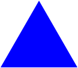
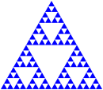
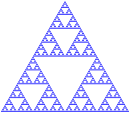
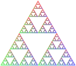
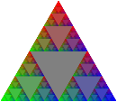
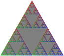
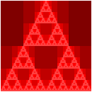

**Summary**: {{ page.summary }}

**Starter code**: [`fractals.rkt`](../code/mps/fractals.rkt).

Please save your code for this assignment as [`fractals.rkt`](../code/mps/fractals.rkt).  

In addition to submitting `fractals.rkt`, submit at least one image from your procedure in part 4, named `my-image.png`.

## Background: Building Sierpinski triangles 

Informally, _fractals_ are images that appear similar at different scales.  Although this mini-project will primarily emphasize fractals made from simple shapes, there are also fractals that are much less regular.  For example, the coastline of almost any country is considered a fractal because coastlines are similarly "jagged" at any scale.

We will explain the self-similarity of regular shapes using one of the most straightforward regular fractals, the _Sierpinski Triangle_.  Here's how you might think of those triangles.

We'll start with a blue, equilateral, triangle with side-length 128.

`(define triangle-128 (solid-equilateral-triangle 128 "blue"))`



Let's build another triangle with half that side length.  If you recall your geometry, this triangle will have 1/4 the area of the original triangle.

`(define triangle-64 (solid-equilateral-triangle 64 "blue"))`


We can get a similar triangle to the original one (but with a "hole" in the middle) by appropriately combining three of those triangles, two side by side and then one over them.

`(above triangle-64 (beside triangle-64 triangle-64))`


Of course, we could use a similar process to build each of those three blue triangles.


And each of those.


And each of those.



And so on.


And so forth.



If we do this process sufficiently many times (perhaps "arbitrarily many times"), we end up with a structure called the "Sierpinski Triangle".  Sierpinski triangles have many surprising mathematical properties, none of which are relevant to us at this time.  Instead, we will use Sierpinski triangles to make aesthically appealing images (or at least aesthetically appealing to them).

We will start by defining the intermediate results recursively.  Here's one way.  We'll call a triangle that's been broken up `n` times a "level `n` fractal triangle".

* A level-0 fractal equilateral triangle with edge-length `len` is just an equilateral triangle of edge-length `len`.
* A level-n fractal equilateral triangle with edge-length `len` is built from three level-(n-1) fractal equilateral triangles, each with edge-length `len`/2.  For example, a level-5 fractal equilateral triangle with side-length 128 is built from three level-4 equilateral triangles, each with side length 64.

You can turn that into a recursive procedure, can't you?  Don't worry; you'll have a chance to do so in the exercises below.

Once we can build fractal triangles, we can start varying them.  For example, rather than making each sub-triangle the same color, we might make one lighter and another darker.  If we use the "standard" technique of adding 32 to each component to make colors "lighter" and subtracting 32 to make them "darker", we might end up with something like the following for a level-4 gray triangle.


Here's another one that we've built by making the top triangle redder, the bottom-left triangle greener, and the bottom-right triangle bluer.  (I think this has six levels of recursion.)



And one where we've turned each middle triangle into the base color.  (We've done that by overlaying the recursive result on a larger triangle.)



It looks a bit different if we just overlay the first one on gray.



Just to continue exploring variations, let's rotate the result of each recursive call in the base version by 15 degrees clockwise. 


When we do enough recursion, it may not matter all that much whether or not the base case is a triangle.  (Is that surprising or intuitive?)  For example, here are a set of shapes using the `(above shape (beside shape shape))` formula with a square as the base case.


Somewhere along the way, I think we said that these techniques might help us make compelling (or repelling?) images.  Here's an experiment with using that last approach with seven shades of red and then overlaying them.



## Part one: Fractal triangles

a. Write a procedure, `fractal-triangle`, that makes the basic fractal triangle described above.

```
;;; (fractal-triangle side color n) -> image?
;;;   side : positive-real?
;;;   color : rgb?
;;;   n : non-negative integer
;;; Make a fractal triangle of the given side length using `color` as 
;;; the primary color.
```

**Warning**: Because shapes generally can't have fractional width or height, you may find that `fractal-triangle` produces triangles that are slightly bigger than expected. Such a result is acceptable. You'll notice all of our tests use a size that's a power of two to address such issues.

b. Write a procedure, `rgb-fractal-triangle`, that makes a fractal triangle in which the top triangle is "redder" than the basic color, the lower-left triangle is "greener" than the basic color, and the lower-right triangle is "bluer" than the basic color.

```
;;; (rgb-fractal-triangle side color n) -> image?
;;;   side : positive-real?
;;;   color : rgb?
;;;   n : non-negative integer
;;; Make a fractal equilateral triangle of the given side length using
;;; `color` as the primary color.  In the recursive steps, the base
;;; color of the top triangle is `(rgb-redder color)`, the base color
;;; of the lower-left triangle is `(rgb-greener color)`, and the base
;;; color of the lower-right triangle is `(rgb-bluer color)`.  
```

c. As you saw in our examples, once we start changing colors, it can be nice 
to "fill in" the center triangle with the original color.  You will find it easiest to do so by overlaying the fractal triangle on a same-size triangle in the original color.

Write a procedure, `(new-rgb-fractal-triangle side color n)`, that does just that.

```
;;; (new-rgb-fractal-triangle side color n) -> image?
;;;   side : positive-real?
;;;   color : rgb?
;;;   n : non-negative integer
;;; Make a fractal equilateral triangle of the given side length using
;;; `color` as the primary color.  In the recursive steps, the base
;;; color of the top triangle is `(rgb-redder color)`, the base color
;;; of the lower-left triangle is `(rgb-greener color)`, and the base
;;; color of the lower-right triangle is `(rgb-bluer color)`.  The base
;;; color of the central triangle should be `color`.  
```

d. Write a procedure, `(fractal-right-triangle height width color n)`, that builds a right triangle using the fractal approach.  

```
;;; (fractal-right-triangle height width color n) -> image?
;;;   height : positive-real?
;;;   width : positive-real?
;;;   color : color?
;;;   n : non-negative integer
;;; Make a fractal right triangle using `color` as the primary color.
```

## Part two: Fractal squares (carpets)

Just as we can think of triangles as being made up of four sub-triangles, and we can use that idea to make fractal triangles, we can break squares up into sub-squares and use those to make fractal squares.  The most common approach is to make a three-by-three grid of squares, building all but the center square recursively.  How do we combine them?  We can make each row with `beside` and then stack the three rows with `above`.  What about the middle square, which we normally leave "blank"?  I find it easiest to specify a color to use for the center.  Here are the first few stages.


No, the limit of this is not a "Sierpinski square".  However, it is normally referred to as a Sierpinski carpet".

**a. Write a procedure, `(carpet-a size color-x color-y n)` that makes an image like those above.**

```
;;; (carpet-a size color-x color-y n) -> image?
;;;   size : positive real?
;;;   color-x : color?
;;;   color-y : color?
;;;   n : non-negative integere
;;; Create a `size`-by-`size` image of the standard fractal carpet with
;;; `n` levels of recursion, using `color-x` as the "primary" color and
;;; `color-y` as the center color.  
```

b. Of course, there's no reason we have to recurse on those particular eight squares.  We could, for example, use only six.  Here's one such pattern.


_Here and elsewhere, we are seeing some strange artifacts from how DrRacket deals with sequares that have non-integer edge lengths._

**Write a procedure, `(carpet-b size color-x color-y n)`, that makes images like this latest set.**

```
;;; (carpet-b size color-x color-y n) -> image?
;;;   size : positive real?
;;;   color-x : color?
;;;   color-y : color?
;;;   n : non-negative integer.
;;; Create a `size`-by-`size` image of a fractal carpet with `n` levels
;;; of recursion, using `color-x` as the "primary" color and `color-y`
;;; as the "secondary" color.  Our pattern looks something like this.
;;; 
;;;     X y X
;;;     y y X
;;;     X X X
;;; 
;;; where `X` means "recurse" and `y` means "square with `color-y`.
```

c. Those big squares really stand out, don't they?  But we can handle that.  Instead
of just making a rectangle of `color-y`, we can recurse in those squares, too, flipping
the primary and secondary colors.  Here are the first few versions with that model, using the same pattern as in `carpet-b`.


**Write a procedure, `(carpet-c size color-x color-y n)`, that makes images like the latest set.**

```
;;; (carpet-c size color-x color-y n) -> image?
;;;   size : positive real?
;;;   color-x : color?
;;;   color-y : color?
;;;   n : non-negative integer.
;;; Create a `size`-by-`size` image of a fractal carpet with `n` levels
;;; of recursion, using `color-x` as the "primary" color and `color-y`
;;; as the "secondary" color.  Our pattern looks something like this.
;;; 
;;;     X Y X
;;;     Y Y X
;;;     X X X
;;; 
;;; where `X` means "recurse keeping colors as they are" and `Y` means
;;; "recurse swapping the two colors".
```

d. Just as we can recurse on the secondary squares, we can choose not to recurse on some of the primary color squares.  Here's an example with a somewhat different pattern.  You can see if you can determine the pattern by inspection, or you can read the documentation.


**Write a procedure, `(carpet-d size color-x color-y n)`, that makes images like the latest set.**

```
;;; (carpet-d size color-x color-y n) -> image?
;;;   size : positive real?
;;;   color-x : color?
;;;   color-y : color?
;;;   n : non-negative integer.
;;; Create a `size`-by-`size` image of a fractal carpet with `n` levels
;;; of recursion, using `color-x` as the "primary" color and `color-y`
;;; as the "secondary" color.  Our pattern looks something like this.
;;; 
;;;     X y X
;;;     x Y x
;;;     X y X
;;; 
;;; where `X` means "recurse keeping colors as they are", `Y` means
;;; "recurse swapping the two colors", `x` means "square in `color-x`"
;;; and `y` means "square in `color-y`".
```

e. At this point, you may feel like you want to experiment with different patterns of carpet recursion.  And you could do so by making slight changes to `carpet-d`.  However, it's much better to extend our procedure to take the pattern of recursion as a parameter.  For eample, the "pattern" for `carpet-d` is `"XyXxYxXyX"`.  


**Write a procedure, `(carpet pattern size color-x color-y n)`, that generalizes carpet generation using patterns.**

_This procedure is only required for an E._

```
;;; (carpet pattern size color-x color-y n) -> image?
;;;   pattern ; string? (length 9, composed only of x, X, y, and Y)
;;;   size : positive real?
;;;   color-x : color?
;;;   color-y : color?
;;;   n : non-negative integer.
;;; Create a `size`-by-`size` image of a fractal carpet with `n` levels
;;; of recursion, using `color-x` as the "primary" color and `color-y`
;;; as the "secondary" color.  
;;; 
;;; The pattern is given by the letters in pattern, where `X` means
;;; "recurse" keeping colors as they are", `Y` means "recurse swapping
;;; the two colors", `x` means "square in `color-x`" and `y` means
;;; "square in `color-y`".  
;;; 
;;; The positions of the letters correspond to the parts of the pattern
;;; 
;;;      0 1 2
;;;      3 4 5
;;;      6 7 8
```

## Part three: Spiraling shapes

Let's move on to some fun with rotation.  These images are not quite fractals, but they give you some more experience with numeric recursion.

a. **Write a procedure, `(spiral-squares-a side color angle n)`, that uses the following approach to create a "spiral" of `n`+1 squares.**

* If `n` is zero, make a square of the appropriate side length and color, outlined in black.
* If `n` is greater than 0, make a spiral square with n squares, rotate it by `angle` degrees, and then overlay it on a square of the appropriate side length and color, outlined in black.

Here's a sequence of the first few spirals, using a base color of green and an angle of -15 degrees.


```
;;; (spiral-squares-a side color angle n) -> image?
;;;   side : positive-real?
;;;   color : color?
;;;   angle : real?
;;;   n : non-negative integer
;;; Create an image of `n`+1 outlined squares of the given side-length and
;;; color.  The bottom square is in the normal orientation.  The one on 
;;; top of that is rotated by `angle` degrees.  The one on top of that is
;;; rotated by an additional `angle` degrees.  And so on and so forth.
```

You can use `thinly-outlined-square` to make each outlined square.

```
;;; (thinly-outlined-square size color) -> image?
;;;   size : non-negative-integer?
;;;   color : color?
;;; Create an onlined square.
(define thinly-outlined-square
  (lambda (size color)
    (overlay (outlined-square (- size 2) "black" 1)
             (solid-square size color))))
```

b. Let's do something similar, changing the color a little bit each time.  Let's make it a bit darker, adding 32.


**Write a procedure, `(spiral-squares-b side color angle n)`, that makes a similar spiral square.**

```
;;; (spiral-squares-b side color angle n) -> image?
;;;   side : positive-real?
;;;   color : color?
;;;   angle : real?
;;;   n : non-negative integer
;;; Create an image of `n`+1 outlined squares of the given side-length and
;;; color.  The bottom square is in the normal orientation.  The one on 
;;; top of that is rotated by `angle` degrees and has `darker-32` applied
;;; to the color.  The one on top of that is rotated by an additional `angle` 
;;; degrees and has `darker-32` applied to the color twice.  And so on and 
;;; so forth.
```

You will likely want a copy of `darker-32`.

```
;;; (rgb-transformer transform-component) -> color-function?
;;;    component-transformer : function from integer to integer
;;; Returns a new function that takes a color as input and applies
;;; `component-trasformer` to each, yielding a new color.
(define rgb-transformer
  (lambda (transform-component)
    (lambda (color)
      (rgb (transform-component (color-red color))
           (transform-component (color-green color))
           (transform-component (color-blue color))))))

;;; (darker-32 color) -> color?
;;;   color : color?
;;; Create a darker version of color by attempting to subtract 32
;;; from each component.
(define darker-32 (rgb-transformer (cut (- <> 32))))
```

c. Let's try another version, this time changing not only the color, but also the size, scaling the size by 9/10 each time.


**Write a procedure, `(spiral-squares-c side color angle ratio n)`, that makes a similar spiral square, with each subsequent square shrinking by the specified ratio.**

```
;;; (spiral-squares-c side color angle ratio n) -> image?
;;;   side : positive-real?
;;;   color : color?
;;;   angle : real?
;;;   ratio : positive-real? (usually less-than 1)
;;;   n : non-negative integer
;;; Create an image of `n`+1 outlined squares of the given side-length and
;;; color.  The bottom square is in the normal orientation.  The one on 
;;; top of that is rotated by `angle`, has `darker-32` applied to the 
;;; color, and has a side of `(* side ratio)`.  The one on top of that is 
;;; rotated by an additional `angle` degrees, has `darker-32` applied to 
;;; the color twice, and has a side length of `(* side ratio ratio)`.  
;;; And so on and so forth.
```

d. If we are shrinking the square each time, we might use a different metric to decide when to stop.  For example, rather than stopping when `n` is 0, we could instead stop when the side length is "small" (say, 10 or less).  Since we may be making a lot of squares, we'll make them lighter each time, rather than darker.


**Write a procedure, `(spiral-squares-d side color angle ratio)`, that makes a spiral of squares of shriking side length and lightening color, stopping when the side length reaches 10 or below.**

```
;;; (spiral-squares-d side color angle ratio) -> image?
;;;   side : positive-real?
;;;   color : color?
;;;   angle : real?
;;;   ratio : positive-real? (usually less-than 1)
;;; Create an image many outlined squares.  The bottom square is in the 
;;; normal orientation, has side-length `side`, and is colored `color`.  
;;; The one on top of that is rotated by `angle`, has lighter-16` applied 
;;; to the color, and has a side of `(* side ratio)`.  The one on top 
;;; of that is rotated by an additional `angle` degrees, has `lighter-16` 
;;; applied to the color twice, and has a side length of 
;;; `(* side ratio ratio)`.  And so on and so forth.  The smallest square
;;; has a side length of ten or less.
```

You will likely find the following procedure helpful.

```
;;; (lighter-16 color) -> color?
;;;   color : color?
;;; Create a lighter version of color by attempting to add 16
;;; to each component.
(define lighter-16 (rgb-transformer (cut (+ <> 16))))
```

In writing this procedure, you will likely need to employ a variant of the strategy we suggested in part a.

* If `side` is ten or less, make a square of the appropriate side length and color, outlined in black.
* Otherwise, make a spiral square with using side length `(* side ratio)`, rotate it by `angle` degrees, and then overlay it on a square of the appropriate side length and color, outlined in black.

e. Are there other things we might change or generalize?  Since we may want to change how we transform colors, we can add a color transformer to the mix.  Here are some examples.  In each case, we start with a medium gray, `(rgb 128 128 128)`.  In the first and second, we cyclically add 64 to each component.  In the third, we make it lighter by 16 at each step.  In the fourth, we make it redder by 16.  In the fifth, we make it bluer.  


**Write a procedure, `(spiral-squares-e side color angle ratio color-transform)`, that makes a spiral of squares of shriking side length and with `color-transform` applied to the color at each step, stopping when the side length reaches 10 or below.**

```
;;; (spiral-squares-e side color angle ratio color-transform) -> image?
;;;   side : positive-real?
;;;   color : color?
;;;   angle : real?
;;;   ratio : positive-real? (usually less-than 1)
;;;   color-transform : procedure? (from color to color)
;;; Create an image many outlined squares.  The bottom square is in the
;;; normal orientation, has side-length `side`, and is colored `color`.
;;; The one on top of that is rotated by `angle`, has `color-tranform` 
;;; applied to the color, and has a side of `(* side ratio)`.  The one 
;;; on top of that is rotated by an additional `angle` degrees, has 
;;; `color-transform` applied to the original color twice, and has a side 
;;; length of `(* side ratio ratio)`.  And so on and so forth.  The smallest 
;;; square has a side length of ten or less.
```

You may find the following procedure useful as you experiment.

```
;;; (cyclically-add-64 color) -> color?
;;;   color : color?
;;; Add 64 to each component of color, cycling when we exceed 255.
(define cyclically-add-64
  (rgb-transformer (lambda (c) (remainder (+ c 64) 256))))
```

## Part four: Freestyle

Using variants of the fractal approaches from parts 1 and 2, along with anything else you consider useful, come up with a recursive procedure, `(my-fractal size color n)` that creates a self-similar (or otherwise numerically recursive) image using the starting size, color, and non-negative integer.

Use your procedure to create three images that you'd like to share.  Save them as `my-image-01.png`, `my-image-02.png`, and `my-image-03.png`.  Your commands will look something like the following.

```
> (image-save (my-fractal 128 (rgb 255 0 255) 8) "my-image-01.png")
```

Include a comment in your code file that explains how you generated
the image.

Please check the rubric for other expectations.

Grading rubric
--------------

### Redo or above

Submissions that lack any of these characteristics will get an I.

```
[ ] Passes all of the "R" autograder tests.
[ ] Includes the specified file, `fractals.rkt`.
[ ] Includes an appropriate header on the file that indicates the
    course, author, etc.
[ ] Acknowledges appropriately.
[ ] Code runs in DrRacket.
[ ] `my-fractal` creates an image when given appropriate parameters.
    (Note that for an R, you need not make a fractal.)
[ ] Includes `my-image-01.png`, which seems to be generated by `my-fractal`.
[ ] Includes `my-image-02.png`, which seems to be generated by `my-fractal`.
[ ] Includes `my-image-03.png`, which seems to be generated by `my-fractal`.
```

### Meets expectations or above

Submissions that lack any of these characteristics but have all of the
prior characteristics will get an R.

```
[ ] Passes all of the "M" autograder tests.
[ ] Used the starter code.  (Identifiable by the section separators
    and such.)
[ ] Code is well-formatted with appropriate names and indentation.
[ ] Code has been reformatted with Ctrl-I before submitting.
[ ] Code generally follows style guidelines.
[ ] `my-fractal` involves explicit or implicit recursion other than
    from invoking procedures in parts 1--3.
[ ] Explains how `my-image` was created (that is, the parameters
    to `my-fractal`).
```

### Exemplary / Exceeds expectations

Submissions that lack any of these characteristics but have all of the
prior characteristics will get an M.

```
[ ] Passes all of the E star autograder tests.
[ ] Includes a working version of `carpet` (2e).
[ ] Style is impeccable (or nearly so).
[ ] Avoids repeated work.  In particular, avoids identical recursive calls.
[ ] Documentation for all procedures is correct / has the correct form.
[ ] `my-fractal` involves a basic shape other than triangles, squares,
    and rectangles.
```

## Q&A

### General

How do we do recursion without a list? What is the base case if we do not have a limit for the number of elements?

> If we're doing recursion with numbers (as is appropriate on this assignment), we usually stop when we reach some target number (or target range of numbers). For example, we'll usually stop the fractals when `n` is 0. If we don't have an `n`, we'll stop when some other numeric parameter ges small enough, such as when `side` is less than 10. For the recursive case, we make the number closer to the target (e.g., subtracting 1, multiplying by a fraction less than 1).

I think one of my fractal procedures is correct, but it's failing the tests. What's wrong?

> Unfortunately, the "does this look right" procedure is imperfect. Check with your instructor to see if you missed something.

What is the difference between explicit & implicit recursion? 

> Explicit recursion is when a procedure calls itself. Implicit recursion happens when a procedure calls a recursive procedure or when a procedure calls another procedure that then calls the first procedure.

What would be considered an identical recursive call?

> For example, to make a fractal triangle of side length `s`, you need to make three fractal triangles of side length `s`/2. If you wrote something like

```
(above (fractal-triangle (/ side 2) color (- n 1))
       (beside (fractal-triangle (/ side 2) color (- n 1))
               (fractal-triangle (/ side 2) color (- n 1))))
```

> You have three identical recursive calls.

How would you avoid identical recursive calls?

> You avoid it by using `let` or a helper procedure.

### Part one: Fractal triangles

### Part two: Fractal squares (carpets)

Would `let` be useful for naming X, x, Y, and y in the carpet procedures and if so, would we use `let` before or after `lambda`.

> Yes, `let` will be very useful. Since what you get from the `let` will vary, it will need to be after the `lambda`. Since you only want to recurse when the base case test fails, the `let` will also have to be after the base case test.

### Part three: Spiraling shapes

### Part four: Freestyle
