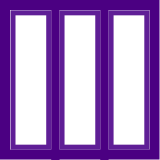

In the first few days of class, you have received a crash-course introduction to programming in Racket, in particular with images.  Furthermore, you also learned about *algorithmic decomposition* and its importance in computer programming.  In this project, we'll practice these techniques further by playing around with images in the context of a game called "Layers".

## Background: Broad conceputal issues

### External and internal correctness

In this course, we're concerned about writing good code.  What does that look like?  Good programs have two qualities we're looking after:

+ **External correctness**: Does the program behave correctly according to its specification?
+ **Internal correctness**: Is the program designed well?

External correctness is *observable* in the sense that we can run a program and determine that its behavior is correct.  In contrast, internal correctness concerns the design of our program: Is it readable? Does it follow the design guidelines outlined in the exercise write-up and otherwise adhere to good coding conventions?  External correctness is often a given---we always want to write programs that do the right thing.

However, we'll find in this course that internal correctness is just as important!  Computer programs are not just "consumed" by computers.  Other people will read and even modify our programs.  In particular, you will find that in three months (or perhaps sooner), you will feel like "another person", forgetting what you were thinking when you were designing the program.  So it is important that we build habits that are conducive to writing readable code.

### Playing around

As we may have discussed previously, *programming is not a spectator sport* (really, few things are in this world).  You need to write programs to learn how to program.  You often need to write programs to learn to think computationally.  The labs and projects will be you primary vehicle for this sort of practice.  This alone may be enough for some of you to master Racket programming.  But for many people, you will need additional practice to truly master these concepts.

One way to do this is through "playing around." What we mean by this is *programming for the purposes of exploring a programming language or its libraries*, rather than a specific end-product.  This is how many of us approach learning a new language.  We may have a few starting points in our back pockets, but as we write, we are less concerned about finishing the task at hand as we are about understanding the new environment.  This exploration usually involves investigating and answering questions such as "How do I do *X* in this language?" or "How does feature *X* that I don't understand compare to feature *Y* that I do understand?" or even "How does this language lead me to think differently about algorithm design?"

Because you are beginning programmers, your questions will likely be markedly simpler: "How can I even make a thing happen?" And "how do I type a thing?".  But nevertheless, "playing around" lets you tackle some of those ideas.  You might start with one our lab exercises that you developed with a peer as a starting point and then change the code in ways that are novel to you.  Or you might start from scratch and try to reproduce something you have seen or written before.  There is no right way to go about "play".  Its the attitude that's important: one of exploration and asking and answering questions rather than focusing on the final product.

## Background: The Layers Game

Layers is a game (more or less) in which players have identical sets of colored squares with "holes" in them and compete to put them together as fast as possible to match a pattern of stacked cards.

You can find the full rules of the game at <https://cdn.1j1ju.com/medias/46/2d/d7-layers-rulebook.pdf>. We should also have copies of the game in our classroom.

We also have a Scheme-based version of layers which you can get by using `(require csc151/layers)` in the DrRacket definitions pane. Here are the pieces in their "normal" orientation.

`three-rects-a` and `three-rects-b`:




`four-circles-a` and `four-circles-b`:


`diagonal-oval-a` and `diagonal-oval-b`:


`stripes-a` and `stripes-b`:


`two-wedges-a` and `two-wedges-b`:


In the physical world, to play a game of layers, you draw a puzzle card and then attempt to put together the appropriate number of pieces to make the same image. (The goal is to be the fastest one to solve the puzzle.) 

In the Scheme world, to play a game of layers, you type `(layers 3)` or `(layers 4)` or `(layers 5)` to create a puzzle with the specified number of cards. For example, here are a few puzzles we get from `(layers 3)`.


You can then try to solve the puzzle with the physical pieces or by overlaying pieces, possibly rotated. For example, we might solve the first puzzle with

```
(overlay (rotate diagonal-oval-a 90)
         (rotate two-wedges-b 90)
         (rotate three-rects-b 90))
```

And no, it's not always the case that you rotate all three pieces.

## Background: Procedures for producing, combining, and modifying images

In order to create your own pieces for the game, you'll need to know some basic  procedures for producing and modifying images. You should be able to find a more complete list in [the image reference pages](https://rebelsky.cs.grinnell.edu/Courses/CSC151/reference/categories/image). You should also be able to find the documentation for any of the procedures mentioned below by clicking on its name.

We won't show you the output of these procedures. As we noted above, you should learn these procedures, in part, by "playing around". You should try them in the interactions pane in DrRacket. Make sure to enter `(require csc151)` in the definitions pane and click "Run".

### Basic shapes

You can create **a solid circle** with `(solid-circle diameter color)`. For now, you should stick to color names, which you write with double quotation marks, such as `"red"` or `"purple"`. You can find the list of color names with `(all-color-names)`.


You can create  **an outlined circle** with `(outlined-circle inner-diameter color line-width)`. As you might expect, `line-width` indicates how thick the line should be, and can be a number between 0 and 255, inclusive.


You can create **a solid ellipse** with `(solid-ellipse width height color)`. And you can create **an outlined ellipse** with `(outlined-ellipse width height color line-width)`.


You can create **a solid square** with `(solid-square size color)`. And you can create **an outlined square** with `(outlined-square size color line-width)`.


You can create **a solid rectangle** with `(solid-rectangle width height color)`. And you can create **an outlined rectangle** with `(outlined-rectangle width height color line-width)`.


You can create **a solid wedge of a circle** with `(solid-wedge radius angle color)`. Outlined wedges are not yet available.


You can create **a solid equilateral triangle ** with `(solid-equilateral-triangle size color)`. And you can create **an outlined equilateral triangle** with `(outlined-equilateral-triangle size color line-width)`.


You can create **a solid isosceles triangle** with `(solid-isosceles-triangle width height color)`. And you can create **an outlined isosceles triangle** with `(outlined-isosceles-triangle width height color line-width)`.


You can create **a solid right triangle** with `(solid-right-triangle width height color)`. And you can create **an outlined right triangle** with `(outlined-right-triangle width height color line-width)`.


That's probably enough to get you started, right?

### Combining shapes

To make more complex images, we need to be able to put our basic images together. There are a two basic operations for combining images: we can overlay them on top of each other or we can put them next to each other.

`(above top bottom)` puts the top image above the bottom image, centering them horizontally.


`(above/align halignment top bottom)` puts the top image above the bottom image centering them according to `halignment`, which can be `"left"`, `"center"`, or `"right"`.


`(beside left right)` puts the two images side-by-side, centering them vertically.


`(beside/align valignment left right)` puts the two images side-by-side, centering them vertically according to `halignment`, which can be `"top"`, `"center"`, or `"bottom"`.


`(overlay top bottom)` puts the top image on top of the bottom image (think in terms of a third dimension), centering them over each other.


`(overlay/origin top bottom)` puts the top image on top of the bottom image, aligning them on the top-left corner. (Graphics coordinates treat the origin as the top-left corner. Positive vertical offsets go down, not up.)


We've found that these operations cover most of what we need to do when combining images.

### Modifying images

To **rotate** an image, use `(rotate img angle)`.

To **flip** an image horizontally or vertically, use `(hflip img)` or `(vflip img)`.

To **shift** an image horizontally or vertically `(hshift img amt)` or `(vshift img amt)`.

There are a few others available to you, such as `(scale img amt)` and `(crop img left top width height)`, but these should suffice for this assignment.

### Cutting out parts

As you may have noticed, many of the pieces have a part cut out of them. For now, the easiest way to cut out parts is to make those parts white and then use `(white->transparent img)` to cut out the white parts.

```
> (define my-image (overlay (solid-circle 20 "white") (solid-square 30 "blue")))
> my-image

> (overlay my-image (solid-square 40 "red"))

> (define my-image-revised (white->transparent my-image))
> my-image-revised

> (overlay my-image-revised (solid-square 40 "red"))

```

As you can see, it doesn't do a perfect job. However, it does a good-enough job for our purposes.

### Other useful operations

The `frame` procedure is useful for when we're not quite sure where the boundaries of our image are. It puts a one-pixel-wide frame around the image.

> (frame (hshift (vshift (solid-circle 20 "blue") 10) 30))

.

### Putting it all together

Let's consider how we might use these tools to make something like `four-circles-b` in a 128x128 image. We're not going to try for an exact copy. Rather, our goal is to get something similar and think about the steps along the way.


There are four orange circles, three with their center cut out. So let's start by making an appropriate orange circle. We need a diameter for those circles. Each appears to be a bit more than half of the width of the shape. Let's go with 72.

```
> (define orange-circle (solid-circle 72 "orange"))
> orange-circle

```

Now, we have to add the white center, which we'll use for three of the circles.

```
> (define hollow-orange-circle (overlay (solid-circle 36 "white") orange-circle))
> hollow-orange-circle

```

Hmmm ... That center doesn't look big enough, does it? Let's try again.

```
> (define hollow-orange-circle (overlay (solid-circle 44 "white") orange-circle))
> hollow-orange-circle

```

That's better. 

Now, let's make the first row. We have two circles. Can we put them beside each other?

```
> (beside hollow-orange-circle orange-circle)

```

Whoops. We need them to overlap a little. And if we want them to overlap, we probably need overlay. And we'll have to shift the solid circle right a bit. Maybe 60 spaces.

```
> (define row1 (overlay/origin hollow-orange-circle (hshift orange-circle 60)))
> row1

```

That looks pretty good. Now let's make the second row.

```
> (define row2 (overlay/origin hollow-orange-circle (hshift hollow-orange-circle 60)))
> row2

```

Now, we can put those two above each other. 

```
> (define circles (above row1 row2))
> circles

```

Whoops! Once again, we'll need to overlay to get the overlap.

```
> (define circles (overlay/origin row1 (vshift row2 60)))
> circles

```

Now, we can put that on a red background.

```
> (define my-layers-piece (overlay circles (solid-square 128 "dark red")))
> my-layers-piece

```

Double whoops! I made the circles a bit too big. But you get the idea. Let's do one more step to make sure that the white circles are "cut out".

```
> (define my-layers-piece (white->transparent (overlay circles (solid-square 128 "dark red"))))
> (overlay my-layers-piece (solid-square 164 "gray"))

```

That worked pretty well, except for the infelicities with the sizes and the issues with `white->transparent`. We can't fix the second issue right now, but we may have to go back and play with the numbers a bit. We'll leave that as an exercise for the reader.

## The assignment

### Part the first: A pair of layers cards

Create a pair of 512x512 layers pieces, differing only in colors. Name them `my-layers-piece-a` and `my-layers-piece-b`. For example,

```
(define my-layers-piece-a
  (white->transparent
   (overlay (overlay (solid-circle 400 "white")
                     (solid-circle 480 "green"))
            (solid-square 512 "yellow"))))

(define my-layers-piece-b
  (white->transparent
   (overlay (overlay (solid-circle 400 "white")
                     (solid-circle 480 "green"))
            (solid-square 512 "orange"))))
```

You can experiment with your pieces by combining them with the basic pieces.

```racket
> (beside (overlay my-layers-piece-a three-rects-a)
          (overlay (rotate three-rects-a 90) my-layers-piece-b))

```

You can also play the Layers game using your piece with a command like the following.

```racket
> (layers 3 my-layers-piece-a my-layers-piece-b
            three-rects-a three-rects-b
            diagonal-oval-a diagonal-oval-b)

```
            
Ideally, you'll make your two pieces compatible with the other pieces (whatever that means to you).

#### Additional requirements

Each pieces must involve at least four sub-images.

You must decompose your images as we did in the earlier "four circles" example (and as we failed to do in the sample `my-layers-a` and `my-layers-b` examples).

For this part of the assignment, you may not write any procedures of your own. (You'll need to do so in the next two parts.) 

Other than these, there are no minimum or maximum requirements regarding limits, code size, or complexity.  Have fun with it!

Each layers piece should have only two colors.

### Part the second: Your own library functions

If we were going to generate a lot of layers pieces (perhaps more complex ones) or change the size of our layers pieces, we would benefit from our own procedures (functions, subroutines) to make parts of the pieces. For example, if we wanted a lot of hollow circles (as we used in our four-circles example), we could write something like this.

```racket
;;; (hollow-circle size color) -> image?
;;;   size : positive-integer?
;;;   color : color?
;;; Create a circle of the given size, with an appropriate-sized white
;;; center.
(define hollow-circle
  (lambda (color size)
    (overlay (solid-circle (* 44/72 size) "white")
             (solid-circle size color))))
```

The 44/72 comes from the numbers we used in our 128x128 example. Others might work better.


a. Write five (5) procedures that you think will be useful in building other (perhaps more complex) cards for the Layers game. Your procedures will look something like the `hollow-circle` procedure above.

b. Create a list of five images, one built from each procedure, and call that list `examples`.

```
(define examples (list (hollow-circle 20 "red") ...))
```

Once again, there are no minimum requirements regarding limits, code size, or complexity.

### Part the third: Generalizing layers cards

Take the layer pieces you created in part one and turn them into a procedure, `(make-my-layers-piece bgcolor fgcolor size)`, with the given parameters. You may rely on helper procedures (either the ones you wrote above or new ones you create here).

You may not use `scale` in writing `make-my-layers-piece`.

### Part the fourth: (Re-)making cards

a. Write a definition that creates a 512x512 piece that looks like `my-layers-piece-a` by using `make-my-layers-piece`. Make sure it is named `my-new-layers-piece-a`.

```
(define my-new-layers-piece-a (make-my-layers-piece "green" "yellow" 512))
``` 

b. Write a definition that creates a 512x512 piece that looks like `my-layers-piece-b` by using `make-my-layers-piece`. Make sure it is named `my-new-layers-piece-b`.

```
(define my-new-layers-piece-b (make-my-layers-piece "orange" "yellow" 512))
``` 

c. Write a definition that creates a different 512x512 layers piece (one with difference colors than `my-layers-piece-a` and `my-layers-piece-b`. Make sure it is named `my-new-layers-piece-c`.

d. Write a definition that creates a 128x128 piece that looks like a smaller version of `my-layers-piece-a` using `make-my-layers-piece`. Make sure it is named `my-layers-piece-a-128`.

```
(define my-layers-piece-a-128 (make-my-layers-piece "green" "yellow" 512))
``` 

## A note on additional complexity

You are under no obligation to use additional functions or language features beyond what we have introduced in the first week or so of the class.  However, You may feel limited by the functions we have discussed so far.  If so, you are free to reference the documentation for the `csc151` library for some of the functions available (see the "Reference" link at the top of the page). Note that that both the library and the documentation are "in process". If there's something you'd like, you might ask Prof. Rebelsky about it.  Note that this documentation may not be entirely comprehensible to you yet!  That is fine.  If you choose to explore this library in more detail, we recommend experimenting with these functions in the interactions pane and figure out how they work before throwing them into your code.  Remember, if you adapt any code from this library's documentation, you should cite that you did so in a comment in your code!

## Turn-in details

For this mini project, you will create one file: `new-layers.rkt`.  The particular contents of that file are detailed below.  For additional details on turning on this assignment and interpreting your feedback from it, please consult the [Gradescope page]({{ "/handouts/gradescope" | relative_url }}).

The beginning of `new-layers.rkt` should have an appropriate description of the file, something liek the following. The semicolons are "comments"; text intended for the human reader of the file, rather than the computer reader..

```racket
# lang racket
(require csc151)
(require csc151/layers)

;; new-layers.rkt
;;
;; Pieces for the layers game
;;
;; CSC-151 Spring 2025
;; Mini Project 1: Layers
;; Author: Stu Dent
;; Date: 2025-01-30
;;
;; Acknowledgements: 
;;   * ...
;;   *

; (...code below here...)
;
(define my-layers-piece-a 
  ...)

(define my-layers-piece-b 
  ...)

...

(define make-my-layers-piece
  ...)

...
```

## Partial rubric

In grading these assignment, we will look for the following for each level.
We may also identify other characteristics that move your work between levels.

**You should read through the rubric and verify that your submission meets the rubric.**

### Redo or above

Submissions that lack any of these characteristics will get an I.

```
[ ] Includes the specified file (correctly named).
[ ] Includes an appropriate header on the file that indicates the course, author, etc.
[ ] Code runs in DrRacket.
```

### Meets expectations or above

Submissions that lack any of these characteristics will get an R or below.

```
[ ] In Part 1, includes at least four sub-images.
[ ] In Part 1, the images are correctly named `my-layers-piece-a` and
    `my-layers-piece-b`.
[ ] In Part 1, does not rely on any student-written procedures.
[ ] In Part 1, the image is decomposed.
[ ] In Part 2, includes five helper procedures.
[ ] In Part 2, each helper procedure has at least one parameter.
[ ] In Part 2, includes the required `examples` list, which has the required 
    form.
[ ] In Part 3, the procedure is correctly named `make-my-layers-piece`.
[ ] In Part 4, there is a call to generate `my-new-layers-piece-a`.
[ ] In Part 4, there is a call to generate `my-new-layers-piece-b`.
[ ] In Part 4, there is a call to generate `my-new-layers-piece-c`.
[ ] In Part 4, there is a call to generate `my-layers-piece-a-128`.
```

### Exemplary / Exceeds expectations

Submissions that lack any of these characteristics will get an M or below.

```
[ ] In Part 1, code is concise and avoids repetition.
[ ] In Part 2, one or more of the helper procedures is especially innovative.
[ ] In Part 3, decomposes the procedure.
[ ] In Part 4, `my-new-layers-piece-a` appears the same as `my-layers-piece-a`.
[ ] In Part 4, `my-new-layers-piece-b` appears the same as `my-layers-piece-b`.
[ ] In Part 4, `my-new-layers-piece-c` appears different than the other pieces.
[ ] In Part 4, `my-layers-piece-a-128` appears the same as `my-layers-piece-a`,
    just smaller.
```

## Q&A

_Ask questions on Teams and I'll do my best to put the answers here._

### General

**Are there any guidelines or cheat sheets we can use?**

> Just the assignment itself. But you can always ask questions, including suggestions for moving forward.

**Are the numbers in the various procedures pixels?**

> The numbers are pixels (approximately). I tend to treat them as "numbers in some geometric system that I don't quite understand".

**What does a sub-image mean in the layers piece?**

> Part of an image. For example, if you put two circles side by side, each circle is a sub-image.

**How can we balance decomposition and concise code?**

> Ideally, decomposition will lead to more concise code, since you won't repeat yourself. However, given the choice, I would lean toward decomposition.

**Are we presenting a file without any signs of "trial and error" in terms of code (a cleaned/edited form)?**

> Yes, I would prefer that you submit the cleaned/edited form of your work.

**What does it mean by we cannot write any procedure of our own?**

> For part 1, you must use the pre-coded procedures. For parts 2 and 3, you will write your own procedures.

**Are we turning in all four parts into Gradescope as one assignment?**

> Yes.

**What kinds of things should I put in the "Acknowledgements" section of my comments at the top?**

> You should acknowledge anyone you talk to about the assignment.

> You should acknowledge any Web pages you reference (other than the assignment page).

### Part two

**What should we be doing in this part? Are we making pieces?**

> You're making things that could be used in the construction of pieces.

**Can we use previously defined helper procedures in other helper procedures? e.g., if I make a semicircle procedure, can I use that procedure to define a hollow-semicircle procedure?**

> Yes, you may use your other helper procedures in defining new helper procedures.

**In Part 2, what does a helper procedure need to do to be "innovative" as given in the grading rubric?**

> To quote the Supreme Court of the United States, "We'll know it when we see it."

**What is the most efficient way to go about orientating the shapes and making sure they are correct?**

> It's okay not to be efficient in the first assignment; part of getting things "wrong" is learning from playing. But I find it helps to lay things out on paper first (say, using the grid paper).

**What kind of procedures are useful to make more complex cards?**

> Part of the goal is that you consider this issue. Perhaps you decide that you want wedges with white in the center. Perhaps you decide that you'll regularly want four items in a grid. There are lots of possibilities.

### Part three

**What should we be doing in this part?**

> For this part, you are writing a procedure that makes pieces (as opposed to making them directly, which you did in part one).


### Part four
