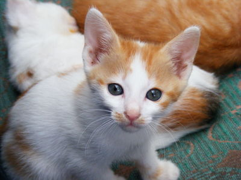
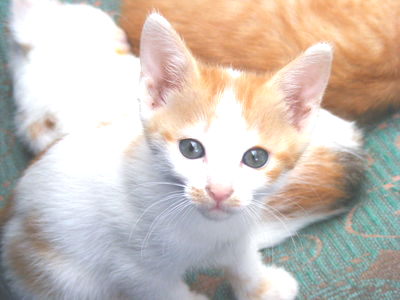
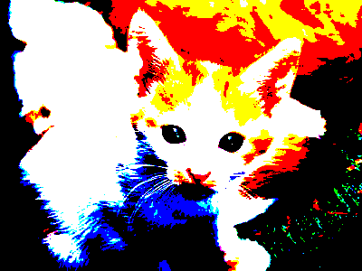
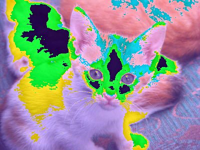

# {{ page.title }} : {{ page.subtitle }}

## Some background

_Estimated time to read and understand the background: About 30 minutes._

As our programs get more complicated, the structure of our code and good names and formatting are not enough to make our code readable and correct.
We need to rely on *extrinsic* means to ensure these things.
To ensure that our code is readable, we use *documentation* to capture aspects of our code that are not obvious upon inspection.
To ensure that our code is correct, we use *tests* that codify the correctness our programs through concrete examples.

As you may recall, we recommend a four-step process for developing procedures: Document the procedure, make a list of sample inputs and outputs that will help you determine whether your implementation is correct, write your procedure, and extend your list of sample inputs and outputs.

During our week on software engineering fundamentals, we'll discuss these concepts in more detail.
For now, we'll employ some basic documentation and testing for our program.

### Documentation

For each function that you write in this mini project, include a *function comment* that captures the types of the function as well as describes its output in a sentence or two.
For example, here is a function comment for a function that finds the minimum of three numbers:

```racket
;;; (min-of-three x y z) -> real?
;;;   x : real?
;;;   y : real?
;;;   z : real?
;;; Returns the minimum of x, y, and z
(define min-of-three
  (lambda (x y z)
    (cond
      [(and (<= x y) (<= x z))
       x]
      [(and (<= y x) (<= y z))
       y]
      [else
       z])))
```

The function comment is a stylized comment that consists of the following three components:

* `(min-of-three x y z) -> real?`: the *signature* of the function which names its arguments and describes the *output* type of the function.  In Racket, we express the types with the predicate functions that we use in code to test whether an expression has that type.  For example, this signature says that `min-of-three` has three arguments, `x`, `y`, and `z` and that it produces a real number (as tested by the `real?` function).
* `x : real? ...`: the types of each of the parameters mentioned in the signature.  Like the return type of the function, we document the types of the parameters with the predicates that we would use in code to test values of those types.
* `Returns the minimum of x, y, and z`: finally, we include a brief sentence or two description of the behavior and output of the function.  Here, the behavior of the function is simple, so we comparatively have little to say: the function returns the minimum of its arguments.

### Tests

Up until this point, we have asked you to experiment with the functions that you write in the interactions window to check for correctness.
This has the upside of being fast, but if you change your code, you need manually type in all those tests again which is tedious (which in turn makes it less likely you'll recheck the correctness of your code).
A better solution is to *codify* your tests in your code so that you can rerun the tests at will.

During our unit on software engineering fundamentals, we'll introduce you to a library, `rackunit`, that makes test authoring and execution a breeze.
For now, we'll look at two basic RackUnit procedures

When we are developing predicates (procedures that return a Boolean) value, Racket (RackUnit) provides an important procedure to help us make that list of inputs/outputs and automatically check it for us: `(test-equal? DESCRIPTION EXP EXPECTED)`, which evaluates `EXP`, compares it to `EXPECTED`, and prints an error message only if it fails.

For example,

```
> (test-equal? "the square root of 3 squared is 3" (sqrt (sqr 3)) 3)
> (test-equal? "the square root of 4 squared is 4" (sqrt (sqr 4)) 4)
> (test-equal? "the square root of 100 squared is 100" (sqrt (sqr 100)) 100)
> (test-equal? "the square of the square root of 100 is 100" (sqr (sqrt 100)) 100)
> (test-equal? "the square of the square root of 4 is 4" (sqr (sqrt 4)) 4)
> (test-equal? "the square of the square root of 3 is 3" (sqr (sqrt 3)) 3)
--------------------
the square of the square root of 3 is 3
. FAILURE
name:       check-equal?
location:   31-interactions from an unsaved editor:22:2
actual:     2.9999999999999996
expected:   3
--------------------
```

As this suggests, if the test succeeds, you get no output.  However, if the test fails, you get a helpful FAILURE message.  (Please don't feel like a failure for getting such messages.  All of us get them from time to time.)

While we cannot normally use `test-equal?` to compare images, we can use it to cmpare characteristics of those images.  For example, consider the following procedure that is supposed to make a snowman of a certain height.

```
(define my-snowman
  (lambda (height)
    (above (circle (* height 1/4) "outline" "black")
           (circle (* height 1/3) "outline" "black")
           (circle (* height 5/12) "outline" "black"))))
```

Here are a few tests we've written to see whether it works.  The first is what some folks call a "corner" or "corner case"; one with a strange but valid input.  In this case, we've made a zero-height snowman.

```
(test-equal? "zero height snowman" (image-height (my-snowman 0)) 0)
(test-equal? "normal snowman" (image-height (my-snowman 40)) 40)
(test-equal? "small snowman" (image-height (my-snowman 5)) 5)
(test-equal? "large snowman" (image-height (my-snowman 100)) 100)
```

This time, we're going to put the tests in the definitions pane and click "Run".  What do you think will happen?  Let's see ...

```
--------------------
normal snowman
. FAILURE
name:       check-equal?
location:   let-it-snow.rkt:13:0
actual:     80
expected:   40
--------------------
--------------------
small snowman
. FAILURE
name:       check-equal?
location:   let-it-snow.rkt:14:0
actual:     10
expected:   5
--------------------
--------------------
large snowman
. FAILURE
name:       check-equal?
location:   let-it-snow.rkt:15:0
actual:     200
expected:   100
--------------------
```

Whoops!  There's something wrong with our procedure.  Interestingly, it got the right height for the "zero height" snowman, but not for the rest.  If we look closely, we see that each result is twice as large as it should be.  Ah!  I forgot that the first parameter to `circle` is the _radius_ not the _diameter_.  Let's try again.

```
(define my-snowman
  (lambda (height)
    (above (circle (* height 1/8) "outline" "black")
           (circle (* height 1/6) "outline" "black")
           (circle (* height 5/24) "outline" "black"))))

(test-equal? "zero height snowman" (image-height (my-snowman 0)) 0)
(test-equal? "normal snowman" (image-height (my-snowman 40)) 40)
(test-equal? "small snowman" (image-height (my-snowman 5)) 5)
(test-equal? "large snowman" (image-height (my-snowman 100)) 100)
```

What happens when I click run this time?

```
Welcome to DrRacket, version 8.9 [cs].
Language: racket, with debugging; memory limit: 128 MB.
> 
```

Whoo!  No errors.  That suggests that I got the height right.

As this example suggests, we should put our tests immediately after our code in the definitions pane.  Then, when we click "Run", we'll quickly determine if there are any problems (and what those problems are).  If we see no reports, we can be sure that the code passed all of our tests.

Note that to use these procedures, one must require the `rackunit` library with `(require rackunit)`.

## Part the first: Bar charts

_Estimated time for this part: 30-60 minutes._

You will use the file `bar-chart.rkt` for this part of the mini-project.

While we can make images primarily to exercise our creativity, many images can also serve informative purposes.  For example, many people rely on _bar charts_ to help others understand and compare numerical data.  In this part of the assignment, you will create simple bar charts.

**Document and write a procedure, `(bar-chart height label1 num1 color1 label
2 num2 color2 label3 num3 color3)` that makes a three column bar chart.**
The heights of the three bars depend on `num1`, `num2`, and `num3`.  The height of the bar with the largest number should be `height`.  The heights of the other two bars should be appropriately proportional to that height.  Each bar should appear in the corresponding color.  The labels should appear below each of the corresponding bars.  The numbers should appear within the bars.  Bars should be 40 units wide.  Use 12 point font for the labels and 10 point for the numbers.  

Note that you can use `(text str size color)` to create text in an image.  You then overlay that on top of the image.

We would strongly recommend that you create a separate `(make-bar bar-height labe1 num color)` procedure.  (And you must create such a procedure to earn an E.)

Here are some examples.  You may note that we've added black outlines to some bars and changed the color of the text.  *You are not required to do so!*  Feel free to outline every bar in black and to use black text, even if it's hard to see.

```
(bar-chart 100
           "one" 50 "blue"
           "two" 75 "yellow"
           "three" 25 "lightpink")
```

![Three bars next to each other.  The first bar is blue and of medium height.  The number 50 appears in white within it.  The word 'one' appears below it.  The second bar is yellow, taller than the other two, and outlined in black.  The number 75 appears within it, colored black.  The word 'two' appears below it.  The third is pink, shorter than the other two (half the height of the first bar, one third the height of the second bar), and outlined in black.  The number 25 appears within it, colored black.  The word 'three' appears below it.](../images/mps/bars-blue-yellow-pink.png)

```
(bar-chart 100
           "foo" 2.3 "black"
           "bar" 7.2 "gray"
           "baz" 11 "white")
```


Save your `bar-chart` procedure in a file named `bar-chart.rkt`.

Because we haven't given you precise guidance on the separation of bars, it will be difficult to write automated tests for this procedure.

## Part the Second: Transforming colors

_Estimated time for this part: 30 minutes to read the new material, 30-60 minutes to write the procedures._

Save all of this work in `color-transformation.rkt`.

**Note**: You may need to update your csc151 library to get access to the `rgb` procedure and the `image-map` procedure.

As you have learned (or will soon learn), we can represent colors using a red/green/blue triplet or a red/green/blue/alpha four-tuple where each value is a number between 0 and 255.  For the color components, the number represents the amount of each color in an additive model: 255 means "really bright" and 0 means "off".  (Don't worry about the alpha for now.)

You can create a new RGB color with `(rgb red-component green-component blue-component)`.  For example, `(rgb 128 0 128)` creates a darkish purple, which we can see with

```
> (circle 30 "solid" (rgb 128 0 128))
```


We can also _transform_ an existing color by reading its components with `color-red`, `color-green`, `color-blue`, and `color-alpha` and using those values to compute a new color.  For example, here's a procedure to make a color brighter.

```
;;; (color-brighter-32 c) -> color?
;;;    c : color?
;;; Create a brighter version of c by increasing each component by 32
;;; (if possible).
(define color-brighter-32
  (lambda (c)
    (rgb (+ (color-red c) 32)
         (+ (color-green c) 32)
         (+ (color-blue c) 32))))
```

We can try this out.

```
> (define my-purple (rgb 128 0 128))
> (beside (circle 30 "solid" my-purple)
          (circle 30 "solid" (color-brighter-32 my-purple))
          (circle 30 "solid" (color-brighter-32 (color-brighter-32 my-purple))))
```


But we've just learned about testing, so we should also test our procedure.

```
(test-equal? "brighter black" (color-brighter-32 (rgb 0 0 0)) (rgb 32 32 32))
(test-equal? "brighter white" (color-brighter-32 (rgb 255 255 255)) (rgb 255 255 255))
(test-equal? "mixed components" (color-brighter-32 (rgb 250 100 240) (rgb 255 32 255)))
```

Color transformations alone are a bit boring.  So we use `image-map` to apply them to a complete image.  For example, here is a picture of a kitten released under an unrestricted license.  (You can make your own copy by right clicking and choosing "Save As ...".)



And here's what we get when we apply our color transfomration to the kitten twice.

```
> (define kitten (image-load "kitten.jpg"))
> (image-map color-brighter-32 (image-map color-brighter-32 kitten))
```



**a. Document and write a procedure `(color-extreme c)`, that takes one parameter, a color, and creates a new color in which each component is (a) 255 if the original is at least 128, or (b) 0, if the original is less than 128.  You may not use conditionals.**

```
> (color-extreme (color 0 64 200))
(color 0 0 255 255) ; we always end up with an alpha of 255
> (color-extreme (color 128 130 0))
(color 255 255 0)
```

Since you may not use conditionals, you will need to think creatively about what kinds of math might help.

Here's our kitten, with `color-extreme` applied using `image-map`.




**b. Write at least three tests to check whether your `color-extreme` procedure works correctly.**

**c. Document and write a procedure, `(color-dominant c)`, that takes one parameter, a color, and creates a new color in which each component is either (a) 255, if it is the largest component of the original color (or tied for largest) or (b) 0, otherwise.  Once again, you may not use conditionals.**

```
> (color-dominant (color 0 5 0))
(color 0 255 0 255)
> (color-dominant (color 200 199 199))
(color 255 0 0 255)
> (color-dominant (color 10 0 10))
(color 255 0 255 255)
```

*Hint:* You should be able to do this with a clever combination of `max`, division, rounding, and multiplication.

**d. Write at least three tests to check whether your `color-extreme` procedure works correctly.**

**e.** As you've seen, when we apply the typical color transformation, such as `color-brighter` or `color-redder, we eventually reach a limit of 0 or 255.  But we can get some interesting effects by "wrapping around" at the end.  For example, here's the output from a function that adds 90 to a number, wrapping when we hit 255.

```
> (cyclic-add-90 75)
165 ; 75 + 90 = 165
> (cyclic-add-90 165)
255 ; 165 + 90 = 255
> (cyclic-add-90 166)
0 ; 165 + 90 = 256 so we wrap around to 0
> (cyclic-add-90 166)
1 ; 165 + 90 = 257 so we wrap around to 1
```

Here's one possible definition of `cyclic-add-90`.

```
;;; (cyclic-add-90 v) -> integer? (in the range 0 .. 255)
;;;   v : integer? (in the range 0 .. 255)
;;; Add 90 to v, "wrapping around" when we hit 255.
(define cyclic-add-90
  (lambda (val)
    (modulo (+ val 90) 256)))
```

**Document and write a procedure, `(cyclic-add-colors c1 c2)`, that takes two colors as input and produces a new color formed by the cyclic addition of the corresponding components of the two colors.**

```
> (cyclic-add-colors (color 90 90 90) (color 165 166 167))
(color 255 0 1 255)
```

Here's yet another abuse of our kitten image.

```
(define a-color (color 64 32 96))
(define cyclic-add-a-color
  (lambda (c)
    (cyclic-add-colors a-color c)))
> (image-map cyclic-add-a-color kitten)
```



**f. Write at least four tests for `cyclic-add-colors`.

## Part the Third: Freestyle

_Estimated time for this part: 30 minutes to read the new material._

Please save this work in `freestyle-transformation.rkt`.

Document, write, and test your own "interesting" color transformation.  (We may apply it to the kitten as a demonstration in class, but you should feel free to try it with other images, too.)  Your color transformation should use at least one separate procedure that you write.  (For example, the `cyclic-add-a-color` procedure from above would have counted if you hadn't already been assigned to write `cyclic-add-colors`, since it uses `cyclic-add-colors.)

Please name your color transformation `color-transform`.  We realize that the name is not very creative.  But it will help us identify it in the midest of your code.

## Grading rubric

The grading rubric is forthcoming.

## Acknowledgements

The bar graph problem was modified from a similar problem given in CSC-151 2022 Spring.

The first set of color problems were modified from similar problems given in 2017 Spring (although in a different Scheme environment).

The Freestyle problem is all new.

The kitten image was downloaded from <http://public-photo.net/displayimage-2485.html>.  Unfortunately, the site behind that URL has disappeared.  Nonetheless, the kitten image lives on.
