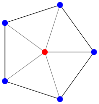

_Warning! This assignment was newly created on Wednesday, 31 January 2024. It will likely be updated over the next few days. Feel free to report infelicities or missing pieces of information._

For this project, you should put all of your code in the file `polygons.rkt`.

## Some background

As you may know, Grinnell's CS faculty are (re-)building the image library for CSC-151. In many cases, once we've written a core operation, like `solid-polygon`, we can write many other operations in terms of that operation. For example, the implementation of `solid-rectangle` looks something like the following.

```
(define solid-rectangle
  (lambda (width height color)
    (solid-polygon (list (pt 0 0) (pt width 0) (pt width height) (pt 0 height))
                   color)))
```

It is, of course, a bit more complex than that. We include testing for the validity of the parameters (or we should). We permit an optional description. We tag it as a rectangle. But the basic concept is there.

In case you couldn't tell, the `solid-polygon` procedure takes two primary parameters: a list of points and a color. The points give the vertices of the polygon, usually in clockwise order. The color is, of course, the fill color. And yes, there's an optional description. We create a new point with the `pt` operation.

Here's a somewhat more complex polygon.

```
(solid-polygon (list (pt 0 0) (pt 100 0) (pt 50 20) (pt 50 80) (pt 100 100)
                     (pt 0 100) (pt 50 80) (pt 50 20))
               "blue")
```

Can you guess what it looks like? After doing so, try entering the code in DrRacket to see.

In this assignment, you will build a few useful shapes that seem to be missing from the `csc151` image library.

### Warnings!

As the documentation for `solid-polygon` suggests, no matter what coordinates you use for the vertices, the polygon gets shifted so that the leftmost point is at the left edge of the image and the topmost point is at the top edge of the image. You can likely use this feature to your advantage. For example, if you're making a somewhat symmetrical image, you can use (0,0) as the center.

Um ... I just checked, and that documentation seems to be missing. Stay tuned!

The `image-subtract` procedure that you will need for one or more problems is not yet implemented. It should be ready by the end of the day on February 1.

### Documentation

For each procedure that you write in this mini project, include a *procedure comment* that captures the parameter types of the procedure as well as describes its output in a sentence or two.  For example, here is a procedure comment for a procedure that finds the minimum of three numbers. (You don't need to understand how the procedure works.)

```racket
;;; (min-of-three x y z) -> real?
;;;   x : real?
;;;   y : real?
;;;   z : real?
;;; Returns the minimum of x, y, and z
(define min-of-three
  (lambda (x y z)
    (cond
      [(and (<= x y) (<= x z))
       x]
      [(and (<= y x) (<= y z))
       y]
      [else
       z])))
```

The function comment is a stylized comment that consists of the following three components:

* `(min-of-three x y z) -> real?`: the *signature* of the function which names its arguments and describes the *output* type of the function.  In Racket, we express the types with the predicate functions that we use in code to test whether an expression has that type.  For example, this signature says that `min-of-three` has three arguments, `x`, `y`, and `z` and that it produces a real number (as tested by the `real?` function).
* `x : real? ...`: the types of each of the parameters mentioned in the signature.  Like the return type of the function, we document the types of the parameters with the predicates that we would use in code to test values of those types.
* `Returns the minimum of x, y, and z`: finally, we include a brief sentence or two description of the behavior and output of the function.  Here, the behavior of the function is simple, so we comparatively have little to say: the function returns the minimum of its arguments.

## Part one: Right triangles

Document and write a procedure, `(solid-right-triangle width height color)`, that makes a solid right triangle of the designated width and color.

```
> (solid-right-triangle 100 50 "blue")

> (image-description (solid-right-triangle 100 50 "blue"))
"a solid blue triangle whose width is 100 and height is 50"
> (solid-right-triangle 25 25 (rgb 255 0 255))

> (image-description (solid-right-triangle 25 25 (rgb 255 0 255)))
"a solid fuchsia triangle whose width is 25 and height is 25"
```

Note that you can generate the description for the triangle with an expression something like the following:

```
(string-append "a solid " 
               (color-description color) 
               " triangle whose width is "
               (number->string width)
               " and height is "
               (number->string height))
```

## Part two: Right triangles, revisited

Document and write a procedure, `(outlined-right-triangle width height color pen-width)` that makes an outlined right triangle in which the outline is the specified color and pen width.

You may *not* use `outlined-polygon` for this part of the assignment. Rather, you should use `image-subtract` (not available until February 1) to do so.

You may discover that your initial approach with `image-subtract` does not produce the desired result. In particular, you may find that the diagonal of the triangle is not the proper width. You will still earn an M if the other two edges are correct. However, to earn an E you should attempt something more substantial *and* you should include an explanation of how your algorithm achieves the goal.

## Part three: Some regular polygons

A _regular polygon_ is a polygon in which all of the sides and angles are the same. For example, a square is a regular polygon, as is an equilateral triangle.

How do we make regular polygons? We will need to compute the coordinates of the vertices of the polygon. It turns out that that's easier than you might think. Consider a regular pentagon (a five-sided polygon).



The five angles by the red dot are all the same. Since there are five of them, we know that the angle is $$2\pi/5$$, or `(* 1/5 2 pi)`. (Is your high-school trigonometry coming back to you soon?) If we know the distance from the center to a vertex (we'll call that the _radius_ of the pentagon), we can compute the `x` and `y` coordinates using the angle and the distance using Racket's `make-polar`, `real-part`, and `complex-part` procedures, all of which you can read about in [the Racket Reference section on complex numbers](https://docs.racket-lang.org/reference/generic-numbers.html#%28part._.Complex_.Numbers%29).

But how long should the radius distance be? One option would be to make the radius a parameter for our `solid-pentagon` procedure. However, our experience suggests that clients (people who use our code) more often want to specify either the overall width of the pentagon or the side-length of the polygon. Let's go with the side length.

How do we convert the side length to the radius? We use math! Let's see ... we'll start with a picture.

```
       ^
      /|\
     / | \ radius
    /  |  \
    -------
      side
```

The legendary SOHCAHTOA rule says that the sine of an angle is the opposite over the hypotenuse. If we look at the angle at the top of the triangle, it's 1/2 of the angle we computed before, which we'll call $$\theta$$. The opposite is half the side. The radius is the hypotenuse (or vice versa). So, $$sin \frac{\theta}{2} = (side/2)/hyp$$.  That means that $$hyp = side/(2(sin \frac{\theta}{2}))$$. Yay math!

You'll note that we have not written these formulae in Scheme. Part of your goal will be to translate the ideas into Scheme code.

a. Document and write a procedure, `(solid-pentagon side-length color)`, that makes a solid five-sided regular polygon of the specified side length and color.

```
> (solid-pentagon 30 "blue")

> (beside (solid-square 30 "red") (solid-pentagon 30 "blue"))

```

b. Document and write a procedure, `(solid-hexagon side-length color)`, that makes a solid six-sided regular polygon of the specified side length and color.

```
> (solid-hexagon 30 "blue")

> (above (solid-square 30 "red")
         (solid-hexagon 30 "blue"))

```

c. Document and write a procedure, `(solid-octagon side-length color)`, that makes a solid eight-sided regular polygon of the specified side length and color.

```
> (solid-octagon 30 "blue")

> (rotate (solid-octagon 30 "blue") 22.5)

> (above (solid-square 30 "red")
         (beside (solid-square 30 "blue")
                 (solid-hexagon 30 "purple")
                 (solid-square 30 "blue"))
         (solid-square 30 "red"))

```

In each case, you may find it helpful to decompose the procedure so that you can rely on helper procedures.

## Part four: Stars

Now that we've developed some basic skills at making polygons, let's try a somewhat more complicated example, five-pointed stars.


You may note that the outer verticies of the star are just the vertices of a pentagon.


Hmmm ... the inner vertices are also the vertices of a smaller pentagon, just rotated slightly.


If we can interleave the points, we should be able to make a star.

In this case, it seems better to use the inner radius and outer radius rather than some "side length" that does not naturally correspond to any part of the star.

Document and write a procedure, `(solid-star outer-radius inner-radius color)`, that makes the specified star.

```
> (solid-star 100 50 "blue")

> (solid-star 100 70 "red")

> (solid-star 100 10 "purple")

> (solid-star 40 15 "green")

```

Note that you should not use the `rotate` procedure. Rather, you should calculate both sets of vertices yourself.

## Part five: Freestyle

a. Design, document, and implement your own parameterized polygonal procedure. You may name it whatever you like. It should take at least one number (presumably representing some length/size) and one color as parameters.

b. Create a list, `freestyle-examples`, that shows the result of five calls to your procedure. For example, if `outlined-right-triangle` were your procedure for part a, you might write something like the following.

```
(define freestyle-examples 
  (list (outlined-right-triangle 50 50 "red" 5)
        (outlined-right-triangle 50 50 "red" 20)
        (outlined-right-triangle 100 10 "blue" 5)
        (outlined-right-triangle 10 100 "blue" 5)
        (outlined-right-triangle 1 1 "green" 100)))
```

In this set of examples, we've shown three kinds of right triangles (one with equal sides, one much wider than it is high, one much higher than it is wide), a few different line widths, and one fairly strange case.

## Grading rubric

_This rubric is in **very** draft form. Expect substantive changes._

### Redo or above

Submissions that lack any of these characteristics will get an I.

```
[ ] Passes all of the one-star autograder tests. These mostly verify
    that the procedures exist and return images.
[ ] Includes the specified file (`polygons.rkt`).
[ ] Includes an appropriate header on each file that indicates the
    course, author, etc.
[ ] Code runs in DrRacket.
[ ] Documentation for most procedures.
```

### Meets expectations or above

Submissions that lack any of these characteristics but have all of the
prior characteristics will get an R.

```
[ ] Passes all of the two-star autograder tests.
[ ] Code is well-formatted with appropriate names and indentation.
[ ] Code has been reformatted with Ctrl-I before submitting.
[ ] All the primary procedures are documented.
[ ] Documentation for most procedures is correct / has the correct form.
```

### Exemplary / Exceeds expectations

Submissions that lack any of these characteristics but have all of the
prior characteristics will get an M.

```
[ ] Passes all of the three-star autograder tests.
[ ] Avoids repeated work.
[ ] All helper procedures are documented.
[ ] All three sides of the outlined triangle are approximately the right size.
[ ] Each procedure generates an appropriate description.
[ ] A particularly creative procedure.
```

## Acknowledgements

This assignment was newly written for CSC-151 2024 Spring.
