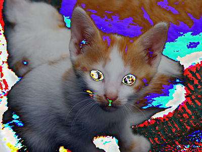
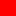
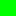
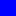
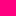

You will create only one file for this mini-project, `image-transformations.rkt`. You should begin your project with [this starter code](../code/mps/image-transformations.rkt)

_Warning! This MP is still under development. However, the only major changes anticipated are to the rubric._

Background
----------

If you've played with an image-editing application like Photoshop, you've likely discovered that such applications provide a wide variety of mechanisms for transforming images. In this assignment, you will build your own versions of some image transformation. While we cannot reasonably explore how to build all such mechanisms, we will consider three kinds of mechanisms in this assignment.

We will start in part one with transformations based on the RGB values of each pixel in the image.

We will introduce a new color representation in part two, HSV (hue-saturation-value) colors, and explore some pixel-based transformations that use HSV colors.

<!--
In part three, we will begin to explore more complex transformations that consider not just a pixel, but also additional information, such as the surrounding pixels and the position of the pixel.
-->

In part three, you will design your own transformations.

Part one: Transforming images by transforming RGB colors
--------------------------------------------------------

As you may recall, we can build a variety of image transformations by using the following model.

```
(define my-color-transformation
  (lambda (c)
    (rgb (some-computation c)
         (some-computation c)
         (some-computation c))))

(define my-image-transformation
  (lambda (img)
    (pixel-map my-color-transformation img)))
```

For example, to swap the red and blue components of an image, we might write the following.

```
;;; (rgb-swap-rb c) -> rgb?
;;;   c : rgb?
;;; Swap the red and blue components of `c`.
(define rgb-swap-rb
  (lambda (c)
    (rgb (rgb-blue c)
         (rgb-green c)
         (rgb-red c))))

;;; (swap-red-blue img) -> image?
;;;   img : image?
;;; Create a new image by swapping the red and blue components of
;;; each pixel in `img`.
(define swap-red-blue
  (lambda (img)
    (pixel-map rgb-swap-rb img)))
```

Here's the procedure in action. We'll start with our kitten.


Here's what happens when we call `swap-red-blue` on that image.


We can also build `swap-red-blue` by plugging the `lambda` part of `rgb-swap-rb` in place of `rgb-swap-rb`.

```
(define swap-red-blue
  (lambda (img)
    (pixel-map (lambda (c)
                 (rgb (rgb-blue c)
                      (rgb-green c)
                      (rgb-red c)))
               img)))
```

In a few cases, we can use composition to write the color transformations that are applied to each pixel. For example, the following procedure decreases the green component of eachp ixel in an image.

```
;;; (decrease-green img) -> image?
;;;   img : image?
;;; Create a new image by making each pixel of `img` less green (and
;;; a bit more blue and red).
(define decrease-green
  (lambda (img)
    (pixel-map (o rgb-pseudo-complement rgb-greener rgb-pseudo-complement)
               img)))
```

Here's the effect on the kitten.


We can also use the `cut` operation along with some multi-parameter RGB operations to achieve some transformations. For example, here's one that sets the green component of an image to the maximum value.

```
;;; (maximize-green img) -> image?
;;;   img : image?
;;; Createa a new image by setting the green component of each pixel
;;; to the maximum value.
(define maximize-green
  (lambda (img)
    (pixel-map (cut (rgb-add (rgb 0 255 0) <>)) img)))
```

And here's the effect on our kitten.


Perhaps that wasn't the best transformation to use.

These few procedures give you a sample of the kinds of "basic" RGB transformations we might do.  Of course, we will normally do somewhat more complex transformations than these. Nonetheless, they serve as a starting point for thinking about transformations.

## 1a. Extreme components

Write a procedure, `(rgb-extreme color)`, that takes one parameter, an RGB color, and turns each component to 255 if it is at least 128 and to 0 if it is less than 128.

```
> (rgb->string (rgb-extreme (rgb 0 64 200)))
"0/0/255"
> (rgb->string (rgb-extreme (rgb 128 130 0)))
"255/255/0"
```

We've provided a procedure, `(extreme img)`, that takes one parameter, an image, and applies `rgb-extreme` to each pixel in the image.


### 1b. Dominant components

Write a procedure, `(rgb-enhance-dominant color), that takes one parameter, an RGB color, and produces a new color in which each component is 255 if it is the largest component (or tied for largest) and 0 otherwise.

```
> (rgb->string (rgb-enhance-dominance (rgb 0 5 0)))
"0/255/0"
> (rgb->string (rgb-enhance-dominance (rgb 200 199 199)))
"255/0/0"
> (rgb->string (rgb-enhance-dominance (rgb 10 0 10)))
"255/0/255"
```

Hint: While you can write this procedure with conditionals, you might be able to achieve more concise code with a clever combination of max, addition, division, rounding, and multiplication.

We've provided a procedure, `(enhance-dominance img)`, that applies `rgb-enhance-dominance` to each pixel in an image.


### 1c. Flattening

A common technique for manipulating images is known as “flattening” the image. In general, we flatten an image by restricting the values of each component to multiples of a certain value. For example, we might ensure that the components are each multiples of 16, 32, or 64. (We’ll use 255 instead of 256 for the highest multiple.)

How do we convert each component to the appropriate multiple? Consider the case of multiples of 32. If we divide the component by 32, round, and then multiply by 32, we’ll get the nearest multiple of 32. For example,

```
> (* 32 (round (/ 11 32)))
0
> (* 32 (round (/ 21 32)))
32
> (* 32 (round (/ 71 32)))
64
> (* 32 (round (/ 91 32)))
96
> (* 32 (round (/ 211 32)))
224
> (* 32 (round (/ 255 32)))
256
```

As the last example suggests, we may sometimes get a number outside of the range 0..255. Fortunately, the `rgb` function treats 256 (and any reasonable number greater than 256) the same as 255.

Write a procedure, `(image-flatten-32 img)`, that flattens an image by converting each component to the nearest multiple of 32

You may then want to see the effect this procedure has on various images.


Hint: The sample code for computing nearest multiples of 32 should help.

### 1d. Eight-bit colors

Old-school video games did not provide nearly as many color options as we now have. To save memory, they used "eight bits" for a color, three for the red component, three for the green component, and two for the blue component. If you don't know about bits, that's okay. It means that there are only eight different values for the red component, eight different values for the green component, and four different values for the blue component.

Write a procedure, `(8bit img)`, that converts an image to the equivalent of 8-bit color.


Note: While you can use some ideas from the prior problem, the process you used for `image-flatten-32` should have given you nine different component levels: 0, 32, 64, 96, 128, 160, 192, 224, and 255 (the last computed as 256).

### 1e. Cycling through colors

As you have seen, when we apply the typical color transformation, such as `rgb-darker` or `rgb-redder`, we eventually reach a limit of 0 or 255. But we can get some interesting effects by "wrapping around" at the end. For example, here's the output from a function that adds 90 to a number, wrapping when we go beyond 255.

```
> (cyclic-add-90 75)
165 ; 75 + 90 = 165
> (cyclic-add-90 165)
255 ; 165 + 90 = 255
> (cyclic-add-90 166)
0 ; 166 + 90 = 256, wrap around to 0
> (cyclic-add-90 167)
1 ; 167 + 90 = 257, wrap around to 1
> (cyclic-add-90 255)
89 ; we wrap around because we hit 255
> (cyclic-add-90 89)
179 ; 89 + 90 = 179
> (cyclic-add-90 179)
13 ; 179 + 90 = 269, 269 - 256 = 13
```

As you might expect, cyclic-add-90 can be written in a variety of ways, combining addition and remainder. Here's one approach.

```
(define cyclic-add-90
  (lambda (val)
    (remainder (+ val 90) 256)))
```

Here's another.

```
(define cyclic-add-90 (o (cut (remainder <> 256)) (cut (+ <> 90))))
```

Write a procedure, `(rgb-cyclic-add c1 c2)`, that takes two RGB colors as input and produces a new color formed by the cyclic addition of the corresponding components of the two colors.

```
> (rgb->string (rgb-cyclic-add (rgb 200 100 100) (rgb 100 250 80)))
"44/94/180"
> (rgb->string (rgb-cyclic-add (rgb 165 166 167) (rgb 90 90 90)))
"255/0/1"
```

```
> (pixel-map (cut (rgb-cyclic-add (rgb 192 192 192) <>)) kitten)

```

### 1f. Cycling through colors, revisited

Write a procedure, `(rgb-cyclic-subtract c1 c2)`, that behaves much like `rgb-subtract`, except that if the component would end up negative, it cycles back to higher numbers.

```
> (rgb->string (rgb-cyclic-subtract (rgb 10 20 30) (rgb 25 25 25)))
"241/251/5"
> (rgb->string (rgb-cyclic-subtract (rgb 241 251 5) (rgb 25 25 25)))
"216/226/236"
```

```
> (pixel-map (cut (rgb-cyclic-subtract <> (rgb 32 32 32))) kitten)

> (pixel-map (cut (rgb-cyclic-subtract <> (rgb 128 128 128))) kitten)

> (pixel-map (cut (rgb-cyclic-add <> (rgb 128 128 128))) kitten)

```

### 1g. Gamma correction

Because humans do not perceive brightness linearly, some image formats modify the meaning of the stored values’ brightness scale (0-255) to better cover the range of sensitivities with a nonlinear transformation.

The typical transformation is commonly called a _Gamma correction_, for the name of the parameter used to determine the extent of rescaling. In particular, when a color component brightness value is on the real-valued scale of 0-1 (rather than our discrete 0-255 scale), the transformation is given by V_out = `(expt V_in gamma)`. You can [read more about this transformation on Wikipedia](https://en.wikipedia.org/wiki/Gamma_correction#Power_law_for_video_display) if you’re especially curious, or simply forge ahead with the assignment if you’re not.

In this problem, you will implement a series of steps to do this gamma correction on an image.

i. Write a procedure, `(gamma-correct-component component gamma)`, that takes a color component value (i.e., a single number in the range 0-255), and applies the gamma correction described above. Note that you’ll need to rescale the component to the range 0-1 (by dividing) before you exponentiate and rescale it back to 0-255 (by multiplying) afterward.

```
> (gamma-correct-component 128 1/2)
181.0
> (gamma-correct-component 128 2)
64
> (gamma-correct-component 64 1/2)
128.0
> (gamma-correct-component 64 1/4)
180.0
> (gamma-correct-component 64 2)
16
> (gamma-correct-component 64 3)
4
> (gamma-correct-component 255 1/4)
255
```

ii. Write a procedure, (gamma-correct-color c gamma)`, that gamma corrects `c` by applying `gamma-correct-component` to each component.

```
> (rgb 128 0 0)

> (gamma-correct-color (rgb 128 0 0) 1/2)

> (rgb->string (gamma-correct-color (rgb 128 0 0) 1/2))
"181/0/0"
> (gamma-correct-color (rgb 128 0 0) 3)

> (rgb->string (gamma-correct-color (rgb 128 0 0) 3))
"32/0/0"
```

iii. Write a procedure, `(gamma-correct-two img)`, that darkens the image by gamma-correcting each pixel with a gamma of two.

```
> (gamma-correct-two kitten)

```

iv. Write a procedure, `(gamma-correct-half img)`, that lightens the image by gamma-correcting each pixel with a gamma of 1/2.

```
> (gamma-correct-half kitten)

```

Part two: HSV colors and HSV-based transformations
--------------------------------------------------

As we learned in [the reading on design and color](../readings/design-and-color-reading.html), RGB is not the only way to represent colors on the computer.  For example, we might represent a color in terms of hue, saturation, and value.  _Hue_ represents the pure color (e.g., red, blue, yellow, or a combination of these). _Saturation_ represents the "colorfulness" of the hue in the color. For instance, a completely saturated color would be a pure hue (like red), while a less saturated color might appear just as bright but somewhat faded (perhaps rose or pink). Finally, _Value_ represents the brightness or darkness of the color.

As shown below, hue is represented as an angle, or a point on a circle. Thus, the values 0-360 sweep through colors red (0 degrees), yellow (60 degrees), green (120 degrees), cyan (180 degrees), blue (240 degrees), magenta (300 degrees), and back to red (at 360 or 0 degrees).


[A reference page on HSV](https://education.siggraph.org/static/HyperGraph/color/colorhs.htm) suggests that you can also think of _value_ as how much black pigment you've mixed with the primary color pigment. When the value is 100, all of the pigment is the color and there's no black pigment. When the value is 0, there's no color pigment and much white pigment as possible. That page also suggests that you can also think of _saturation_ as how much white pigment we've added. When the saturation is 100, we have all color pigment and no white pigment. When the saturation is 0, we have no color pigment and all white pigment. 

There's a process by which we can convert an RGB color into an HSV color and an HSV color to an RGB color. Fortunately, you don't need to translate that process into Scheme; we've provided it as part of the `csc151` library. You can use both `(rgb->hsv rgb-color)` and `(hsv->rgb hsv-color)`. There's also an `(hsv hue saturation value)` procedure.

Let's explore them a bit.

We'll start with the three primaries.

```
> (hsv 0 100 100)

> (hsv 120 100 100)

> (hsv 240 100 100)

> (rgb->string (hsv->rgb (hsv 0 100 100)))
"255/0/0"
> (rgb->string (hsv->rgb (hsv 120 100 100)))
"0/255/0"
> (rgb->string (hsv->rgb (hsv 240 100 100)))
"0/0/255"
```

Now let's try a few pure colors in-between them.

```
> (hsv 60 100 100)

> (hsv 300 100 100)

> (hsv 270 100 100)

> (hsv 330 100 100)

> (rgb->string (hsv->rgb (hsv 60 100 100)))
"255/255/0"
> (rgb->string (hsv->rgb (hsv 300 100 100)))
"255/0/255"
> (rgb->string (hsv->rgb (hsv 270 100 100)))
"128/0/255"
> (rgb->string (hsv->rgb (hsv 330 100 100)))
"255/0/128"
```

What happens if we change the saturation of pure red?

```
> (hsv 0 100 100)

> (hsv 0 75 100)

> (hsv 0 50 100)

> (hsv 0 25 100)

> (hsv 0 0 100)

> (rgb->string (hsv->rgb (hsv 0 100 100)))
"255/0/0"
> (rgb->string (hsv->rgb (hsv 0 75 100)))
"255/64/64"
> (rgb->string (hsv->rgb (hsv 0 50 100)))
"255/128/128"
> (rgb->string (hsv->rgb (hsv 0 25 100)))
"255/191/191"
> (rgb->string (hsv->rgb (hsv 0 0 100)))
"255/255/255"
```

How about changing the value?

```
> (hsv 0 100 100)

> (hsv 0 100 75)

> (hsv 0 100 50)

> (hsv 0 100 25)

> (hsv 0 100 0)

> (rgb->string (hsv->rgb (hsv 0 100 100)))
"255/0/0"
> (rgb->string (hsv->rgb (hsv 0 100 75)))
"191/0/0"
> (rgb->string (hsv->rgb (hsv 0 100 50)))
"128/0/0"
> (rgb->string (hsv->rgb (hsv 0 100 25)))
"64/0/0"
> (rgb->string (hsv->rgb (hsv 0 100 0)))
"0/0/0"
```

If we're going in the other direction, we can determine the hue, saturation, and value by using the `hsv-hue`, `hsv-saturation`, and `hsv-value` procedures. (There's also an `hsv-alpha`, but we won't be using it at the moment.)

```
> (hsv-hue (rgb->hsv (rgb 128 16 255)))
268
> (hsv-saturation (rgb->hsv (rgb 128 16 255)))
94
> (hsv-value (rgb->hsv (rgb 128 16 255)))
100
> (hsv-hue (rgb->hsv (rgb 16 12 30)))
253
> (hsv-saturation (rgb->hsv (rgb 16 12 30)))
60
> (hsv-value (rgb->hsv (rgb 16 12 30)))
12
```

### 2a. `hsv->string`

When we're exploring `hsv` colors, we won't learn much about colors by using just `hsv->rgb` or `rgb->hsv`. Why not? Because they'll just appear as colors.

```
> (rgb 128 16 255)

> (rgb->hsv (rgb 128 16 255))

> (hsv 100 50 75)

> (hsv->rgb (hsv 100 50 75))

```

In the examples above, we used the `rgb->string` procedure to quickly give ourselves the red, green, and blue components.

```
> (rgb->string (hsv->rgb (hsv 0 50 100)))
"255/128/128"
```

Write a procedure, `hsv->string`, that takes an HSV value as input and produces a string of the form `"hue-saturation-value"`.

```
> (hsv->string (hsv 100 50 75))
"100-50-75"
> (hsv->string (hsv 240 100 1))
"240-100-1"
> (hsv->string (rgb->hsv (rgb 128 16 255)))
"268-94-100"
```

### 2b. `string->hsv`

We might also find it useful to do the reverse calculation.

Write a procedure `string->hsv`, that takes a string of the form produced by `hsv->string` and returns the corresponding HSV color.

Note: You can use `string-split` to break the string apart and `list-ref` to get each of the three parts.

```
> (string->hsv "0-100-100")

> (string->hsv "310-50-100")

```

### 2c. `(saturate img)`

We're now ready to start exploring HSV-based transformations.

Write a procedure, `(saturate img)`, that creates a new version of `img` by setting the saturation of each pixel to 100.

```
> (saturate kitten)

```

### 2d. `(rotate-hue img angle)`

Document and write a procedure `(rotate-hue image angle)` that takes an image as a parameter and, for each pixel, produces a new RGB color where the HSV equivalent has a hue rotated by `angle` degrees (a number between zero and 360).

```
> (rotate-hue kitten 100)

> (rotate-hue kitten 50)

> (rotate-hue kitten 300)

```

Note: If the rotated angle is greater than 360, be sure to wrap around properly (e.g., using `remainder`) to get the correct hue angle.

### 2e. `(set-hue img hue)`

Document and write a procedure, `(set-hue img new-hue)`, that takes an  image and a hue value (in the range 0-360) as parameters and creates a image in which each pixel is set to the given hue.

```
> (set-hue kitten 0)

> (set-hue kitten 180)

```

Part three: Freestyle
---------------------

a. Document and write a procedure, `(my-rgb-transformation img value)`, that transforms `img` using `value` and the RGB components of the image.

b. Using your procedure, create three images---`kitten-rgb-transformed-01.jpg`, `kitten-rgb-transformed-02.jpg`, and `kitten-rgb-transformed-03.jpg`---that demonstrate how your procedure affects our kitten image. In a comment, indicate how you created each image.

c. Document and write a procedure, `(my-hsv-transformation img value)`, that transforms `img` using `value` and the HSV components of the image.

d. Using your procedure, create three images---`kitten-hsv-transformed-01.jpg`, `kitten-hsv-transformed-02.jpg`, and `kitten-hsv-transformed-03.jpg`---that demonstrate how your procedure affects our kitten image. In a comment, indicate how
you created each image.

What to submit
--------------

Submit `image-transformations.rkt` and your six `jpg` files on Gradescope.

Grading rubric
--------------

_This is still being updated._

### Redo or above

Submissions that lack any of these characteristics will get an I.

```
[ ] Passes all of the one-star autograder tests.
[ ] Includes the specified file, `transforming-images.rkt`.
[ ] Includes an appropriate header on the file that indicates the
    course, author, etc.
[ ] Acknowledges appropriately.
[ ] Code runs in DrRacket.
[ ] The question marks in the documentation have been filled in.
```

### Meets expectations or above

Submissions that lack any of these characteristics but have all of the
prior characteristics will get an R.

```
[ ] Passes all of the two-star autograder tests.
[ ] Code is well-formatted with appropriate names and indentation.
[ ] Code has been reformatted with Ctrl-I before submitting.
[ ] Code generally follows style guidelines.
[ ] Documentation for all core procedures is correct / has the correct form.
```

### Exemplary / Exceeds expectations

Submissions that lack any of these characteristics but have all of the
prior characteristics will get an M.

```
[ ] Passes all of the three-star autograder tests.
[ ] Style is impeccable (or nearly so).
[ ] Avoids repeated work.
[ ] Uses `cut` and composition when appropriate.
```

Q&A
---

For certain parts of the mini-project such as 1c-flattening, are we allowed to create a color procedure and then use that to apply to the entire image or are we supposed to only make an image transformation by itself?

> You can write helper procedures wherever you find them useful.

> But please document them.

Can you explain when it is appropriate to use `cut` and composition?

> You should use `cut` primarily when you're defining a one-parameter procedure by filling in one or more parameters of another procedure.

> You should use composition primarily when you're defining a one-parameter procedure that only applies a sequence of one parameter procedures.

> You also use cut and composition when you have a procedure---like `pixel-map` or `map`---that applies a procedure (often of the prior form) to a large number of values.

> In each of these cases, `cut` and composition make your code more concise. You should not use `cut` or composition when it makes your code longer.

Why are we finding the remainder in `cyclic-add-90`?

> Because we want to "wrap around to zero" when we hid 256, and remainder achieves that for us.
