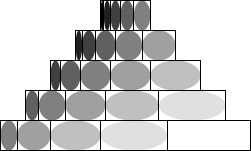
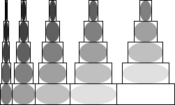
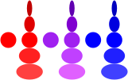

# {{ page.title }} : {{ page.subtitle }}

Summary: {{ page.summary }}

Please save all of your work as `similar-shapes.rkt`.

## Introduction

_Estimated time to read and comprehend: 15--30 minutes._

By this point, you've considered a variety of procedures for making and manipulating some basic shapes, such as circles and squares (or, more generally, ellipses and rectangles).  Suppose we're going to make images that consists of many shapes, but we're not yet sure whether we want, say, solid-color ellipses or outlined solid-color squares.  We might decide to represent the varying parameters as a three-element list consisting of width, height, and color.  Here's one such example.

```
(define red-narrow
  (list 20 10 (rgb 255 0 0)))

(define red-medium
  (list 20 20 (rgb 255 0 0)))

(define red-wide
  (list 20 30 (rgb 255 0 0)))

(define blue-narrow
  (list 20 10 (rgb 0 0 255)))

(define blue-medium
  (list 20 20 (rgb 0 0 255)))

(define blue-wide
  (list 20 30 (rgb 0 0 255)))

(define purple-medium
  (list 20 20 (color-name->rgb "purple")))

(define purple-large
  (list 90 90 (color-name->rgb "purple")))
```

For example, `blue-wide` gives a width, height, and color for a wide blue shape, but doesn't specify what the shape is.

Now, let's suppose that we've written procedures, `solid-ellipse` and `outlined-solid-rectangle`, that expect one of those lists as a parameter.  We could render those parameters procedures we write, such as a solid ellipse with `(solid-ellipse blue-wide)` and as a rectangle with `(outlined-solid-rectangle blue-wide)`.  Here are a few examples.

.

What would those procedures look like?  We know a variety of ways to write such procedures.  Here are four approaches.  

```
;;; (solid-ellipse params) -> image?
;;;   params : shape-params?
;;; Create a solid ellipse based on the shape parameter list.
(define solid-ellipse
  (lambda (params)
    (apply (cut (ellipse <> <> "solid" <>))
           params)))

;;; (outlined-solid-rectangle params) -> image?
;;;   params : shape-params?
;;; Create a solid color rectangle, outline in black, based on the 
;;; parameters.
(define outlined-solid-rectangle
  (lambda (params)
    (overlay
     (rectangle (list-ref params 0)
                (list-ref params 1)
                "outline"
                "black")
     (rectangle (list-ref params 0)
                (list-ref params 1)
                "solid"
                (list-ref params 2)))))

;;; (boxed-solid-ellipse params) -> image?
;;;   params : shape-params?
;;; Create a solid color ellipse, outline in a black rectangle, based 
;;; on the parameters.
(define boxed-solid-ellipse
  (lambda (params)
    (apply boxed-solid-ellipse-helper params)))

;;; (boxed-solid-ellipse-helper width height color) -> image?
;;;   width : non-negative-real?
;;;   height : non-negative-real?
;;;   color : color?
;;; Make a boxed ellipse of the specified width, height, and color.
(define boxed-solid-ellipse-helper
  (lambda (width height color)
    (overlay
     (rectangle width height "outline" "black")
     (ellipse width height "solid" color))))

;;; (solid-right-triangle params) -> image?
;;;   params : shape-params?
;;; Create a solid right-triangle based on the shape parameter list.
(define solid-right-triangle
  (cut (apply (cut (right-triangle <> <> "solid" <>)) <>)))
```

Don't worry if you don't understand the last one; it hurts many people's brains.

How can we use these to make more complex drawings?  By putting the "shape parameter lists" (which we've identified with the `shape-params?` predicate above) into their own lists, and using the techniques we already know.

For example, here's a sequence of the three red shapes, rendered as boxed ellipses.

```
(apply beside (map boxed-solid-ellipse (list red-narrow red-medium red-wide)))
```


And here's a stack of right triangles in three colors.

```
(apply above (map solid-right-triangle (list red-medium purple-medium blue-medium)))
```


Of course, rather than creating lists like these on our own, we can write procedures that do so.  Here's one that takes a shape description and creates five variants of varying widths and "shades".

```
;;; (five-variants params) -> listof shape-params?
;;;   params : shape-params?
;;; Create a list of five shape-params based on the original parameters.
;;; * The first shape is 1/3 the width and much darker.
;;; * The second shape is 1/3 the width and slightly darker.
;;; * The third shape is the same.
;;; * The fourth shape is 4/3 the width and slightly lighter.
;;; * The fifth shape is 5/3 the width and much lighter.
(define five-variants
  (lambda (params)
    (apply five-variants-helper params)))

(define five-variants-helper
  (lambda (width height color)
    (list (list (* 1/3 width) height (rgb-darker (rgb-darker color)))
          (list (* 2/3 width) height (rgb-darker color))
          (list width height color)
          (list (* 4/3 width) height (rgb-lighter color))
          (list (* 5/3 width) height (rgb-lighter (rgb-lighter color))))))
```

We can quickly make make list of variants.

```
> (five-variants (list 30 30 (rgb 128 128 128)))
(list
 (list 10 30 (color 64 64 64 255))
 (list 20 30 (color 96 96 96 255))
 (list 30 30 (color 128 128 128 255))
 (list 40 30 (color 160 160 160 255))
 (list 50 30 (color 192 192 192 255)))
```

And we can render them.

```
> (apply beside
         (map solid-ellipse
              (five-variants (list 30 30 (rgb 128 128 128)))))
```


As we've already learned, there's power in repeating actions.  So we could turn those five shape descriptions into twenty-five with a call to map.

```
> (define twenty-five-grey-things
    (map five-variants (five-variants (list 30 30 (rgb 128 128 128)))))
> twenty-five-grey-things
(list
 (list
  (list 3 1/3 30 (color 0 0 0 255))
  (list 6 2/3 30 (color 32 32 32 255))
  (list 10 30 (color 64 64 64 255))
  (list 13 1/3 30 (color 96 96 96 255))
  (list 16 2/3 30 (color 128 128 128 255)))
 (list
  (list 6 2/3 30 (color 32 32 32 255))
  (list 13 1/3 30 (color 64 64 64 255))
  (list 20 30 (color 96 96 96 255))
  (list 26 2/3 30 (color 128 128 128 255))
  (list 33 1/3 30 (color 160 160 160 255)))
 (list
  (list 10 30 (color 64 64 64 255))
  (list 20 30 (color 96 96 96 255))
  (list 30 30 (color 128 128 128 255))
  (list 40 30 (color 160 160 160 255))
  (list 50 30 (color 192 192 192 255)))
 (list
  (list 13 1/3 30 (color 96 96 96 255))
  (list 26 2/3 30 (color 128 128 128 255))
  (list 40 30 (color 160 160 160 255))
  (list 53 1/3 30 (color 192 192 192 255))
  (list 66 2/3 30 (color 224 224 224 255)))
 (list
  (list 16 2/3 30 (color 128 128 128 255))
  (list 33 1/3 30 (color 160 160 160 255))
  (list 50 30 (color 192 192 192 255))
  (list 66 2/3 30 (color 224 224 224 255))
  (list 83 1/3 30 (color 255 255 255 255))))
```

Unfortunately, we can't convert those to images quite as easily.

```
> (map outlined-solid-rectangle twenty-five-grey-things)
. . rectangle: expects a non negative real number as first argument, given (list 10/3 30 (color 0 0 0 255))
```

Whoops.  It's treating each list as a `shape-params?` rather than as a list.  At least I think it is.

Our goal in this assignment is to write procedures that will help us deal with these nested (perhaps deeply nested) lists of `shape-params?` values.

For example, we will write a procedure, `boxed-solid-ellipses`, that can take a nested list of shape descriptions as a parameter and turn it into a nested list of images.

```

```

We will then write procedures that let us group them together in interesting ways.

```
(sequence-then-stack (boxed-solid-ellipses twenty-five-grey-things))
```




```
(sequence-then-stack (boxed-solid-ellipses twenty-five-grey-things))
```



We will admit that boxed ellipses are not the best shapes to use here.  However, we they help show what's happening, particularly when we end up with a white shape description, as we did in these examples.

Here's another example without the boxes.

```
> (stack-then-sequence (solid-ellipses (list red-medium (five-variants red-medium)
                                             purple-medium (five-variants purple-medium)
                                             blue-medium (five-variants blue-medium))))
```



## Part 1: A `shape-params?` predicate

_Estimated time: 15 minutes._

If we are going to use these "shape parameter lists", we should have a predicate that determines whether something is a shape parameter list.  Such a value is (i), a list, (ii) that contains exactly three elements, (iii) whose first element is a non-negative real number, (iv) whose second element is a non-negative real number, and (v) whose third element is an RGB color.

Document and write a procuedre, `(shape-params? val)`, that takes an Scheme value as a parameter and returns true if it is meets those criteria and false otherwise.

```
(test-true "shape-params?: one of our sample set of parameters" (shape-params? red-narrow))
(test-true "shape-params?: zero width" (shape-params? (list 0 10 (rgb 10 20 30))))
(test-true "shape-params?: zero height" (shape-params? (list 10 0 (rgb 40 50 60))))
(test-false "shape-params?: color name" (shape-params? (list 10 20 "red")))
(test-false "shape-params?: too many elements in list" (shape-params? (list 10 20 (rgb 70 80 90) 10)))
(test-false "shape-params?: only two elements in the list" (shape-params? (list 20 10)))
(test-false "shape-params?: only one element in the list" (shape-params? (list 100)))
(test-false "shape-params?: empty list" (shape-params? (list)))
(test-false "shape-params?: negative width" (shape-params? (list -10 20 (rgb 0 255 0))))
(test-false "shape-params?: negative height" (shape-params? (list 20 -30 (rgb 0 0 255))))
(test-false "shape-params?: integer" (shape-params? 10))
(test-false "shape-params?: string?" (shape-params? "parameters"))
```

## Part 2: Making lists of shape parameters

_Expected time: 30 minutes._

Our `five-variants` procedure is nice, but it's a bit cumbersome to apply.  For example, what if we already have a nested list of `shape-params?` and we want to make five variants of each shape?  We can't just call `five-variants`; you may recall that in our example above, we had to use `map` once we had a list.  But if we have nested lists, `map` won't even work.

We'll do this with a sequence of steps.

First, let's start with a procedure that makes a different set of variants.

a. Document, create at least three tests for, and write a procedure, `(color-variants params)`, that takes `shape-params?` and makes a list of four `shape-params?` values.

* The first should be the original set of values.
* The second should be a redder version of the original set of values.
* The third should be a greener version of the original set of values.
* The fourth should be a bluer version of the original set of values.

You should use the procedures below to make things redder, greener, and bluer.

```
;;; (color-redder c) -> color?
;;;   c : color?
;;; Create a redder version of c.
(define color-redder
  (lambda (c)
    (rgb (+ (color-red c) 16)
         (- (color-green c) 16)
         (- (color-blue c) 16))))

;;; (color-greener c) -> color?
;;;   c : color?
;;; Create a greener version of c.
(define color-greener
  (lambda (c)
    (rgb (- (color-red c) 16)
         (+ (color-green c) 16)
         (- (color-blue c) 16))))

;;; (color-bluer c) -> color?
;;;   c : color?
;;; Create a redder version of c.
(define color-bluer
  (lambda (c)
    (rgb (- (color-red c) 16)
         (- (color-green c) 16)
         (+ (color-blue c) 16))))
```

Here's one test.

```
(test-equal? "color-variants: Middle grey"
             (color-variants (list 30 30 (rgb 128 128 128)))
             (list (list 30 30 (rgb 128 128 128))
                   (list 30 30 (color-redder (rgb 128 128 128)))
                   (list 30 30 (color-greener (rgb 128 128 128)))
                   (list 30 30 (color-bluer (rgb 128 128 128)))))
```

b. Write a procedure, `(color-variants-0 stuff)`, that takes a list of `shape-params?` values as a parameter and applies `color-variants` to each of them.

```
;;; (color-variants-0 stuff) -> listof (listof shape-params?)
;;;   stuff : listof shape-params?
;;; Apply `color-variants` to each element of stuff.
```

_Hint_: Use `map`.

c. Write a procedure, `(color-variants-1 stuff)`, that takes a slightly nested list of `shape-params?` values as a parameter and applies `color-variants` to each `shape-params?`, whether it's in the top-level list or in one of the 

By "slightly nested list of `shape-params?` values", we mean a list that contains only

* `shape-params?` values or
* lists of `shape-params?` values.

Since we have only two options, you may assume that anything that isn't a `shape-params?` value must be a list of `shape-params?` values.

_Hint_: Write a helper procedure that checks whether its parameter is a `shape-params?" or not.  If it is, apply `color-variant`.  If not, apply `color-variants-0`.  (Note: Even though we say "apply"; you shouldn't need to use the `apply` procedure; just apply directly.)

_Note_: Here and elsewhere, you may assume that procedures are given correct inputs.  For example, you won't get an integer or a list that contains other values as input to `color-variants-1`.

```
;;; (color-variants-1 stuff) -> list-of (list-of (list-of shape-params?))
;;;   stuff : list-of (either shape-params? (list-of shape-params?))
;;; Apply color-variants-1 to each shape-params? in stuff.
```

d. Write a procedure, `(color-variants-2 stuff)`, that takes a potentially doubly-nested list of `shape-params?` values as a parameter and applies `color-variants` to any `shape-params?` values that appear within the list.

By "potentially doubly-nested list of `shape-params?` values, we mean one in which each element is either

* A `shape-params?` value or
* A slightly-nested list of `shape-params?` values.

Since we only have two options, you may assume that anything that isn't a `shape-params?` value must be a slightly-nested list of `shape-params?` values, which means that you can apply `color-variants-1` to that list.

_Hint_: Write a helper procedure that checks whether its parameter is a `shape-params?" or not.  If it is, apply `color-variant`.  If not, apply `color-variants-1`. 

e. Have you noticed a pattern here?  Let's write a general version of these procedures.  Write a procedure `(color-variants-all stuff)`, that takes an _arbitrarily nested_ list of `shape-params?` values as a parameter and applies `color-variants` to each `shape-params?` value, no matter how deeply nested it is.

Note that each element of an "_arbitrarily nested_ list of `shape-params?` values is either:

* a `shape-params?` value or
* a simpler arbitrarily nested list of `shape-params?` values.

Since we only have two options, you may assume that anything that isn't a `shape-params?` value must be a simpler nested list of `shape-params?` values.

Sorry, you don't get a hint for this one.

_This procedure is not necessary for an **M**, only for an **E**._

## Part 3: From lists to shapes

_Estimated time: 30 minutes._

a. Document and write a procedure, `(solid-ellipses-0 list-of-params)`, that takes a list of shape parameters as input and returns a list of solid ellipses determined by the corresponding parameters.

Here and elsewhere, you may assume that the procedure is only given correct inputs.

```
> (define red-params (list red-narrow red-medium red-wide))
> (solid-ellipses-0 red-params)
(list . . .) 
; Image forthcoming: A list of a narrow red ellipse, a red circle,
; and a wide red ellipse.
```

Hint: Use `map`.

b. Document and write a procedure, `(solid-ellipses-1 stuff)`, that takes as a parameter a list that consists of both shape parameters _and_ lists of shape parameters and turns each individual shape parameter (whether nested or not) into an ellipse.

Here and elsewhere, you may assume that the procedure is only given correct inputs.

```
> (define red-params (list red-narrow red-medium red-wide))
> (define blue-params (list blue-narrow blue-medium blue-wide))
> (solid-ellipses-1 (list red-params
                          purple-medium
                          blue-params))
(list (list . . .) . (list . . .)) ; Image forthcoming.
```

Hint: Write a helper procedure that checks whether its parameter is a set of shape paramerters.  If so, use `solid-ellipse`.  If not, it must be a list, so use `solid-ellipses-0`.

c. Document and write a procedure, `(solid-ellipses-2 stuff)`, that takes as a parameter a list that consists of

* Individual shape parameters
* Lists of either (i) individual shape parameters or (ii) lists of shape parameters.

```
> (define red-params (list red-narrow red-medium red-wide))
> (solid-ellipses-2 (list (list red-params (reverse red-params) red-params)
                          red-params
                          red-medium))
(list (list (list . . .) (list . . .) (list . . .)) (list . . .) .)
```

Hint: Write a helper procedure that checks whether its parameter is a set of `shape-params?` values.  If so, use `solid-ellipse`.  If not, it must be a list, so use `solid-ellipses-1`.

d. It feels like it's time to generalize, doesn't it?  Write a procedure, `(solid-ellipses stuff)`, that takes an _arbitrarily nested_ list of color-parameters and turns each into the corresponding ellipse.

```
> (solid-ellipses (list (list red-params (reverse red-params) red-params)
                        (list red-medium (list red-params red-medium))
                        red-medium))

(list (list (list . . .) (list . . .) (list . . .)) (list . (list (list . . .) .)) .)
```

_This procedure is only necessary for an E._

e. Now that we've written `solid-ellipses`, it feels like we should be able to write similar procedures for the other shapes. 

i. Write a procedure, `(solid-right-triangles stuff)`, that takes an _arbitrarily nested_ list of color-parameters and turns each into the corresponding right triangle.

ii. Write a procedure, `(boxed-solid-ellipses stuff)`, that takes an _arbitrarily nested_ list of color-parameters and turns each into the corresponding boxed solid ellipse.

iii. Write a procedure, `(outlined-solid-rectangles stuff)`, that takes an _arbitrarily nested_ list of color-parameters and turns each into the corresponding outlined solid rectangle.

_These procedures are only necessary for an E._

## Part 4: Combining images

_Estimated time: 30 minutes._

We can now build complex nested lists of images.  As you might expect, we'd like to be able to convert these nested lists to a single image.

a. Write a procedure, `(stack images)`, that takes a list of images as a parameter and returns a single image in which each image in the list is placed above the next.  In this case, your input list is not nested; it is the output from a procedure like `solid-ellipses-0`.

b. Write a procedure, `(sequence images)`, that takes a list of images as a parameter and returns a single image in which each image in the list is placed next to the subsequent images.  Once again, in this case, your input list is not nested.

c. Write a procedure, `(stack-then-sequence stuff)`, that takes a singly nested list of images as a parameter and returns an image in which each sublist is stacked and then the stacks are placed next to each other.  You can assume that your input to this is something like the output from `solid-ellipses-1`.  

Note that, as in the case of `solid-ellipses-1`, you will likely want to write a helper procedure.  In this case, it should check whether the parameter is an image or not.  If it's an image, you can leave it as is.  If it's a list, you probably want to stack it.  After applying that helper to each element of `stuff`, you can put them beside each other.

d. Write a procedure, `(sequence-then-stack stuff)`, that takes a singly nested list of images as a parameter and returns an image in which each sublist is stacked and then the stacks are placed next to each other.  You can assume that your input to this is something like the output from `solid-ellipses-1`.  

e. Write a procedure, `(sequence-then-stack-then-sequence stuff)`, that takes a doubly-nested list as input.  You should be able to guess what it should do.

f. Write a procedure, `(stack-then-sequence-then-stack stuff)`, that takeks a doubly-nested list as input.  You should be able to guess what it should do.

g. It's time to generalize.  Write procedures `(stacked-ss stuff)` and `(sequenced-ss stuff)`, that take arbitrarily nested lists of images as input and either (a) sequence then stack then ... then stack the images (for `stacked-ss`) or (b) stack then sequence then .. then sequence the images (for `sequenced-ss`).  _This procedure is only necessary for an E._

Note that, in contrast to the prior procedures, the names of the procedures indicate what we do at the "top level".

_Hint_: You should consider using `sequenced-ss` as a helper for `stacked-ss` and vice versa.  This technique is called "mutual recursion".

## Part 5: Freestyle

_Estimated time: 15--30 minutes._

Using these procedures and any others you write, create an interesting image which you should call `freestyle`.

```
(define freestyle (stacked-ss ...))
```

To earn an E, you will need to write your own variants of the procedures in parts 2, 3, and 4.

Grading rubric
--------------

### Redo or above

Submissions that lack any of these characteristics will get an I.

```
[ ] Passes all of the one-star autograder tests.
[ ] Includes the specified file, `similar-shapes.rkt`.
[ ] Includes an appropriate header on the file that indicates the
    course, author, etc.
[ ] Acknowledges appropriately.
[ ] Code runs in DrRacket.
[ ] Most procedures are documented in some form.
```

### Meets expectations or above

Submissions that lack any of these characteristics but have all of the
prior characteristics will get an R.

```
[ ] Passes all of the two-star autograder tests.  For example,
    [ ] Correctly mplements `shape-params?`.
    [ ] Correctly implements `solid-ellipses-0`.
    [ ] Correctly implements `solid-ellipses-1`.
    [ ] Correctly implements `solid-ellipses-2`.
    [ ] Correctly implements `stack`.
    [ ] Correctly implements `sequence`.
    [ ] Correctly implements `stack-then-sequence`.
    [ ] Correctly implements `sequence-then-stack`.
    [ ] Correctly implements `stack-then-sequence`.
    [ ] Correctly implements `sequence-then-stack-then-sequence`.
    [ ] Correctly implements `stack-then-sequence-then-stack`.
[ ] Code is well-formatted with appropriate names and indentation.
[ ] Code has been reformatted with Ctrl-I before submitting.
[ ] Code generally follows style guidelines.
[ ] Documentation for all core procedures is correct / has the correct form.
[ ] Creates an image called `freestyle`.
```

### Exemplary / Exceeds expectations

Submissions that lack any of these characteristics but have all of the
prior characteristics will get an M.

```
[ ] Passes all of the three-star autograder tests.  For example,
    [ ] Correclty implements `color-variants-all`.
    [ ] Correctly implements `solid-ellipses`.
    [ ] Correctly implements `solid-right-triangles`.
    [ ] Correctly implements `boxed-solid-ellpises`.
    [ ] Correctly implements `outlined-solid-rectangles`.
    [ ] Correctly implements `stacked-ss`.
    [ ] Correctly implements `sequenced-ss`.
[ ] Adds a new procedure akin to `color-variants`.  That is, adds a 
    procedure that takes a `color-params?` as a parameter and creates
    a list of `color-params?` (or list of lists of ....)`.
[ ] Adds a new procedure akin to `solid-ellipse`, `solid-right-triangle`, etc.
    That is, adds a procedure that takes a nested list of `color-params?`
    as a parameter and creates a list of similar shapes.
[ ] Adds a new procedure akin to `stacked-ss` or `sequenced-ss` (e.g.,
    overlaying or combining diagonally).  That is, adds a procedure that
    takes a nested-list of shapes as a parameter and builds an image
    from them (other than by using `stacked-ss` or `sequenced-ss`).
[ ] Style is impeccable (or nearly so).
[ ] Avoids repeated work.
[ ] Documentation for all procedures is correct / has the correct form.
```

## Q&A

_Forthcoming._
