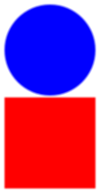
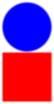

# {{ page.title }} : {{ page.subtitle }}

_Name your file for this assignment `pixel-problems.rkt`._

As you may recall from your recent work, we can treat each image as a width-by-height grid of colors.  We call such a structure a "bitmap".  Bitmaps provide a variety of useful procedures.

```
;;; (create-bitmap func width height) -> bitmap?
;;;   func : a procedure that takes two non-negative integers as input
;;;          and returns a color
;;;   width : positive-integer?
;;;   height : positive-integer?
;;; Creates a new `width`-by-`height` bitmap by applying `func` to
;;; each (col,row) coordinate to determine the color at that position.
```

```
;;; (bitmap-pixel bitmap col row) -> color?
;;;   bitmap : bitmap?
;;;   col : non-negative-integer? (less than (bitmap-width bitmap))
;;;   row : non-negative-integer? (less than (bitmap-height bitmap))
;;; Get the color of the pixel at position (`col`,`row`) in `bitmap`.
```

```
;;; (bitmap-set-pixel! bitmap col row color) -> void?
;;;   bitmap : bitmap?
;;;   col : non-negative-integer? (less than (bitmap-width bitmap))
;;;   row : non-negative-integer? (less than (bitmap-height bitmap))
;;;   color : color?
;;; Set the color of the pixel at position (`col`,`row`) in `bitmap`.
```

```
;;; (bitmap->image bitmap) -> image?
;;;   bitmap : bitmap?
;;; Convert a bitmap into an image.  (E.g., so that we can rotate,
;;; overlay, scale, etc.)
```

```
;;; (image->bitmap image) -> bitmap?
;;;   image : image?
;;; Convert an image into a bitmap.  (E.g., so that we can get and
;;; set pixels.)
```

```
;;; (bitmap-width bitmap) -> positive-integer?
;;;   bitmap : bitmap?
;;; Determine the width of a bitmap.
```

```
;;; (bitmap-height bitmap) -> positive-integer?
;;;   bitmap : bitmap?
;;; Determine the height of a bitmap.
```

Part one: Similar bitmaps
-------------------------

_Estimated time: 15--30 minutes._

Although we can often tell if two images are identical using `equals?`, that approach may not work for more complex images, such as our fractals.  Is there a way to determine if two images are "similar"?  Here's one possible approach.

> Two images are similar if (a) they have the same width and height and (b) the corresponding pixels in a high percentage of N randomly sampled locations are similar.

Of course, that brings up the question of what it means for two pixels (or two colors) to be similar.  We'll look at it in terms of the distance between the colors.  What's do we mean by "distance"?  We can treat a color as a point in three space.  The distance between two colors is therefore their distance in three space: the square root of the sum of the squares of the differences of the individual pixels.

Unfortunately, computing square roots is slow.  So we'll use "squared distance" instead.

```
;;; (color-distance-squared c1 c2) -> integer?
;;;    c1 : color?
;;;    c2 : color?
;;; Find the square of the color distance between c1 and c2.
(define color-distance-squared
  (lambda (c1 c2)
    (+ (sqr (- (color-red c1) (color-red c2)))
       (sqr (- (color-green c1) (color-green c2)))
       (sqr (- (color-blue c1) (color-blue c2))))))

;;; (color-distance c1 c2) -> real?
;;;   c1 : color?
;;;   c2 : color?
;;; Find the color distance between c1 and c2.
(define color-distance
  (lambda (c1 c2)
    (sqrt (color-distance-squared c1 c2))))
```

a. Document and write a procedure, `(colors-similar? c1 c2)`, that determines whether two colors are similar (in that their squared distance is less than 400).

b. Document and write a procedure, `(bitmaps-similar? b1 b2 n)`, that checks whether bitmaps `b1` and `b2` are similar in that (a) the widths of `b1` and `b2` are the same,, (b) the heights of `b1` and `b2` are the same, and (c) 90% of pixels sampled from `n` random locations in `b1` and `b2` are similar.

c. Document and write a procedure, `(images-similar? i1 i2)`, that checks whether images `i1` and `i2` are similar in that (a) the widths of `i1` and `i2` are the same, (b) the heights of `i1` and `i2` are the same, and (c) 90% of pixels sampled from approximately 1% of the pixel locations in `i1` and `i2` are similar.  For example, if our image is 512x1024, we should sample about 5,243 random locations.  (512x1024 = 524,288.)

Part two: Bitmaps as vectors
----------------------------

_Estimated time: 30 minutes._

As you may recall, we can think of a bitmap in terms of a grid of pixels.  Each pixel in the grid is indexed by a column and a row.

```
       0     1     2     3              w-2   w-1
    +-----+-----+-----+-----+- .... -+-----+-----+
 0  | 0,0 | 1,0 | 2,0 | 3,0 |        |w-2,0|w-1,0|
    |     |     |     |     |        |     |     |
    +-----+-----+-----+-----+- .... -+-----+-----+
 1  | 0,1 | 1,1 | 2,1 | 3,1 |        |w-2,1|w-1,1|
    |     |     |     |     |        |     |     |
    +-----+-----+-----+-----+- .... -+-----+-----+
 2  | 0,2 | 1,2 | 2,2 | 3,2 |        |w-2,2|w-1,2|
    |     |     |     |     |        |     |     |
    +-----+-----+-----+-----+- .... -+-----+-----+
    |  .  |  .  |  .  |  .  |        |  .  |  .  |
       .     .     .     .              .     .
    |  .  |  .  |  .  |  .  |        |  .  |  .  |
    +-----+-----+-----+-----+- .... -+-----+-----+
h-2 |0,h-2|1,h-2|2,h-2|3,h-2|        |w-2, |w-1, | 
    |     |     |     |     |        | h-2 | h-2 |
    +-----+-----+-----+-----+- .... -+-----+-----+
h-1 |0,h-1|1,h-1|2,h-1|3,h-1|        |w-2, |w-1, |
    |     |     |     |     |        | h-1 | h-1 |
    +-----+-----+-----+-----+- .... -+-----+-----+
```

We can turn a bitmap into a single $w\times h$ vector of pixels by putting each row next to the previous one.

```
  0      1     2             w-1    w    w+1           w+w-1  w+w  w+w+1
+-----+-----+-----+- .... -+-----+-----+-----+- .... -+-----+-----+-----+- ...
| 0,0 | 1,0 | 2,0 |        |w-1,0| 0,1 | 1,1 |        |w-1,1| 0,2 | 1,2 |
+-----+-----+-----+- .... -+-----+-----+-----+- .... -+-----+-----+-----+- ...
```

As you may be able to tell, the pixel at `(c,r)` can be found at $c + (r\times w)$.

Knowing this, we can write procedures that convert bitmaps to pixels and vice versa.

```
;;; (bitmap->vector bitmap) -> vector-of color?
;;;   bitmap : bitmap?
;;; Convert a bitmap to a vector of colors in row-major order.
(define bitmap->vector
  (lambda (bitmap)
    (let* ([w (bitmap-width bitmap)]
           [h (bitmap-height bitmap)]
           [pixels (make-vector (* w h) (rgb 0 0 0))])
      (bitmap->vector/helper! bitmap pixels w h 0 0)
      pixels)))

;;; (bitmap->vector/helper bitmap vec w h c r) -> void?
;;;   bitmap : bitmap?
;;;   vec : vector-of color? (size w*h)
;;;   w : non-negative-integer? (= (vector-width bitmap))
;;;   h : non-negative-integer? (= (vector-height bitmap))
;;;   c : non-negative-integer? ("column")
;;;   r : non-negative-integer? ("row")
;;; Copy the pixels from (c,r) to (w,h) of bitmap into vec.
(define bitmap->vector/helper!
  (lambda (bitmap pixels w h c r)
    (cond
      ; If we reach the end of a row, move on to the next one.
      [(>= c w)
       (bitmap->vector/helper! bitmap pixels w h 0 (+ r 1))]
      ; If we reach the end of the last row, we're done.
      [(>= r h)
       (void)]
      ; Otherwise, we copy the pixel at (c,r) and continue.
      [else
       (vector-set! pixels (+ c (* r w)) (bitmap-pixel bitmap c r))
       (bitmap->vector/helper! bitmap pixels w h (+ c 1) r)])))

;;; (vector->bitmap pixels w h) -> bitmap?
;;;   pixels : vector-of color? (size w*h)
;;;   w : positive-integer?
;;;   h : positive-integer?
;;; Convert a vector of colors into a bitmap
(define vector->bitmap
  (lambda (pixels w h)
    (cond
      [(not (= (vector-length pixels) (* w h)))
       (error "vector->bitmap: incorrect size vector")]
      [else
       (let* ([base-color (rgb 128 128 128)]
              [bitmap (create-bitmap (lambda (c r) base-color) w h)])
         (vector->bitmap/helper! pixels bitmap w h 0 0)
         bitmap)])))

;;; (vector->bitmap/helper! pixels bitmap w h c r) -> void?
;;;   pixels : vector-of color? (size is w*h)
;;;   bitmap : bitmap?
;;;   w : non-negative-integer? (= (vector-width bitmap))
;;;   h : non-negative-integer? (= (vector-height bitmap))
;;;   c : non-negative-integer? ("column")
;;;   r : non-negative-integer? ("row")
;;; Copy the pixels from (c,r) to (w,h) of bitmap into vec.
(define vector->bitmap/helper!
  (lambda (pixels bitmap w h c r)
    (cond
      ; If we reach the end of a row, move on to the next one.
      [(>= c w)
       (vector->bitmap/helper! pixels bitmap w h 0 (+ r 1))]
      ; If we reach the end of the last row, we're done.
      [(>= r h)
       (void)]
      ; Otherwise, we copy the pixel to (c,r) and continue.
      [else
       (bitmap-set-pixel! bitmap c r (vector-ref pixels (+ c (* r w))))
       (vector->bitmap/helper! pixels bitmap w h (+ c 1) r)])))
```

a. Write the following procedure:

```
;;; (set-row! pixels width height row color) -> void?
;;;   pixels : vector-of color? (length is width*height)
;;;   width : positive-integer? (represents the width of the image)
;;;   height : positive-integer? (represents the height of the image)
;;;   row : non-negative integer?
;;;   color : color?
;;; Sets the given row of the image to the specified color.
```

Here's a quick experiment you might try with the procedure.

```
> (define pixels (bitmap->vector (image->bitmap (rectangle 4 6 "solid" "blue"))))
> (set-row! pixels 4 6 1 (rgb 255 255 255))
> (scale 10 (bitmap->image (vector->bitmap pixels 4 6)))
> (set-row! pixels 4 6 2 (rgb 0 0 0))
> (scale 10 (bitmap->image (vector->bitmap pixels 4 6)))
```

_Hint_: Write a helper procedure that recurses over the column.

b. Write the following procedure.

```
;;; (set-rows! pixels width height initial final color) -> void?
;;;   pixels : vector-of color? (length is width*height)
;;;   width : positive-integer? (represents the width of the image)
;;;   height : positive-integer? (represents the height of the image)
;;;   initial: non-negative integer?
;;;   final: non-negative integer?
;;;   color : color?
;;; Sets the rows between initial (inclusive) to final (exclusive)
;;; to the given color.
```

_Hint_: Write a helper procedure that recurses over the row, calling
`set-row!` for each row.

c. Write the following procedure.

```
;;; (set-column! pixels width height column color) -> void?
;;;   pixels : vector-of color? (length is width*height)
;;;   width : positive-integer? (represents the width of the image)
;;;   height : positive-integer? (represents the height of the image)
;;;   column : non-negative integer?
;;;   color : color?
;;; Sets the given column of the image to the specified color.
```

Here's a quick experiment you might try with the procedure.

```
> (define pixels (bitmap->vector (image->bitmap (rectangle 4 6 "solid" "blue"))))
> (set-column! pixels 4 6 1 (rgb 255 255 255))
> (scale 10 (bitmap->image (vector->bitmap pixels 4 6)))
> (set-column! pixels 4 6 2 (rgb 0 0 0))
> (scale 10 (bitmap->image (vector->bitmap pixels 4 6)))
```

_Hint_: Write a helper procedure that recurses over the row.

d. Write the following procedure.

```
;;; (set-columns! pixels width height initial final color) -> void?
;;;   pixels : vector-of color? (length is width*height)
;;;   width : positive-integer? (represents the width of the image)
;;;   height : positive-integer? (represents the height of the image)
;;;   initial: non-negative integer?
;;;   final: non-negative integer?
;;;   color : color?
;;; Sets the columns between initial (inclusive) to final (exclusive)
;;; to the given color.
```

_Hint_: Write a helper procedure that recurses over the column, calling
`set-column!` for each column.

Part three: Blurring images
---------------------------

_Estimated time: 60 minutes._

_This part is only necessary for an E._

Document and write a procedure, `(blur image)`, that takes an image as input and "blurs" the image by average the nine pixels around each location.  Your procedure will return a new image.

You can skip the pixels on the border of the image (they don't have surrounding pixels on each side).

You may choose to implement this procedure by converting to a vector, working with the vector, and then converting back.  You might also choose to implement this procedure by converting to a bitmap, working with the bitmap, and then converting back.

Here's a procedure that may help.

```
;;; (average-color colors) -> color?
;;;   colors : list-of? color, nonempty?
;;; Average the colors in the list.
(define average-color
  (lambda (colors)
    (let ([len (length colors)])
      (rgb (quotient (reduce + (map color-red colors)) len)
           (quotient (reduce + (map color-green colors)) len)
           (quotient (reduce + (map color-blue colors)) len)))))
```

Here's a simple image to blur.

```
(define img (overlay (above (circle 50 "solid" "blue")
                            (rectangle 100 2 "solid" "white")
                            (square 100 "solid" "red"))
                     (rectangle 110 212 "solid" "white")))
```

Here are five stages of blurring the image.







Part four: Steganography
------------------------

_Estimated time: 60 minutes._

_Steganography_ is a technique for hiding information within a larger corpus.  For example, some people conceal messages in letters by using, say, each fifth letter in the original message to represent a new message.  (I'm not talented enough to give an example.)

Since our eyes can't always distinguish nearby colors, images can often be a good host for hidden information; we modify the image to add information at each pixel, or each few pixels.

Here's one approach for doing so: We develop a mechanism for converting the sum of components in each pixel to a letter.  To hide a message in an image, we then convert each pixel so that it has the right sum.

We'll use a simple mapping of the numbers 0 .. 31 to letters.

* 0: end of message
* 1: a
* 2: b
* 3: c
* 4: d
* 5: e
* ...
* 20: t
* 21: u
* 22: v
* 23: w
* 24: x
* 25: y
* 26: z
* 27: period
* 28: space
* 29: newline
* 30: reserved for future use (use underscore for now)
* 31: reserved for future use (use underscore for now)

How do we convert the components to a number?  We can add them up then take the remainder when divided by 32.

Suppose we want to encode the word "cat" in our image, and that the first four pixels in the image are `(rgb 255 100 10)`, `(rgb 255 100 255)`, `(rgb 255 100 10)`, and `(rgb 100 200 128)`.  The sum of the components in the first pixel are 365.  `(remainder 365 32)` is 13.  We want it to be 3 (the letter c).  So we need to subtract ten from the components.  Perhaps we use `(rgb 248 98 9)`.  Let's check.

```
> (remainder (+ 248 98 9) 32)
3
```

We could also have used `(rgb 255 100 10)` or `(rgb 251 97 7)` or any other way of subtracting ten.

On to the next pixel.  

```
> (remainder (+ 255 100 255) 32)
2
```

That one's pretty close.  We want a remainder of 1 for an a.  So we can convert the color to `(rgb 254 100 255)`.

The next pixel is the same color, which gives a remainder of 2.  We need to get it all the way to 20 for a `t`.  So we could add 18 to the 100 and use `(rgb 255 118 255)`.  

```
> (remainder (+ 255 118 255) 32)
20
```

Alternately, we could subtract 14 (perhaps 6 from the red, 2 from the green, and 6 from the blue).

```
> (remainder (+ 249 98 249) 32)
20
```

How do we decide whether to add or subtract?  That's up to you.  Since we have to subtract from white and we have to add to black, it might be easiest to subtract from colors whose components sum to more than $127\times 3$ and add to colors whose components sum to less than that.

Last up is the "end of message" value, 0.  Let's see where we start.

```
> (remainder (+ 100 200 128) 32)
12
```

Using the most recent policy, that suggests we should subtract.

```
> (remainder (+ 96 196 124) 32)
0
```

We're done.  At least we're done with the example.  Now it's time to write some helpful procedures.

a. Document, write tests for, and write a procedure, `(color->letter color)`, that uses the "add the components, take the remainder, look it up in the table above" approach to find the letter that corresponds to a color.  (You can use `#\nul` for "end of input".)

```
> (color->letter (rgb 0 0 0))
#\nul
> (color->letter (rgb 33 0 0))
#\a
> (color->letter (rgb 32 (+ 32 27) 0))
#\.
> (color->letter (rgb 32 64 (+ 128 28)))
#\space
> (color->letter (rgb 32 64 (+ 128 29)))
#\newline
> (color->letter (rgb 32 64 (+ 128 30)))
#\_
> (color->letter (rgb 32 64 (+ 128 31)))
#\_
```

b. Document and write a procedure, `(extract-text pixels)`, that takes a vector of colors as input, reads all of the letters (using `color->letter`) until it hits `#\nul`, and then puts them together into a string.  If there's no `#\nul`, 

```
> (extract-text
   (bitmap->vector
    (create-bitmap (lambda (c r) (rgb (+ 1 c r) 0 0)) 32 2)))
"abcdefghijklmnopqrstuvwxyz. \n__"
> (extract-text
   (bitmap->vector
    (create-bitmap (lambda (c r) (rgb (+ 1 c r) 0 0)) 16 4)))
. . vector-ref: index is out of range
  index: 64
  valid range: [0, 63]
  vector: (vector (color 1 0 0 255) (color 2 0 0 255) (color 3 0 0 255) (color 4 0 0 255) (color 5 0 0 255) (color 6 0 0 255) (color 7 0 0 255) (color 8 0 0 255) (color 9 0 0 255) (color 10 0 0 255) (color 11 0 0 255) (color 12 0 0 255) (color 13 0 0 255) (...
; We never hit a zero, so this crashes.  That's okay.
> (extract-text
   (bitmap->vector
    (create-bitmap (lambda (c r) (rgb (+ 14 c r) 0 0)) 16 4)))
"nopqrstuvwxyz. \nopqrstuvwxyz. \n_pqrstuvwxyz. \n__qrstuvwxyz. \n__"
```

c. Document and write a procedure, `(steg-decode img)`, that takes an image as an input and "decodes" hidden text using `extract-text`.

```
> (steg-decode (overlay (circle 5 "solid" "black")
                        (square 10 "solid" (rgb 1 0 0))))
"aaa"
```

d. Document, write tests for, and write a procedure, `(letter->color letter color)`, that takes a letter and a color as input and converts the color to a nearby color for which `color->letter` returns the letter.  You may assume that `color->letter` uses the encoding system we just described.

```
; I've chosen to use a somewhat randomized letter->color.  You need not
; do so.
> (letter->color #\g (rgb 0 0 0))
(color 1 4 2 255)
> (letter->color #\g (rgb 0 0 0))
(color 2 2 3 255)

; This requires a bit more checking (at least for me)
> (letter->color #\t (rgb 255 255 255))
(color 251 251 254 255)
> (remainder (+ 251 251 254) 32)
20

; Perhaps this is a better way to check.
> (color->letter (letter->color #\q (rgb 128 128 128)))
#\q
> (color->letter (letter->color #\q (rgb 0 0 0)))
#\q
> (color->letter (letter->color #\q (rgb 255 255 255)))
#\q
> (color->letter (letter->color #\nul (rgb 255 255 255)))
#\nul
```

e. Document and write a procedure, `(insert-text! text pixels)`, that takes a string and vector of colors as input and updates the colors in `pixels` so that they encode the text.

```
> (define example (make-vector 6 (rgb 0 0 255)))
> (insert-text! "cat" example)
> example
(vector (color 2 2 255 255) (color 1 1 255 255) (color 11 10 255 255) (color 0 1 255 255) (color 0 0 255 255) (color 0 0 255 255))
; Note that we changed *four* colors.  We needed to insert the null, too
> (extract-text example)
"cat"
> (let ([aphorism (make-vector 128 (rgb 128 128 128))])
    (insert-text! "there is more to life than computer science." aphorism)
    (extract-text aphorism))
```

f. Document and write a procedure, `(steg-encode text img)`, that takes a string and an image as input and "encodes" the text in the image using the specified technique.  `steg-encode` should return a new image.

```
> (steg-decode (steg-encode "there is more to life than computer science"
               (circle 20 "solid" "blue")))
"there is more to life than computer science"
```

Part five: Freestyle
--------------------

_Estimated time: 30 minutes._

Document and write a procedure that does something "interesting" using the vector representation of an image.

Grading rubric
--------------

Note: You should save your file as `pixel-problems.rkt`.

### Redo or above

Submissions that lack any of these characteristics will get an I.

```
[ ] Passes all of the one-star autograder tests.
[ ] Includes the specified file, `pixel-problems.rkt`.
[ ] Includes an appropriate header on the file that indicates the
    course, author, etc.
[ ] Acknowledges appropriately.
[ ] Code runs in DrRacket.
[ ] Includes at least one test for `color->letter`.
[ ] Includes at least one test for `letter->color`.
[ ] Includes something for part five.
```

### Meets expectations or above

Submissions that lack any of these characteristics but have all of the
prior characteristics will get an R.

```
[ ] Passes all of the two-star autograder tests.
[ ] Code is well-formatted with appropriate names and indentation.
[ ] Code has been reformatted with Ctrl-I before submitting.
[ ] Code generally follows style guidelines.
[ ] All primary procedures are documented in the correct form.
[ ] Includes at least three normal tests and three edge cases
    for `color->letter`.
[ ] Includes at least three normal tests and three edge cases
    for `letter->color`.
```

### Exemplary / Exceeds expectations

Submissions that lack any of these characteristics but have all of the
prior characteristics will get an M.

```
[ ] Passes all of the three-star autograder tests.
[ ] Style is impeccable (or nearly so).
[ ] Avoids repeated work.  In particular, avoids identical recursive calls.
[ ] Documentation for all procedures (including helper procedures) is 
    correct / has the correct form.
[ ] Implements `blur` (and passes tests).
[ ] Freestyle procedure is non-trivial.
[ ] Freestyle procedure is described appropriately.
```

Questions
---------

When I'm writing `blur`, what should I do to ensure that I don't use the new color at the spots above me and to my left?

> Put the result into a new vector.

Do you have hints on how I can recurse over positions?

> Look at `bitmap->vector` for one strategy.

What helpers might I write for `blur`?

> I would write `(vector-get-pixel pixels width height col row)`,
  `(vector-set-pixel! pixels width height col row color)`, 
  `(vector-neighboring-pixels pixels width height color row)` ,
  and `(pos->index width height col row)` for starters.

> I found it helpful to start with `vector-blur` (and a 
  `vector-blur-kernel`), then use that to build `bitmap-blur`, and
  then use that to build `blur`.

Do we represent newlines with `#\newline`?

> Yes.  And spaces with `#\space`.

I don't see newlines in my strings.

> Newlines show up as `\n` in strings.

What charaacters should I use for 30 and 31?

> Underscore, `#\_`.
