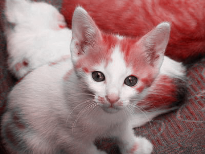

You will create only one file for this mini-project, `image-transformations.rkt`. You should begin your project with [this starter code](../code/mps/image-transformations.rkt)

_Warning! This MP is still under development. However, the only major changes anticipated are to the rubric._

```

> (list (rgb 255 0 0) (rgb 0 255 0) (rgb 0 0 255))
'(  )
Hello != Goodbye
```

```
> (set-hue kitten 0)

```

