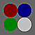

Name your file for this assignment [`pixel-problems.scm`](../code/mps/pixel-problems.scm). Please make sure to begin with the [starter code](../code/mps/pixel-problems.scm).

## Background

As you may recall from your recent work, we can envision each image as a width-by-height grid of colored "pixels".  We call such a structure a "bitmap".  As you might expect, each pixel in the grid is indexed by a column and a row. Here's a diagram of the indices in a `w`-by-`h` bitmap.

```
       0     1     2     3              w-2   w-1
    +-----+-----+-----+-----+- .... -+-----+-----+
 0  | 0,0 | 1,0 | 2,0 | 3,0 |        |w-2,0|w-1,0|
    |     |     |     |     |        |     |     |
    +-----+-----+-----+-----+- .... -+-----+-----+
 1  | 0,1 | 1,1 | 2,1 | 3,1 |        |w-2,1|w-1,1|
    |     |     |     |     |        |     |     |
    +-----+-----+-----+-----+- .... -+-----+-----+
 2  | 0,2 | 1,2 | 2,2 | 3,2 |        |w-2,2|w-1,2|
    |     |     |     |     |        |     |     |
    +-----+-----+-----+-----+- .... -+-----+-----+
    |  .  |  .  |  .  |  .  |        |  .  |  .  |
       .     .     .     .              .     .
    |  .  |  .  |  .  |  .  |        |  .  |  .  |
    +-----+-----+-----+-----+- .... -+-----+-----+
h-2 |0,h-2|1,h-2|2,h-2|3,h-2|        |w-2, |w-1, | 
    |     |     |     |     |        | h-2 | h-2 |
    +-----+-----+-----+-----+- .... -+-----+-----+
h-1 |0,h-1|1,h-1|2,h-1|3,h-1|        |w-2, |w-1, |
    |     |     |     |     |        | h-1 | h-1 |
    +-----+-----+-----+-----+- .... -+-----+-----+
```

You'll note that columns run from 0 to `w`-1 and rows run from 0 to `h`-1.

We can turn a bitmap into a single `w*h` vector of pixels by putting each row next to the previous one.

```
  0      1     2             w-1    w    w+1           w+w-1  w+w  w+w+1
+-----+-----+-----+- .... -+-----+-----+-----+- .... -+-----+-----+-----+- ...
| 0,0 | 1,0 | 2,0 |        |w-1,0| 0,1 | 1,1 |        |w-1,1| 0,2 | 1,2 |
+-----+-----+-----+- .... -+-----+-----+-----+- .... -+-----+-----+-----+- ...
```

As you may be able to tell, the pixel at position `(c,r)` can be found at `(+ c (* r w))`.

Scamper provides two primary procedures that permit us to convert between images and vectors of RGB colors.

<pre source="scamper source-only">
;;; (image->pixels img) -> canvas?
;;;   img: canvas?
;;; Returns a vector of rgb values corresponding to the pixels of the given canvas.
;;;
;;; (pixels->image pixels width height) -> canvas?
;;;   pixels: vector? of rgb values
;;;   width: integer?
;;;   height: integer?
;;; Returns a new canvas with the given pixels and dimensions width × height.
</pre>

<!--
Let's explore these a bit.

First, we'll create a very small circle.

```
> (define c (solid-circle 3 "blue"))
```

Next, we'll extract its pixels

```
> (define pixels (image->pixels c))
> pixels
'#(        )
> (vector-map rgb->string pixels)
'#("0/0/255" "0/0/255" "0/0/255" "0/0/255" "0/0/255" "0/0/255" "0/0/255" "0/0/255" "0/0/255")
```

Hmmm ... What's going on? All the pixels are blue, but they appear different. Ah! We forgot about the alpha channel.

```
> (vector-map rgb-alpha pixels)
'#(134 244 133 243 255 242 133 243 132)
```

Okay. That makes more sense.

Note that bitmaps scale differently than other images. If we've created a shape and then scale it, we get a bigger version of the same shape.

```
> (scale c 30)

```

In contrast, if we scale an image created from pixels, we get a somewhat blurred version of the pixels.

```
> (scale (pixels->image pixels 3 3 "a small blue circle") 30)

```

Let's try a quick experiment to see if we can more easily see the pixels when scaling.

```
> (define squared-circle
    (above (beside (solid-square 1 (vector-ref pixels 0))
                   (solid-square 1 (vector-ref pixels 1))
                   (solid-square 1 (vector-ref pixels 2)))
           (beside (solid-square 1 (vector-ref pixels 3))
                   (solid-square 1 (vector-ref pixels 4))
                   (solid-square 1 (vector-ref pixels 5)))
           (beside (solid-square 1 (vector-ref pixels 6))
                   (solid-square 1 (vector-ref pixels 7))
                   (solid-square 1 (vector-ref pixels 8)))))
> (scale squared-circle 30)

```

Once we have the pixels in a vector, we can change them a bit. For example, let's set the center pixel to red.

```
> (vector-set! pixels 4 (rgb 255 0 0))
> (scale (pixels->image pixels 3 3 
                      "a small blue circle with the center set to red") 
         30)

> (define new-squared-circle
    (above (beside (solid-square 1 (vector-ref pixels 0))
                   (solid-square 1 (vector-ref pixels 1))
                   (solid-square 1 (vector-ref pixels 2)))
           (beside (solid-square 1 (vector-ref pixels 3))
                   (solid-square 1 (vector-ref pixels 4))
                   (solid-square 1 (vector-ref pixels 5)))
           (beside (solid-square 1 (vector-ref pixels 6))
                   (solid-square 1 (vector-ref pixels 7))
                   (solid-square 1 (vector-ref pixels 8)))))
> (scale new-squared-circle 30)

```
-->

Part one: Setting rows and columns
----------------------------------

Let's begin our exploration of bitmaps by working on individual rows and columns of the image.

a. Write the following procedure:

```
;;; (set-row! pixels width height row color) -> void?
;;;   pixels : (all-of (vector-of rgb?) (has-length (* width height)))
;;;   width : positive-integer? (represents the width of the image)
;;;   height : positive-integer? (represents the height of the image)
;;;   row : non-negative integer?
;;;   color : rgb?
;;; Sets the given row of the image to the specified color.
```

Here's a quick experiment you might try with the procedure.

<!--
```
> (define pixels (image->pixels (solid-rectangle 4 6 "blue")))
> (set-row! pixels 4 6 1 (rgb 255 255 255))
> (scale (pixels->image pixels 4 6 "a blue rectangle with one white row") 10)
> (set-row! pixels 4 6 2 (rgb 0 0 0))
> (scale (pixels->image pixels 4 6 "a blue rectangle with one white row and one black row") 10)
```
-->

_Hint_: Write a helper procedure that recurses over the column.

b. Write the following procedure.

```
;;; (set-rows! pixels width height top bottom color) -> void?
;;;   pixels : (all-of (vector-of rgb?) (has-length (* width height)))
;;;   width : positive-integer? (represents the width of the image)
;;;   height : positive-integer? (represents the height of the image)
;;;   top : non-negative integer?
;;;   bottom : non-negative integer?
;;;   color : rgb?
;;; Sets the rows between top (inclusive) and bottom (exclusive)
;;; to the given color.
```

_Hint_: Write a helper procedure that recurses over the rows, calling
`set-row!` for each row.

_Note_: Do _not_ set the final row.

c. Write the following procedure.

```
;;; (set-column! pixels width height column color) -> void?
;;;   pixels : (all-of (vector-of rgb?) (has-length (* width height)))
;;;   width : positive-integer? (represents the width of the image)
;;;   height : positive-integer? (represents the height of the image)
;;;   column : non-negative integer?
;;;   color : rgb?
;;; Sets the given column of the image to the specified color.
```

Here's a quick experiment you might try with the procedure.

<!--
```
> (define pixels (image->pixels (solid-rectangle 4 6 "blue")))
> (set-column! pixels 4 6 1 (rgb 255 255 255))
> (scale (pixels->image pixels 4 6 "a blue rectangle with one white column") 10)
> (set-column! pixels 4 6 2 (rgb 0 0 0))
> (scale (pixels->image pixels 4 6 "a blue rectangle with one white column and one black column") 10)
```
-->

_Hint_: Write a helper procedure that recurses over the row.

d. Write the following procedure.

```
;;; (set-columns! pixels width height left right color) -> void?
;;;   pixels : (all-of (vector-of rgb?) (has-length (* width height)))
;;;   width : positive-integer? (represents the width of the image)
;;;   height : positive-integer? (represents the height of the image)
;;;   left : non-negative integer?
;;;   right : non-negative integer?
;;;   color : rgb?
;;; Sets the columns between left (inclusive) to right (exclusive)
;;; to the given color.
```

_Hint_: Write a helper procedure that recurses over the column, calling `set-column!` for each column.

_Note_: Once again, make sure not to include the final column.

e. Write the following procedure.

```
;;; (set-region! pixels width height left right top bottom color) -> void?
;;;   pixels : (all-of (vector-of rgb?) (has-length (* width height)))
;;;   width : positive-integer? (represents the width of the image)
;;;   height : positive-integer? (represents the height of the image)
;;;   left : non-negative integer?
;;;   right : non-negative integer?
;;;   top : non-negative integer?
;;;   color : rgb?
;;; Set a rectangular region of the image to `color`. The region is
;;; bounded on the left by `left` (inclusive), on the right by `right`
;;; (exclusive), on the top by `top`, and on the bottom by `bottom`.
```

_Hint_: You should be able to write `set-region!` with a relatively minor modification to either `set-rows!` or `set-columns!` and its helpers.

Part two: Modifying images
--------------------------

Once we can directly access and modify pixels in an image, we also have the opportunity to write more complex image transformations, including transformations based on the position. Let's start with a somewhat silly one.

Write a procedure, `(positionally-transform-pixels! pixels width height)`, that takes a vector of pixels representing a `width`-by-`height` image as a parameter and modifies each pixel by using the following procedure.

```
;;; (positionally-transform-pixel color col row) -> rgb?
;;;   color : rgb?
;;;   col : nonnegative-integer?
;;;   row : nonnegative-integer?
;;; Transform `color` based on its column and row.
(define positionally-transform-pixel
  (lambda (color col row)
    (rgb (+ (rgb-red color)
            (remainder (round (sqrt (+ (sqr (- col 50)) (sqr (- row 50)))))
                       64))
         (+ (rgb-green color)
            (* 2 (remainder (round (sqrt (+ (sqr (- col 150)) (sqr (- row 50)))))
                            32)))             
         (+ (rgb-blue color)
            (* 3 (remainder (round (sqrt (+ (sqr (- col 200)) (sqr (- row 200)))))
                            25)))
         (rgb-alpha color))))
```

_Hint_: Think about how to decompose the problem. You will likely find it helpful to write helper procedures (e.g., that process a row or a column).

Once you've written `positionally-transform-pixels!`, you can see its effect on an image with the following procedure.

```
;;; (positionally-transform img) -> image?
;;;   img : image?
;;; Transform an image by adding the column of each pixel to its red 
;;; component, the row of each pixel to its blue component, and the
;;; average of the row and column to the green component.
(define positionally-transform
  (lambda (img)
    (let ([pixels (image->pixels img)])
      (positionally-trasform-pixels! pixels)
      (pixels->image pixels (image-width img) (image-height img)))))
```

Let's see how it works.

```
> (positionally-transform (solid-square 300 "gray"))

> (positionally-transform (solid-circle 300 "black"))

> (positionally-transform (overlay (solid-circle 300 "black")
                                   (solid-square 300 "gray")))

> (positionally-transform kitten)

```

Interesting. Perhaps you can find better approaches in the freestyle.

<!--
Part three: Modifying images, revisited
---------------------------------------

_You can do either part three or part four for an M. You must do **both** part three and part four for an E._

Of course, one can also use other kinds of context to affect pixels. For example, one might enhance the colors in an image by increasing their distance from the surrounding colors or blur the image by averaging it with the surrounding pixels.

a. Document and write a procedure, `(neighboring-pixels pixels width height col row)`, that grabs the pixels around the specified position (including the pixel at the position). Note that your procedure will normally return nine colors, but will return fewer when its at the borders of the image. (E.g., at position (0,0), there are no pixels in the row above or column to the left, so you'll only return four colors.)

```
(define sample-pixels
  (list->vector (map (lambda (x) (rgb (* 16 x) 0 0))
                     (range 16))))
(define red-less-than
  (lambda (c1 c2)
    (< (rgb-red c1) (rgb-red c2))))

(test-equal? "sample, upper-left corner"
             (sort (neighboring-pixels sample-pixels 4 4 0 0) red-less-than)
             (list (rgb 0 0 0) (rgb 16 0 0)
                   (rgb 64 0 0) (rgb 80 0 0)))
(test-equal? "sample, col 1 row 0"
             (sort (neighboring-pixels sample-pixels 4 4 1 0) red-less-than)
             (list (rgb 0 0 0) (rgb 16 0 0) (rgb 32 0 0)
                   (rgb 64 0 0) (rgb 80 0 0) (rgb 96 0 0)))
(test-equal? "sample, upper-right corner"
             (sort (neighboring-pixels sample-pixels 4 4 3 0) red-less-than)
             (list (rgb 32 0 0) (rgb 48 0 0)
                   (rgb 96 0 0) (rgb 112 0 0)))
(test-equal? "sample, col 1 row 1"
             (sort (neighboring-pixels sample-pixels 4 4 1 1) red-less-than)
             (list (rgb 0 0 0) (rgb 16 0 0) (rgb 32 0 0)
                   (rgb 64 0 0) (rgb 80 0 0) (rgb 96 0 0)
                   (rgb 128 0 0) (rgb 144 0 0) (rgb 160 0 0)))
(test-equal? "sample, lower-left corner"
             (sort (neighboring-pixels sample-pixels 4 4 0 3) red-less-than)
             (list (rgb 128 0 0) (rgb 144 0 0)
                   (rgb 192 0 0) (rgb 208 0 0)))
(test-equal? "sample, lower-right corner"
             (sort (neighboring-pixels sample-pixels 4 4 3 3) red-less-than)
             (list (rgb 160 0 0) (rgb 176 0 0)
                   (rgb 224 0 0) (rgb 240 0 0)))
```

b. Write a procedure, `(blur-pixels pixels width height)`, that creates a new version of `pixels` in which each pixel is blurrd by averaging the neighboring pixels. (There are other ways to blur an image; you _must_ use this approach.)

Here's a procedure that may help.

```
;;; (average-color colors) -> rgb?
;;;   colors : (all-of (list-of rgb?) nonempty?)
;;; Average the colors in the list.
(define average-color
  (lambda (colors)
    (let* ([len (length colors)]
           [average-component
             (lambda (fun)
               (quotient (reduce + (map fun colors)) len))])
      (rgb (average-component rgb-red)
           (average-component rgb-green)
           (average-component rgb-blue)
           (average-component rgb-alpha)))))
```

We've provided a procedure, `(blur img)`, that uses `blur-pixels` to blur an image.

```
;;; (blur img) -> image?
;;;   img : image?
;;; Blur the image by setting each pixel to the average of the 3x3 grid
;;; around that image (or the partial grid around edge/corner pixels).
(define blur
  (lambda (img)
    (let ([pixels (image->pixels img)]
          [width (image-width img)]
          [height (image-height img)])
      (pixels->image (blur-pixels pixels width height)
                     width height
                     (string-append (image-description img)
                                    ", blurred")))))
```

Here's a simple image to blur.

```
(define blur-me (overlay (above (solid-circle 100 "blue")
                                (solid-rectangle 100 2 "white")
                                (solid-square 100 "red"))
                         (solid-rectangle 110 212 "white")))
```

Here are five stages of blurring that image.


Here are a few stages of blurring our favorite kitten image.

```
> kitten

> (blur kitten)

> (blur (blur kitten))

> (blur (blur (blur kitten)))


```

c. Write a procedure, `(enhance-pixels pixels width height)`, that makes a new version of `pixels` in which each pixel is enhanced by increasing its difference from the neighboring pixels using the following procedure.

```
;;; (enhance-color color base) -> rgb?
;;;   color : rgb?
;;;   base : rgb?
;;; "Enhance" `color` by increasing its difference from `base`.
(define enhance-color
  (lambda (color base)
    (rgb (enhance-component (rgb-red color) (rgb-red base))
         (enhance-component (rgb-green color) (rgb-green base))
         (enhance-component (rgb-blue color) (rgb-blue base))
         (enhance-component (rgb-alpha color) (rgb-alpha base)))))

;;; (enhance-component component base) -> rgb-component?
;;;   component : rgb-component?
;;;   base : rgb-component?
;;; Create a new version of `component` that has twice the distance
;;; from `base` (or as much more as possible).
(define enhance-component
  (lambda (component base)
    (max 0
         (min 255
              (+ component (- component base))))))
```

Here's an image to enhance.

```
;;; enhance-me : image?
;;; A sample image to enhance
(define enhance-me
    (overlay (above (beside (solid-circle 20 (rgb 128 0 0))
                            (solid-circle 20 (rgb 0 0 128)))
                    (beside (solid-circle 20 (rgb 0 128 0))
                            (solid-circle 20 (rgb 192 192 192))))
             (solid-square 50 (rgb 100 100 100))))
```

And here are a few steps of enhancing it. (Note that `enhance-color` is fairly extreme in what it does to colors. We could do a more subtle enhancement.)

```
> enhance-me

> (enhance enhance-me)

> (enhance (enhance enhance-me))

> (enhance (enhance (enhance enhance-me)))

> (enhance (enhance (enhance (enhance enhance-me))))

> (enhance (enhance (enhance (enhance (enhance (enhance (enhance (enhance enhance-me))))))))

```

Should we try our kitten? Of course!

```
> kitten

> (enhance kitten)

> (enhance (enhance kitten))

> (enhance (enhance (enhance kitten)))

```

Not quite what I expected, but interesting nonetheless.
-->

Part three: Steganography
------------------------

_Steganography_ is a technique for hiding information within a larger corpus.  For example, some people conceal messages in letters by using, say, each fifth letter in the original message to represent a new message.  (I'm not talented enough to give an example.)

Since our eyes can't always distinguish nearby colors, images can often be a good host for hidden information; we modify the image to add information at each pixel, or each few pixels.

Here's one approach for doing so: We develop a mechanism for converting the sum of components in each pixel to a letter.  To hide a message in an image, we then convert each pixel so that it has the right sum.

We'll use a simple mapping of letters to the numbers 0 .. 31.

* 0: end of message
* 1: a
* 2: b
* 3: c
* 4: d
* 5: e
* ...
* 20: t
* 21: u
* 22: v
* 23: w
* 24: x
* 25: y
* 26: z
* 27: period
* 28: space
* 29: newline
* 30: reserved for future use; do not use (appears as underscore)
* 31: anything else (appears as asterisk)

How do we convert the components to a number?  We can add them up then take the remainder when divided by 32.

```
;;; (color->number color) -> integer?
;;;   color : color?
;;; Use the not-so-secret formulat to convert a color to an appropriately
;;; representative integer.
(define color->number
  (lambda (color)
    (remainder (+ (rgb-red color) (rgb-green color) (rgb-blue color))
               32)))
```

Suppose we want to encode the word "cat" in our image, and that the first four pixels in the image are `(rgb 255 100 10)`, `(rgb 255 100 255)`, `(rgb 255 100 10)`, and `(rgb 100 200 128)`.  The sum of the components in the first pixel are 365.  `(remainder 365 32)` is 13.  We want it to be 3 (the letter c).  So we need to subtract ten from the components.  Perhaps we use `(rgb 248 98 9)`.  Let's check.

```
> (color->number (rgb 248 98 9))
3
```

We could also have used `(rgb 255 90 10)` or `(rgb 251 97 7)` or any other way of subtracting ten.

```
> (color->number (rgb 255 90 10))
3
> (color->number (rgb 245 100 10))
3
> (color->number (rgb 251 97 7))
3
```

On to the next pixel.  

```
> (color->number (rgb 255 100 255))
2
```

That one's pretty close.  We want a remainder of 1 for an a.  So we can convert the color to `(rgb 254 100 255)`.

```
> (color->number (rgb 254 100 255))
1
```

The next pixel is the same color, which gives a remainder of 2.  We need to get it all the way to 20 for a `t`.  So we could add 18 to the 100 and use `(rgb 255 118 255)`.  

```
> (color->number (rgb 255 118 255))
20
```

Alternately, we could subtract 14 (perhaps 6 from the red, 2 from the green, and 6 from the blue).

```
> (color->number (rgb 249 98 249))
20
```

How do we decide whether to add or subtract?  There are many strategies. Since we have to subtract from white and we have to add to black, it might be easiest to subtract from colors whose components sum to more than 127x3 and add to colors whose components sum to less than that.

Here's one strategy, which uses randomness to encode the letter in a color.

```
;;; (encode-letter color) -> color?
;;;   letter : char?
;;;   color : color?
;;; Encode a letter in a color, creating a nearby color.
(define encode-letter
  (lambda (letter color)
    (let* ([current (color->number color)]
           [target (letter->number letter)]
           [pos-diff (remainder (+ 32 (- target current)) 32)]
           [r (color-red color)]
           [g (color-green color)]
           [b (color-blue color)]
           [a (color-alpha color)]
           [goal (+ r g b pos-diff)])
      (if (> (+ r g b) (+ 1 (* 3 127)))
          (color-decrement-to r g b a (+ -32 goal))
          (color-increment-to r g b a goal)))))

;;; (color-decrement-to r g b a target) -> color?
;;;   r : rgb-component?
;;;   g : rgb-component?
;;;   b : rgb-component?
;;;   a : rgb-component?
;;;   target : (all-of exact-integer? (at-least 0) (at-most (+ r g b)))
;;; Randomly decrement `r`, `g`, and `b` until we reach a sum of `target`.
(define color-decrement-to
  (lambda (r g b a target)
    (let ([rgb-sum (+ r g b)])
      (if (= rgb-sum target)
          (rgb r g b a)
          (let ([rand (random rgb-sum)])
            (cond
              [(< rand r)
               (color-decrement-to (- r 1) g b a target)]
              [(< rand (+ r g))
               (color-decrement-to r (- g 1) b a target)]
              [else
               (color-decrement-to r g (- b 1) a target)]))))))

;;; (color-increment-to r g b a target) -> color?
;;;   r : rgb-component?
;;;   g : rgb-component?
;;;   b : rgb-component?
;;;   a : rgb-component?
;;;   target : (all-of nonnegative-integer? (at-most (* 3 255)) (at-least (+ r g b)))
;;; Randomly increment `r`, `g`, and `b` until we reach a sum of `target`.
(define color-increment-to
  (lambda (r g b a target)
    (let ([rgb-sum (+ r g b)])
      (if (= rgb-sum target)
          (rgb r g b a)
          (let ([rand (random (- (* 3 255) rgb-sum))])
            (cond
              [(< rand (- 255 r))
               (color-increment-to (+ r 1) g b a target)]
              [(< rand (+ (- 255 r) (- 255 g)))
               (color-increment-to r (+ g 1) b a target)]
              [else
               (color-increment-to r g (+ b 1) a target)]))))))
```

Let's give it a try.

```
> (rgb->string (encode-letter #\t (rgb 255 100 255)))
"250/97/249"
> (rgb->string (encode-letter #\t (rgb 255 100 255)))
"248/99/249"
> (rgb->string (encode-letter #\t (rgb 255 100 255)))
"246/98/252"
> (color->number (rgb 250 97 249))
20
> (color->number (rgb 248 99 249))
20
> (color->number (rgb 246 98 252))
20
```

Great. We have a procedure that lets us encode letters. One fewer step in the bigger picture.

Where were we? Oh, that's right. We were encoding the word `"cat"`. We've done the first three letters. 

Last up is the "end of message" value, 0.  Let's see what value the current color gives.

```
> (color->number (rgb 100 200 128))
12
```

As always, there are many possible colors. We'll go with `(rgb 96 196 124)`.

```
> (color->number (rgb 96 196 124))
0
```

We're done.  At least we're done with the example.  Now it's time to write some helpful procedures.

a. You may note that `encode-letter` requires a helper procedure, `letter->number`. Write at least three additional tests for `letter->number` and then implement it.

```
> (letter->number #\b)
2
> (letter->number #\nul)
0
> (letter->number #\space)
28
> (letter->number #\.)
27
> (letter->number #\?)
31
> (letter->number #\!)
31
```

b. Document, write at least three additional tests for, and implement a procedure, `(color->letter color)`, that uses the "add the components, take the remainder, look it up in the table above" approach to find the letter that corresponds to a color.  (You can use `#\nul` for "end of input".)

```
> (color->letter (rgb 0 0 0))
#\nul
> (color->letter (rgb 33 0 0))
#\a
> (color->letter (rgb 32 (+ 32 27) 0))
#\.
> (color->letter (rgb 32 64 (+ 128 28)))
#\space
> (color->letter (rgb 32 64 (+ 128 29)))
#\newline
> (color->letter (rgb 32 64 (+ 128 30)))
#\_
> (color->letter (rgb 32 64 (+ 128 31)))
#\*
```

c. Document and write a procedure, `(extract-text pixels)`, that takes a vector of colors as input, reads all of the letters (using `color->letter`) until it hits `#\nul`, and then puts them together into a string.  If there's no `#\nul`, 

```
> (extract-text (list->vector (map (lambda (x) (rgb x 0 0)) 
                                   (range 1 65))))
"abcdefghijklmnopqrstuvwxyz. \n_*"
> (extract-text (vector (rgb 1 1 1) (rgb 0 1 0) (rgb 5 5 10)
                        (rgb 8 8 16)))
"cat"
> (extract-text (list->vector (map (lambda (x) (rgb x x x)) (range 1 10))))
. . vector-ref: index is out of range
  index: 9
  valid range: [0, 8]
  vector: '#(#(struct:object:image% ... ...) #(struct:object:image% ... ...) #(struct:object:image% ... ...) #(struct:object:image% ... ...) #(struct:object:image% ... ...) #(struct:object:image% ... ...) #(struct:object:image% ... ...) #(struct:object:imag...
; We never hit a zero, so this crashes.  That's okay. You could also stop
; at the end of the vector.
```

d. Document and write a procedure, `(steg-decode img)`, that takes an image as an input and "decodes" hidden text using `extract-text`.

```
> (steg-decode (overlay (solid-circle 10 "black")
                        (solid-square 10 (rgb 1 0 0))))
"aaa"
```

e. Document and write a procedure, `(insert-text! text pixels)`, that takes a string and vector of colors as input and updates the colors in `pixels` so that they encode the text.

```
> (define example (make-vector 6 (rgb 0 0 255)))
> (insert-text! "cat" example)
> (vector-map rgb->string example)
'#("1/3/255" "0/2/255" "7/14/255" "1/0/255" "0/0/255" "0/0/255")
; Note that we changed *four* colors.  We needed to insert the null, too
> (extract-text example)
"cat"
> (let ([aphorism (make-vector 128 (rgb 128 128 128))])
    (insert-text! "there is more to life than computer science." aphorism)
    (extract-text aphorism))
"there is more to life than computer science."
```

You may assume that `(vector-length pixels)` is larger than `(string-length text)`.

f. Document and write a procedure, `(steg-encode text img)`, that takes a string and an image as input and "encodes" the text in the image using the specified technique.  `steg-encode` should return a new image.

```
> (steg-decode (steg-encode "there is more to life than computer science"
                            (solid-circle 20 "blue")))
"there is more to life than computer science"
```

Wasn't that fun?

<!--
Part five: Freestyle
--------------------

Document and write a procedure that does something "interesting" using the vector representation of an image. You might try extensions of one of the approaches above (e.g., a more sophisticated image transformation that uses positions or neighboring pixels or a more robust or harder to detect stegonagraphic approach) or you might try something else.

Make sure to include a description of your goals for the freestyle and instructions for how the grader should experiment with your procedure.
-->

<!--
Grading rubric
--------------

Note: You should save your file as `pixel-problems.rkt`.

### Redo or above

Submissions that lack any of these characteristics will get an I.

```
[ ] Passes all of the R autograder tests for parts one and two.
[ ] Passes all of the R autograder tests for either part three or part four.
[ ] Includes the specified file, `pixel-problems.rkt`.
[ ] Includes an appropriate header on the file that indicates the
    course, author, etc.
[ ] Acknowledges appropriately.
[ ] Code runs in DrRacket.
[ ] Includes at least one test for `letter->number`.
[ ] Includes at least one test for `color->letter`.
[ ] Includes something for part five.
```

### Meets expectations or above

Submissions that lack any of these characteristics but have all of the
prior characteristics will get an R.

```
[ ] Passes all of the M autograder tests for parts one and two.
[ ] Passes all of the M autograder tests for either part three or part four.
[ ] Code is well-formatted with appropriate names and indentation.
[ ] Code has been reformatted with Ctrl-I before submitting.
[ ] Code generally follows style guidelines.
[ ] All primary procedures are documented in the correct form.
[ ] Includes at least three tests for `letter->number`.
[ ] Includes at least three tests for `color->letter`.
[ ] Freestyle procedure uses pixels.
```

### Exemplary / Exceeds expectations

Submissions that lack any of these characteristics but have all of the
prior characteristics will get an M.

```
[ ] Passes all of the M autograder tests for both part three and part four.
[ ] Passes all of the E autograder tests.
[ ] Includes solutions for both part three and part four.
[ ] Style is impeccable (or nearly so).
[ ] Avoids repeated work.  In particular, avoids identical recursive calls.
[ ] Documentation for all procedures (including helper procedures) is 
    correct / has the correct form.
[ ] Freestyle procedure is non-trivial.
[ ] Freestyle procedure is described appropriately.
```
-->

<!--
Questions
---------

### General

Does the position in the vector depend on not only the row and column in the imae, but also the number of rows and columns?

> Yes, the position in the vector is determined by the row, the column, and how many rows and columns there are in the image. (We use "width" for the number of columns and "height" for the number of rows.)

> Well, it doesn't strictly depend on the number of rows. The formula is `(+ column (* row width))`.

I'm worried because we haven't done much with vectors.

> The mini-project is intended to give you more experience with vectors.

It looks like we carry around three related values: `pixels` (a vector), `width` (a positive integer), and `height` (also a positive integer). Are `width` and `height` inclusive or exclusive?

> The width is the number of columns. The height is the number of rows. Since we start columns and rows at 0, both `width` and `height` are exclusive. That is, columns run from 0 (inclusive) to `width` (exclusive) and rows run from 0 (inclusive) to `height` (exclusive).

How should we interpret the way a vector of colors creates a bitmap image?

> We actually need more than just a vector of colors. We also need to know how many columns and rows the image has.

> Think about chopping the vector into individual rows (given the width/the number of columns). We then stack those on top of each other.

### Part one: Setting rows and columns

### Part two: Modifying images

### Part three: Modifying images, revisited

How many pixels should `neighboring-pixels` return?

> In most cases, nine (eight surrounding positions plus the central one).

> At the corners, only four.

> Along edges (but not at corners), six.

When I'm writing `blur`, what should I do to ensure that I don't use the new color at the spots above me and to my left?

> Put the result into a new vector.

When I'm sharpening an image, what should I use as the `base` color?

> The average of the surrounding pixels.

When computing that average, should I include the central pixel?

> Yes.

How do I make sure that I only grab 4 or 6 pixels if I'm grabbing the pixels around one on the edge or corner?

> If the column is 0, you shouldn't grab anything to the left. If the column is `(- width 1)`, you shouldn't grab anything from the right.

> If the row is 0, you shouldn't grab anything from above. If the row is `(- height 1)`, you shouldn't grab anything from below.

> I ended up with a bunch of `if` statements.

### Part four: Steganography

Do we represent newlines with `#\newline`?

> Yes.  And spaces with `#\space`.

I don't see newlines in my strings.

> Newlines show up as `\n` in strings.

What characters should I use for 30 and 31?

> For 30, use underscore, `#\_`. For 31, use asterisk, `#\*`.
-->