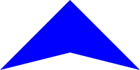

For this project, you should put all of your code in the file `polygons.rkt`.

## Some background

As you may know, Grinnell's CS faculty are (re-)building the image library for CSC-151. In many cases, once we've written a core operation, like `solid-polygon`, we can write many other operations in terms of that operation. For example, the implementation of `solid-rectangle` looks something like the following.

```
(define solid-rectangle
  (lambda (width height color)
    (solid-polygon (list (pt 0 0) (pt width 0) (pt width height) (pt 0 height))
                   color)))
```

It is, of course, a bit more complex than that. We include testing for the validity of the parameters (or we should). We permit an optional description. We tag it as a rectangle. But the basic concept is there.

In case you couldn't tell, the `solid-polygon` procedure takes two primary parameters: a list of points and a color. The points give the vertices of the polygon, usually in clockwise order. The color is, of course, the fill color. And yes, there's an optional description. We create a new point with the `pt` operation.

Here's a somewhat more complex polygon.

```
(solid-polygon (list (pt 0 0) (pt 100 0) (pt 50 20) (pt 50 80) (pt 100 100)
                     (pt 0 100) (pt 50 80) (pt 50 20))
               "blue")
```

Can you guess what it looks like? After doing so, try entering the code in DrRacket to see.

In this assignment, you will build a few useful shapes that seem to be missing from the `csc151` image library.

### Warnings!

As the documentation for `solid-polygon` suggests, no matter what coordinates you use for the vertices, the polygon gets shifted so that the leftmost point is at the left edge of the image and the topmost point is at the top edge of the image. You can likely use this feature to your advantage. For example, if you're making a somewhat symmetrical image, you can use (0,0) as the center.

It's also important to note that graphic coordinate systems are "upside down" compared to normal Euclidean systems. Larger "y" coordinates mean further down, not further up.

Finally, you may find that `outlined-polygon` only works correctly if you provide the points in clockwise order. Otherwise, the "outline" goes on the inside of the space. Welcome to the wonder of computers!

### Documentation

For each procedure that you write in this mini project, include a *procedure comment* that captures the parameter types of the procedure as well as describes its output in a sentence or two.  For example, here is a procedure comment for a procedure that finds the minimum of three numbers. (You don't need to understand how the procedure works.)

```racket
;;; (min-of-three x y z) -> real?
;;;   x : real?
;;;   y : real?
;;;   z : real?
;;; Returns the minimum of x, y, and z
(define min-of-three
  (lambda (x y z)
    (cond
      [(and (<= x y) (<= x z))
       x]
      [(and (<= y x) (<= y z))
       y]
      [else
       z])))
```

The function comment is a stylized comment that consists of the following three components:

* `(min-of-three x y z) -> real?`: the *signature* of the function which names its arguments and describes the *output* type of the function.  In Racket, we express the types with the predicate functions that we use in code to test whether an expression has that type.  For example, this signature says that `min-of-three` has three arguments, `x`, `y`, and `z` and that it produces a real number (as tested by the `real?` function).
* `x : real? ...`: the types of each of the parameters mentioned in the signature.  Like the return type of the function, we document the types of the parameters with the predicates that we would use in code to test values of those types.
* `Returns the minimum of x, y, and z`: finally, we include a brief sentence or two description of the behavior and output of the function.  Here, the behavior of the function is simple, so we comparatively have little to say: the function returns the minimum of its arguments.

## Part one: Darts

A _dart_ is a four-sided object with one axis of symmetry that looks something like the following.


We should be able to describe a solid dart with four parameters: the height, the width, the height of the middle point (which we'll call "middle"), and the color.

```

```

a. Document and write a procedure, `(solid-dart width height middle color)`, that makes a solid dart of the designated width, height, middle point, and color.

```
> (solid-dart 100 100 75 "blue")

> (solid-dart 100 100 50 "blue")

> (solid-dart 100 100 25 "blue")

> (solid-dart 200 100 25 "blue")

> (solid-dart 200 50 25 "blue")

> (describe-image (solid-dart 100 100 75 "blue"))
"a solid blue dart with width 100, height 100, and middle height 75"
> (describe-image (solid-dart 200 100 25 "red"))
"a solid red dart with width 200, height 100, and middle height 25"
```

As those last few lines suggest, your procedure should automatically generate a description of the dart. You use an expression something like the following to generate that description.

```
(string-append "a solid "
               (describe-color color)
               " dart with width "
               (number->string width)
               ", height "
               (number->string height)
               ", and middle height "
               (number->string middle)))))
```

b. Document and write a procedure, `(outlined-dart width height middle color line-size)` that makes an outlined dart in which the outline is the specified color and line width.

```
> (solid-dart 100 50 25 "red")

> (outlined-dart 100 50 25 "red" 1)

> (outlined-dart 100 50 25 "red" 5)

> (outlined-dart 100 50 25 "red" 10)

> (outlined-dart 100 50 25 "red" 20)

```

You should use `outlined-polygon` for this part of the assignment. Note that `outlined-polygon` only works correctly if you create the points in clockwise order. Otherwise, the outline goes on the "inside" rather than the "outside".

```
> (outlined-polygon (list (pt 0 50) (pt 50 0) (pt 100 50) (pt 50 25)) "purple" 5)

> (outlined-polygon (list (pt 0 50)  (pt 50 25) (pt 100 50) (pt 50 0)) "purple" 5)

```

## Part two: Some regular polygons

A _regular polygon_ is a polygon in which all of the sides and angles are the same. For example, a square is a regular polygon, as is an equilateral triangle.

How do we make regular polygons? We will need to compute the coordinates of the vertices of the polygon. It turns out that that's easier than you might think. Consider a regular pentagon (a five-sided polygon).


The five angles by the red dot are all the same. Since there are five of them, we know that the angle is $$2\pi/5$$, or `(* 1/5 2 pi)`. (Is your high-school trigonometry coming back to haunt you?) If we know the distance from the center to a vertex (we'll call that the _radius_ of the pentagon), we can compute the `x` and `y` coordinates using the angle and the distance using Racket's `(make-polar radius angle)`, `(real-part c)`, and `(imag-part c)` procedures, all of which you can read about in [the Racket Reference section on complex numbers](https://docs.racket-lang.org/reference/generic-numbers.html#%28part._.Complex_.Numbers%29).  Note that the real part of a complex number represents the x coordinate and the imaginary part represents the y coordinate.

But how long should the radius be? One option would be to make the radius a parameter for our `solid-pentagon` procedure. However, our experience suggests that clients (people who use our code) more often want to specify either the overall width of the pentagon or the side-length of the polygon. Let's go with the side length.

How do we convert the side length to the radius? We use math! Let's see ... we'll start with a picture.

```
       ^
      /|\
     / | \ radius
    /  |  \
    -------
      side
```

The legendary SOHCAHTOA rule says that the sine of an angle is the opposite over the hypotenuse. If we look at the angle at the top of the triangle, it's 1/2 of the angle we computed before, which we'll call $$\theta$$. The opposite is half the side. The radius is the hypotenuse (or vice versa). So, $$sin \frac{\theta}{2} = (side/2)/hyp$$.  That means that $$hyp = side/(2(sin \frac{\theta}{2}))$$. Yay math!

You'll note that we have not written these formulae in Scheme. Part of your goal will be to translate the ideas into Scheme code.

a. Document and write a procedure, `(solid-pentagon side-length color)`, that makes a solid five-sided regular polygon of the specified side length and color.

```
> (solid-pentagon 30 "blue")

> (beside (solid-square 30 "red") (solid-pentagon 30 "blue"))

```

b. Document and write a procedure, `(solid-hexagon side-length color)`, that makes a solid six-sided regular polygon of the specified side length and color.

```
> (solid-hexagon 30 "blue")

> (above (solid-square 30 "red")
         (solid-hexagon 30 "blue"))

```

c. Document and write a procedure, `(solid-octagon side-length color)`, that makes a solid eight-sided regular polygon of the specified side length and color.

```
> (solid-octagon 30 "blue")

> (rotate (solid-octagon 30 "blue") 22.5)

> (above (solid-square 30 "red")
         (beside (solid-square 30 "blue")
                 (rotate (solid-octagon 30 "purple") 22.5)
                 (solid-square 30 "blue"))
         (solid-square 30 "red"))

```

In each case, you may find it helpful to decompose the procedure so that you can rely on helper procedures.

## Part three: Freestyle

a. Design, document, and implement your own parameterized polygonal procedure. You may name it whatever you like. It should take at least one number (presumably representing some length/size) and one color as parameters.

b. Create a list, `freestyle-examples`, that shows the result of five calls to your procedure. For example, if `outlined-dart` were your procedure for part a, you might write something like the following.

```
(define freestyle-examples 
  (list (outlined-dart 50 50 "red" 5)
        (outlined-dart 40 40 "red" 20)
        (outlined-dart 100 10 "blue" 5)
        (outlined-dart 10 100 "blue" 5)
        (outlined-dart 1 1 "green" 100)))
```

In this set of examples, we've shown multiple kinds of outlined dafrts (one with equal sides, one much wider than it is high, one much higher than it is wide), a few different line widths, and one fairly strange case.

## Grading rubric

### Redo or above

Submissions that lack any of these characteristics will get an I.

```
[ ] Passes all of the **R** autograder tests. These mostly verify
    that the procedures exist and return images.
[ ] Includes the specified file (`polygons.rkt`).
[ ] Includes an appropriate header on the file that indicates the
    course, author, etc.
[ ] Code runs in DrRacket.
[ ] Documentation for most procedures.
```

### Meets expectations or above

Submissions that lack any of these characteristics but have all of the
prior characteristics will get an R.

```
[ ] Passes all of the **M** autograder tests.
[ ] Code is well-formatted with appropriate names and indentation.
[ ] Code has been reformatted with Ctrl-I before submitting.
[ ] All the primary procedures are documented.
[ ] Documentation for most procedures is correct / has the correct form.
```

### Exemplary / Exceeds expectations

Submissions that lack any of these characteristics but have all of the
prior characteristics will get an M.

```
[ ] Passes all of the **E** autograder tests.
[ ] Avoids repeated work.
[ ] All helper procedures are documented.
[ ] Each procedure generates an appropriate description.
[ ] Includes a particularly creative procedure in the freestyle.
[ ] `freestyle-examples` shows off different aspects of the procedure.
```

### General

How do I add a description to an image?

> Almost all of the basic image-creation procedures (including
  `solid-polygon` and `image-subtract`) have an optional parameter for
  a description of the image. You should generate that description.

> For example, here are two versions of `solid-isosceles-triangle`.

> ```
(define sit-a
  (lambda (width height color)
    (solid-polygon (list (pt (/ width 2) 0)
                         (pt width height)
                         (pt 0 height))
                   color)))
```

> ```
(define sit-b
  (lambda (width height color)
    (solid-polygon (list (pt (/ width 2) 0)
                         (pt width height)
                         (pt 0 height))
                   color
                   (string-append "a "
                                  (number->string width)
                                  "-by-"
                                  (number->string height)
                                  " "
                                  (describe-color color)
                                  " isosceles triangle"))))
```

> Let's see how they work.

> ```
>> (describe-image (sit-a 100 200 "blue"))
"a solid blue polygon built from the points (list (pt 50 0) (pt 100 200) (pt 0 200))"
>> (describe-image (sit-b 100 200 "blue"))
"a 100-by-200 blue isosceles triangle"
```

> The second is much clearer.

What is meant by "Code has been reformatted with Ctrl-I before submitting"?

> If you hit Ctrl-I, the code is re-indented for readability. You're now at the stage where you should be striving for moderately well organized code.

What is meant by "Avoids repeated work"?

> We mean (at least) two things: First, you don't recompute the same thing again and again and again. Second, you don't repeat the same (or nearly the same) code again and again and again.

How does the describe-image procedure work?

> When you make an image (using almost any image-making procedure), you can specify a description of the image. `describe-image` then grabs that description. If you don't provide a description, it does the best job it can.

### Part 1

Can I make the dart by overlaying isosceles triangles?

> You can certainly make a solid dart by overlaying isosceles triangles. However, you'll find that the outlined dart is much harder. Hence, I'd recommend that you make both by using polygons.

### Part 2

I understand the formulae, but I'm not sure where to go next in making the pentagon..

> I'd start by decomposing a bit. You'll probably want a procedure that, given a side length and an angle, gives the radius. You'll also probably want a procedure that, given the radius and an angle, gives you the corresponding point.

> Once you put those two procedures together, you should be able to compute each point in the pentagon.

### Part 3

For Part 3, does reusing the same framework of code for creating different polygons count as "repeated work" as given in the grading rubric?

> Ideally, if you find yourself writing similar code, you'd put the similar code in a procedure that both your procedures call.

## Acknowledgements

This assignment was newly written for CSC-151 2024 Spring. In Spring 2025, an old right-triangle exercise that caused students some trouble was replaced by the dart problem. In Spring 2025, the "stars" problem was eliminated.
