_Warning: The first two parts of this assignment were newly created in Spring 2025. There may be infelicities._

Please start with the [template code](../code/mps/recursive-image-construction.rkt).

Please save all of your work as `recursive-image-construction.rkt`.

## Our first topic: Recursive processing of shape lists

In the previous mini-project, you wrote a variety of procedures for transforming and combining lists of shapes (and lists of lists of shapes), such as `shapes->solid-isosceles-triangles`. In most cases, you could use `map` or `reduce` to implement these processes. However, doing so created some limits. For example, if we were using `map`, we had to apply the same operation to each element of a list. Similarly, if we were using `reduce` or `apply` to combine images, we had to combine all of the images in a list in the same way.

Now that we know recursion, we can consider other ways of processing lists. For example, instead of transforming all the shapes in a list to isosceles triangles, we might translate the first to an isosceles triangle, the second to an ellipse, the third to a rectangle, the fourth to an isoceles triangle, the fifth to an ellipse, and so on and so forth. (Note: You may be able to find ways write some of these using `map` or something similar, but we insist that you write them recursively.) Similarly, instead of putting all the elements of a list beside each other, we might put the first and second beside each other, the third and fourth beside each other, the fifth and six, and so on and so forth.

## Part one: Combining lists of images

Let's start by looking at new ways to combine the elements in a list. Rather than combining them all at once, we'll combine them bit by bit.

a. Write at least four tests for and implement a recursive procedure, `(combine-pairs-beside shapes)`, that takes a list of images as input and places each pair of images beside each other. If the list has an odd number of images, the last one should remain by itself. If the list is empty, you should return the empty list. Make sure that you have at least two edge cases. (Please label them as such.)

```
> (combine-pairs-beside (make-list 10 (solid-diamond 10 20 "green")))
'(    )
> (combine-pairs-beside (make-list 5 (solid-diamond 10 20 "green")))
'(  )
```

Here and elsewhere, you may assume that the procedure is only given correct inputs.

_Hint: You will probably need two base cases._

b. Write at least four tests for and implement a recursive procedure, `(combine-pairs-above shapes)`, that takes a list of images as input and places each pair of images in a stack of two, the first beside the next. If the list has an odd number of images, the last one should remain by itself. If the list is empty, you should return the empty list. Make sure that you have at least two edge cases. (Please label them as such.)

_Note that due to infelicities with HTML, although the following lists appear bottom-aligned in DrRacket, they appear center-aligned here._

```
> (combine-pairs-above (make-list 10 (solid-diamond 20 10 "orange")))
'(    )
> (combine-pairs-above (make-list 5 (solid-diamond 20 10 "orange")))
'(  )
```

c. As you may have noted, each time we run `combine-pairs-beside` or `combine-pairs-above`, we create a smaller list of images (approximately half the size of the previous one). By alternately applying the two procedures, we can gradually reduce the number of images in the list to a single image.

```
> (define stuff (map (lambda (x) (solid-ellipse x 20 "black")) (range 5 35 2)))
> (length stuff)
15
> stuff
'(              )
> (combine-pairs-beside stuff)
'(       )
> (combine-pairs-above (combine-pairs-beside stuff))
'(   )
> (combine-pairs-beside (combine-pairs-above (combine-pairs-beside stuff)))
'(![a center-aligned sequence of images (a center-aligned stack of images (a center-aligned sequence of images (a solid black 5-by-20 ellipse beside a solid black 7-by-20 ellipse) above a center-aligned sequence of images (a solid black 9-by-20 ellipse beside a solid black 11-by-20 ellipse)) beside a center-aligned stack of images (a center-aligned sequence of images (a solid black 13-by-20 ellipse beside a solid black 15-by-20 ellipse) above a center-aligned sequence of images (a solid black 17-by-20 ellipse beside a solid black 19-by-20 ellipse)))](../images/mps/recursive-image-construction/image012.png) )
> (combine-pairs-above (combine-pairs-beside (combine-pairs-above (combine-pairs-beside stuff))))
'(![a center-aligned stack of images (a center-aligned sequence of images (a center-aligned stack of images (a center-aligned sequence of images (a solid black 5-by-20 ellipse beside a solid black 7-by-20 ellipse) above a center-aligned sequence of images (a solid black 9-by-20 ellipse beside a solid black 11-by-20 ellipse)) beside a center-aligned stack of images (a center-aligned sequence of images (a solid black 13-by-20 ellipse beside a solid black 15-by-20 ellipse) above a center-aligned sequence of images (a solid black 17-by-20 ellipse beside a solid black 19-by-20 ellipse))) above a center-aligned sequence of images (a center-aligned stack of images (a center-aligned sequence of images (a solid black 21-by-20 ellipse beside a solid black 23-by-20 ellipse) above a center-aligned sequence of images (a solid black 25-by-20 ellipse beside a solid black 27-by-20 ellipse)) beside a center-aligned stack of images (a center-aligned sequence of images (a solid black 29-by-20 ellipse beside a solid black 31-by-20 ellipse) above a solid black 33-by-20 ellipse)))](../images/mps/recursive-image-construction/image014.png))
```

Note that we get a different result if we do the operations in the opposite order.

```
> (combine-pairs-beside (combine-pairs-above (combine-pairs-beside (combine-pairs-above stuff))))
'(![a center-aligned sequence of images (a center-aligned stack of images (a center-aligned sequence of images (a center-aligned stack of images (a solid black 5-by-20 ellipse above a solid black 7-by-20 ellipse) beside a center-aligned stack of images (a solid black 9-by-20 ellipse above a solid black 11-by-20 ellipse)) above a center-aligned sequence of images (a center-aligned stack of images (a solid black 13-by-20 ellipse above a solid black 15-by-20 ellipse) beside a center-aligned stack of images (a solid black 17-by-20 ellipse above a solid black 19-by-20 ellipse))) beside a center-aligned stack of images (a center-aligned sequence of images (a center-aligned stack of images (a solid black 21-by-20 ellipse above a solid black 23-by-20 ellipse) beside a center-aligned stack of images (a solid black 25-by-20 ellipse above a solid black 27-by-20 ellipse)) above a center-aligned sequence of images (a center-aligned stack of images (a solid black 29-by-20 ellipse above a solid black 31-by-20 ellipse) beside a solid black 33-by-20 ellipse)))](../images/mps/recursive-image-construction/image015.png))
```

Write a pair of procedures, `repeatedly-combine-pairs-ab` and `repeatedly-combine-pairs-ba` that alternately apply `combine-pairs-above` and `combine-pairs-beside` until the list contains only a single element. At that point, you should return that element. The `ab` version should start with `above`. The `ba` version should start with `beside`. If the list is empty, return the special value `empty-image`, which is defined in the supplied code.

```
> (repeatedly-combine-pairs-ab stuff)
![a center-aligned sequence of images (a center-aligned stack of images (a center-aligned sequence of images (a center-aligned stack of images (a solid black 5-by-20 ellipse above a solid black 7-by-20 ellipse) beside a center-aligned stack of images (a solid black 9-by-20 ellipse above a solid black 11-by-20 ellipse)) above a center-aligned sequence of images (a center-aligned stack of images (a solid black 13-by-20 ellipse above a solid black 15-by-20 ellipse) beside a center-aligned stack of images (a solid black 17-by-20 ellipse above a solid black 19-by-20 ellipse))) beside a center-aligned stack of images (a center-aligned sequence of images (a center-aligned stack of images (a solid black 21-by-20 ellipse above a solid black 23-by-20 ellipse) beside a center-aligned stack of images (a solid black 25-by-20 ellipse above a solid black 27-by-20 ellipse)) above a center-aligned sequence of images (a center-aligned stack of images (a solid black 29-by-20 ellipse above a solid black 31-by-20 ellipse) beside a solid black 33-by-20 ellipse)))](../images/mps/recursive-image-construction/image015.png)
> (repeatedly-combine-pairs-ba stuff)
![a center-aligned stack of images (a center-aligned sequence of images (a center-aligned stack of images (a center-aligned sequence of images (a solid black 5-by-20 ellipse beside a solid black 7-by-20 ellipse) above a center-aligned sequence of images (a solid black 9-by-20 ellipse beside a solid black 11-by-20 ellipse)) beside a center-aligned stack of images (a center-aligned sequence of images (a solid black 13-by-20 ellipse beside a solid black 15-by-20 ellipse) above a center-aligned sequence of images (a solid black 17-by-20 ellipse beside a solid black 19-by-20 ellipse))) above a center-aligned sequence of images (a center-aligned stack of images (a center-aligned sequence of images (a solid black 21-by-20 ellipse beside a solid black 23-by-20 ellipse) above a center-aligned sequence of images (a solid black 25-by-20 ellipse beside a solid black 27-by-20 ellipse)) beside a center-aligned stack of images (a center-aligned sequence of images (a solid black 29-by-20 ellipse beside a solid black 31-by-20 ellipse) above a solid black 33-by-20 ellipse)))](../images/mps/recursive-image-construction/image014.png)
```
_Hint: You will likely want at least two base cases for each procedure._

_Note: You may find it useful to have the `ab` version call the `ba` version, and vice versa. We call this "mutual recursion."_

d. Of course, it makes sense to generalize our procedures. For the purposes of this assignment, we'll only ask you to generalize one.

Document, write at least four tests for, and implement a procedure, `(combine-neighbors-above n images)`, that takes a positive integer and a list of images as parameters, and combines them much like `combine-pairs-above`, except that it combines `n` images beside each other, rather than two.

_Note that due to infelicities with HTML, although the following lists appear bottom-aligned in HTML, they appear center-aligned here._

```
> (combine-neighbors-above 3 (make-list 11 (solid-ellipse 20 10 "red")))
'(   )
> (combine-neighbors-above 4 (make-list 11 (solid-ellipse 20 10 "red")))
'(  )

> (combine-neighbors-above 5 (make-list 11 (solid-ellipse 20 10 "red")))
'(  )
```

You will likely find the following variants of `take` and `drop` useful.

```
;;; (grab lst n) -> list?
;;;   lst : list?
;;;   n : exact-nonnegative-integer?
;;; Create a new list consisting of the first `n` elements of `lst`.
;;; If `lst` has fewer than `n` elements, returns `lst`.
(define grab
  (lambda (lst n)
    (if (or (null? lst) (zero? n))
        null
        (cons (car lst)
              (grab (cdr lst) (- n 1))))))

;;; (skip lst n) -> list?
;;;   lst : list?
;;;   n : exact-nonnegative-integer?
;;; Create a new list consisting of all but the first `n` elements
;;; of `lst`. If `lst` has fewer than `n` elements, returns null.
(define skip
  (lambda (lst n)
    (if (or (null? lst) (zero? n))
        lst
        (skip (cdr lst) (- n 1)))))
```

### Part two: Transforming shape lists

As we noted, one opportunity we have is to transform each element in a list differently, cycling through our options.

a. Implement two procedures `(shapes->ellipses&rectangles shapes)` and `(shapes->rectangles&ellipses shapes)` that each takes a list of shapes as a parameter and returns a list of ellipses and rectangles, with each element having the same width, height, and color as the corresponding element of shapes. As you might expect, the list produced by `shapes->ellipses&rectangles` will start with an ellipse, and the list produced by `shapes->rectangles&ellipses` will start with a rectangle. 

```drracket
> (shapes->ellipses&rectangles (list (solid-rectangle 20 10 "red")
                                     (solid-rectangle 20 20 "orange")
                                     (solid-rectangle 20 30 "green")
                                     (solid-rectangle 30 20 "blue")
                                     (solid-rectangle 30 10 "gray")
                                     (solid-rectangle 10 30 "black")))
'(   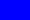  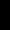)
> (shapes->rectangles&ellipses (list (solid-rectangle 20 10 "red")
                                     (solid-rectangle 20 20 "orange")
                                     (solid-rectangle 20 30 "green")
                                     (solid-rectangle 30 20 "blue")
                                     (solid-rectangle 30 10 "gray")
                                     (solid-rectangle 10 30 "black")))
'(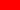  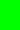   )
```

Before implementing the procedures, you should write at least three tests for each. Make sure to include at least one edge case for each.

You may find the following procedures helpeful.

```
;;; (shape->ellipse shape) -> image?
;;;   shape : image?
;;; Convert `shape` to an ellipse of the same width, height, and color.
(define shape->ellipse
  (lambda (shape)
    (apply solid-ellipse (shape-params shape))))

;;; (shape->rectangle shape) -> image?
;;;   shape : image?
;;; Convert `shape` to a rectangle of the same width, height, and color.
(define shape->rectangle
  (lambda (shape)
    (apply solid-rectangle (shape-params shape))))
```

_Hint: You should consider defining each procedure in terms of the other. This is often called "mutual recursion"._

b. Write at least three tests for and implement a recursive procedure, `(shapes->rects&tris&diamonds shapes)`, that takes a list of shapes as a parameter and converts each shape into a rectangle, isosceles triangle, or diamond, cycling through the three options. Make sure to include at least one edge-case test.

```
> (shapes->rects&tris&diamonds (list (solid-rectangle 20 10 "red")
                                     (solid-rectangle 20 20 "orange")
                                     (solid-rectangle 20 30 "green")
                                     (solid-rectangle 30 20 "blue")
                                     (solid-rectangle 30 10 "gray")
                                     (solid-rectangle 10 30 "black")))
'(     )
> (shapes->rects&tris&diamonds (make-list 8 (solid-square 20 "purple")))
'(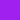       )
```

_Hint: Consider how you implemented the previous pair of procedures._

## Another topic: Fractals and Sierpinski triangles 

Informally, _fractals_ are images that appear similar at different scales.  Although this mini-project will primarily emphasize fractals made from simple shapes, there are also fractals that are much less regular.  For example, the coastline of almost any country is considered a fractal because coastlines are similarly "jagged" at any scale.

We will explain the self-similarity of regular shapes using one of the most straightforward regular fractals, the _Sierpinski Triangle_.  Here's how you might think of those triangles.

We'll start with a blue, equilateral, triangle with side-length 128.

`(define triangle-128 (solid-equilateral-triangle 128 "blue"))`

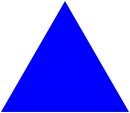

Let's build another triangle with half that side length.  If you recall your geometry, this triangle will have 1/4 the area of the original triangle.

`(define triangle-64 (solid-equilateral-triangle 64 "blue"))`


We can get a similar triangle to the original one (but with a "hole" in the middle) by appropriately combining three of those triangles, two side by side and then one over them.

`(above triangle-64 (beside triangle-64 triangle-64))`

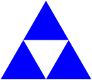

Of course, we could use a similar process to build each of those three blue triangles.

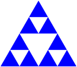

And each of those.

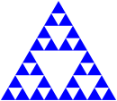

And each of those.

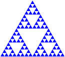

And so on.

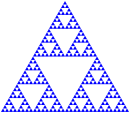

And so forth.

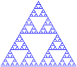

If we do this process sufficiently many times (perhaps "arbitrarily many times"), we end up with a structure called the "Sierpinski Triangle".  Sierpinski triangles have many surprising mathematical properties, none of which are relevant to us at this time.  Instead, we will use Sierpinski triangles to make aesthically appealing images (or at least aesthetically appealing to them).

We will start by defining the intermediate results recursively.  Here's one way.  We'll call a triangle that's been broken up `n` times a "level `n` fractal triangle".

* A level-0 fractal equilateral triangle with edge-length `len` is just an equilateral triangle of edge-length `len`.
* A level-n fractal equilateral triangle with edge-length `len` is built from three level-(n-1) fractal equilateral triangles, each with edge-length `len`/2.  For example, a level-5 fractal equilateral triangle with side-length 128 is built from three level-4 equilateral triangles, each with side length 64.

You can turn that into a recursive procedure, can't you?  Don't worry; you'll have a chance to do so in the exercises below.

Once we can build fractal triangles, we can start varying them.  For example, rather than making each sub-triangle the same color, we might make one lighter and another darker.  If we use the "standard" technique of adding 32 to each component to make colors "lighter" and subtracting 32 to make them "darker", we might end up with something like the following for a level-4 gray triangle.

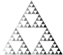

Here's another one that we've built by making the top triangle redder, the bottom-left triangle greener, and the bottom-right triangle bluer.  (I think this has six levels of recursion.)

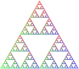

And one where we've turned each middle triangle into the base color.  (We've done that by overlaying the recursive result on a larger triangle.)


It looks a bit different if we just overlay the first one on gray.

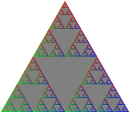

Just to continue exploring variations, let's rotate the result of each recursive call in the base version by 15 degrees clockwise. 

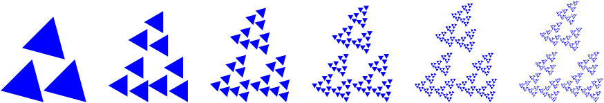

When we do enough recursion, it may not matter all that much whether or not the base case is a triangle.  (Is that surprising or intuitive?)  For example, here are a set of shapes using the `(above shape (beside shape shape))` formula with a square as the base case.

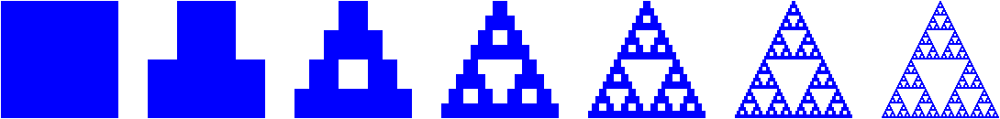

Somewhere along the way, I think we said that these techniques might help us make compelling (or repelling?) images.  Here's an experiment with using that last approach with seven shades of red and then overlaying them.

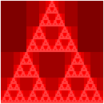

## Part three: Fractal triangles

a. Write a procedure, `fractal-triangle`, that makes the basic fractal triangle described above.

```
;;; (fractal-triangle side color n) -> image?
;;;   side : positive-real?
;;;   color : rgb?
;;;   n : non-negative integer
;;; Make a fractal triangle of the given side length using `color` as 
;;; the primary color.
```

**Warning**: Because shapes generally can't have fractional width or height, you may find that `fractal-triangle` produces triangles that are slightly bigger than expected. Such a result is acceptable. You'll notice all of our tests use a size that's a power of two to address such issues.

b. Write a procedure, `rgb-fractal-triangle`, that makes a fractal triangle in which the top triangle is "redder" than the basic color, the lower-left triangle is "greener" than the basic color, and the lower-right triangle is "bluer" than the basic color.

```
;;; (rgb-fractal-triangle side color n) -> image?
;;;   side : positive-real?
;;;   color : rgb?
;;;   n : non-negative integer
;;; Make a fractal equilateral triangle of the given side length using
;;; `color` as the primary color.  In the recursive steps, the base
;;; color of the top triangle is `(rgb-redder color)`, the base color
;;; of the lower-left triangle is `(rgb-greener color)`, and the base
;;; color of the lower-right triangle is `(rgb-bluer color)`.  
```

## Part four: Fractal squares (carpets)

Just as we can think of triangles as being made up of four sub-triangles, and we can use that idea to make fractal triangles, we can break squares up into sub-squares and use those to make fractal squares.  The most common approach is to make a three-by-three grid of squares, building all but the center square recursively.  How do we combine them?  We can make each row with `beside` and then stack the three rows with `above`.  What about the middle square, which we normally leave "blank"?  I find it easiest to specify a color to use for the center.  Here are the first few stages.

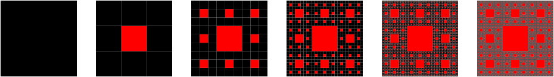

No, the limit of this is not a "Sierpinski square".  However, it is normally referred to as a Sierpinski carpet".

**a. Write a procedure, `(carpet-a size color-x color-y n)` that makes an image like those above.**

```
;;; (carpet-a size color-x color-y n) -> image?
;;;   size : positive real?
;;;   color-x : color?
;;;   color-y : color?
;;;   n : non-negative integere
;;; Create a `size`-by-`size` image of the standard fractal carpet with
;;; `n` levels of recursion, using `color-x` as the "primary" color and
;;; `color-y` as the center color.  
```

b. Of course, there's no reason we have to recurse on those particular eight squares.  We could, for example, use only six.  Here's one such pattern. (We haven't included level 0 of the recursion, which is just a black square.)

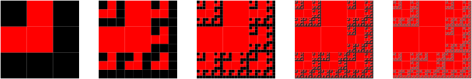

_Here and elsewhere, we are seeing some strange artifacts from how DrRacket deals with sequares that have non-integer edge lengths._

**Write a procedure, `(carpet-b size color-x color-y n)`, that makes images like this latest set.**

```
;;; (carpet-b size color-x color-y n) -> image?
;;;   size : positive real?
;;;   color-x : color?
;;;   color-y : color?
;;;   n : non-negative integer.
;;; Create a `size`-by-`size` image of a fractal carpet with `n` levels
;;; of recursion, using `color-x` as the "primary" color and `color-y`
;;; as the "secondary" color.  Our pattern looks something like this.
;;; 
;;;     X y X
;;;     y y X
;;;     X X X
;;; 
;;; where `X` means "recurse" and `y` means "square with `color-y`.
```

## Part five: Freestyle

a. Document and write at least one new procedure similar to the procedures from parts one and two (that is, a procedure that recursively traverses a list of images either to manipulate the elements or to combine the elements).

b. Using the procedures from parts one and two and the new procedure (or procedures), create three new images called `combination-1.png`, `combination-2.png`, `combination-3.png`. Include the instructions for making the three images.

The next two questions (c and d) are only necessary for an E.

c. Design your own fractal (or fractal-like) procedure using the ideas from parts three and four. You may not make an equilateral triangle, a square, or a rectangle. 

d. Using your procedure, create three new images called `fractal-1.png`, `fractal-2.png`, and `fractal-3.png`.

Grading rubric
--------------

### Redo or above

Submissions that lack any of these characteristics will get an I.

```
[ ] Passes all of the **R** autograder tests.
[ ] Includes the specified file, `recursive-image-construction.rkt`.
[ ] Includes an appropriate header on the file that indicates the
    course, author, etc.
[ ] Acknowledges appropriately.
[ ] Code runs in DrRacket.
[ ] Most procedures are documented in some form.
[ ] Includes images from part 5b.
    [ ] `combination-1.png`
    [ ] `combination-2.png`
    [ ] `combination-3.png`
```

### Meets expectations or above

Submissions that lack any of these characteristics but have all of the
prior characteristics will get an R.

```
[ ] Passes all of the **M** autograder tests.  For example,
[ ] Code is well-formatted with appropriate names and indentation.
[ ] Code has been reformatted with Ctrl-I before submitting.
[ ] Code generally follows style guidelines.
[ ] Documentation for all core procedures is correct / has the correct form.
[ ] Includes all the specified tests.
    [ ] Four tests for `combine-pairs-beside`.
    [ ] Four tests for `combine-pairs-above`. These can be similar to those
        for `combine-pairs-beside`.
    [ ] Four tests for `combine-neighbors-above`.
    [ ] Three tests for `shapes->ellipses&rectangles`.
    [ ] Three tests for `shapes->rectangles&ellipses`.
    [ ] Three tests for `shapes->rects&tris&diamonds`.
[ ] Includes a new procedure that manipulates lists of images.
[ ] Includes instructions for making the first three freestyle images.
```

### Exemplary / Exceeds expectations

Submissions that lack any of these characteristics but have all of the
prior characteristics will get an M.

```
[ ] Passes all of the **E** autograder tests. 
[ ] Style is impeccable (or nearly so).
[ ] Avoids repeated work.
[ ] Avoids identical recursive calls, particularly for fractals.
[ ] Does not use `length` in parts one, two, and five.
[ ] All procedures are documented, including helpers.
[ ] Documentation for all procedures is correct / has the correct form.
[ ] No `define` statements within procedures.
[ ] Each set of tests includes at least one edge case (e.g., an empty
    list, if appropriate).
    [ ] `combine-pairs-beside`
    [ ] `combine-pairs-above` (can be similar to `combine-pairs-beside`)
    [ ] `conbine-neighbors-above`
    [ ] `shapes->ellipses&rectangles`.
    [ ] `shapes->rectangles&ellipses`.
    [ ] `shapes->rects&tris&diamonds`.
[ ] Includes a new fractal procedure.
[ ] Includes the three fractal images.
    [ ] `fractal-1.png`
    [ ] `fractal-2.png`
    [ ] `fractal-3.png`
[ ] Includes instructions for making the three fractal images.
```

## Q&A

### General

The fractal procedures don't have lists as parameters. How do we do recursion without a list? What is the base case if we do not have a limit for the number of elements?

> If we're doing recursion with numbers (as is appropriate on this assignment), we usually stop when we reach some target number (or target range of numbers). For example, we'll usually stop the fractals when `n` is 0. If we don't have an `n`, we'll stop when some other numeric parameter ges small enough, such as when `side` is less than 10. For the recursive case, we make the number closer to the target (e.g., subtracting 1, multiplying by a fraction less than 1).

I think one of my fractal procedures is correct, but it's failing the tests. What's wrong?

> Unfortunately, the "does this look right" procedure is imperfect. Check with your instructor to see if you missed something.

What is the difference between explicit & implicit recursion? 

> Explicit recursion is when a procedure calls itself. Implicit recursion happens when a procedure calls a recursive procedure or when a procedure calls another procedure that then calls the first procedure.

Do we have to use local bindings to get an E?

> No. But you are expected to avoid repeated work, such as identical recursive calls. Local bindings is one of the best ways to do so.

What would be considered an identical recursive call?

> For example, to make a fractal triangle of side length `s`, you need to make three fractal triangles of side length `s`/2. If you wrote something like

> ```
(above (fractal-triangle (/ side 2) color (- n 1))
       (beside (fractal-triangle (/ side 2) color (- n 1))
               (fractal-triangle (/ side 2) color (- n 1))))
```

> You have three identical recursive calls.

How would you avoid identical recursive calls?

> You avoid it by using `let` or a helper procedure.

Can you give an example and explain more on mutual recursion, I saw it mentioned in the `repeatedly-combine-pairs-ab` and `ba` part but I think I'm still slightly confused on how it works?

> See [the new (draft) reading on mutual recursion](../readings/mutual-recursion).

### Part one: Combining lists of images

### Part two: Transforming shape lists

Do I need a counter to keep track of which shape I'm supposed to change into?

> You shouldn't. For 2a, you can use mutual recursion.

> However, if you find it easier to write a recursive helper procedure with a counter, that's fine, too.

### Part three: Fractal triangles

How should I get started?

> Think about making the big triangle with smaller triangles and fewer levels of recursion. (That is, we've "simplified" two of the parameters.)

> Think about the base case in terms of one/both of those parameters.

What should my recursive call for 3a look like?

> Presumably something like `(fractal-triangle (/ side 2) color (- n 1))`.

Do I need to use exponentiation to get small enough triangles?

> No! Trust the recursion.

How can I deal with the need to change colors in 3b?

> One of the parameters to the recursive call is a color. You should modify the color in making each of the three recursive calls.

### Part four: Fractal squares (carpets)

What's our base case?

> When `n` is 0.

What should our output be for `carpet-a` be when `n` is 0?

> A `size`-by-`size` square of `color-x`. (There's no center color this time.)

### Part five: Freestyle

We didn't write anything that makes multiple variants of an image in parts one and two. Can I write such a procedure for the freestyle?

> Certainly.

Can I make an irregular shape, like a U?

> Sure.

For the freestyle, would using a pentagon or hexagon be sufficient?

> I think you'll have trouble making fractal pentagons, but you can try.
