Please start with the [template code](../code/mps/shape-lists.scm).

Please save all of your work as `shape-lists.scm`.

## Introduction

By this point, you've considered a variety of procedures for making and manipulating some basic shapes, such as circles and squares (or, more generally, ellipses and rectangles). As you may have discovered, we can use the characteristics of one shape to make another shape.

Suppose we start with a few rectangles. We've tried to name them in such a way that describes their general characteristics. Note that the functions below use a number of additional functions from the `image` library:

+   `(solid-rectangle width height color)` creates a solid rectangle of the given parameters.
+   `(solid-ellipse width height color)` creates a solid ellipse of the given parameters.
+   `(image-recolor img color)` returns a new image that is `img` but with the given `color`.

```
(define red-narrow
  (solid-rectangle 10 20 "red"))

(define red-medium
  (solid-rectangle 20 20 "red"))

(define red-wide
  (solid-rectangle 30 20 "red"))

(define blue-narrow
  (image-recolor red-narrow "blue"))

(define blue-medium
  (image-recolor red-medium "blue"))

(define blue-wide
  (image-recolor red-wide "blue"))

(define purple-narrow
  (image-recolor red-narrow "purple"))

(define purple-medium
  (image-recolor red-medium "purple"))

(define purple-wide
  (image-recolor red-wide "purple"))
```

Now, let's write a procedure that converts almost any shape to an ellipse.

```
(define shape->ellipse
  (lambda (shape)
    (solid-ellipse (image-width shape) 
                   (image-height shape) 
                   (image-color shape))))
```

Using `map`, we can quickly make lists of shapes and convert them.

```
> narrow-shapes
(list   )
> (map shape->ellipse narrow-shapes)
(list   )
> (apply beside (map shape->ellipse narrow-shapes))

```

We can even make somewhat slightly more complex shapes using that information.

```
;;; (thinly-outlined-ellipse width height color) -> ellipse?
;;;   width : positive-real?
;;;   height : positive-real?
;;;   color : color?
;;; Convert `shape` to an ellipse of the given width and height that is
;;; then outlined with a thick black line.
(define thinly-outlined-ellipse
  (lambda (width height color)
    (overlay (outlined-ellipse width height "black")
             (solid-ellipse width height color))))

;;; (shape->thinly-outlined-ellipse shape) -> ellipse?
;;;   shape : shape?
;;; Convert `shape` to an ellipse of the same width, height, and color
;;; that is then outlined in a thick black line.
(define shape->thinly-outlined-ellipse
  (lambda (shape)
    (thinly-outlined-ellipse (image-width shape)
                             (image-height shape)
                             (image-color shape))))
```

```
> (apply beside (map shape->thinly-outlined-ellipse narrow-shapes))
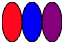
```

To make this a bit easier, we're going to write another helper procedure, `shape-params`, which grabs the width, height, and color from an image and puts them in a list.

```
;;; (shape-params shape) -> list?
;;;   shape : basic-image?
;;; Create a list of the width, height, and color of the image.
(define shape-params
  (lambda (img)
    (list (image-width img) (image-height img) (image-color img))))
```

What does that let us do? Well, here's one example.

```
(define something (o (section apply solid-isosceles-triangle _) shape-params))
```

Can you tell what that does, as strange as it is?

Try it out.

```
> (map something (list purple-narrow purple-medium purple-wide))
; intentionally left for you to try!
```

Of course, rather than creating lists like these on our own, we can write procedures that do so.  Here's one that takes a shape and creates five variants of varying widths and "shades". 

```
;;; (five-variants shape) -> (list-of basic-image?)
;;;   shape : basic-image?
;;; Create a list of five shapes based on the original shape.
;;;
;;; * The first shape is 1/3 the width and much darker.
;;; * The second shape is 1/3 the width and slightly darker.
;;; * The third shape is the same.
;;; * The fourth shape is 4/3 the width and slightly lighter.
;;; * The fifth shape is 5/3 the width and much lighter.
(define five-variants
  (lambda (shape)
    (apply five-variants/helper (shape-params shape))))

;;; (five-variants/helper width height color) -> (list-of shape?)
;;;   width : nonnegative-integer?
;;;   height : nonnegative-integer?
;;;   color : rgb?
;;; Create a list of five shapes based on `width`, `height`, and
;;; `color`. See `five-variants` for the details.
(define five-variants/helper
  (lambda (width height color)
    (list (solid-rectangle (* (/ 1 3) width) height (rgb-darker (rgb-darker color)))
          (solid-rectangle (* (/ 2 3) width) height (rgb-darker color))
          (solid-rectangle width height color)
          (solid-rectangle (* (/ 4 3) width) height (rgb-lighter color))
          (solid-rectangle (* (/ 5 3) width) height (rgb-lighter (rgb-lighter color))))))
```

We can quickly make lists of variants.

```
> (five-variants (solid-rectangle 10 20 "orange"))
(list     )
```

And, with the procedures we've been writing, we can make them different shapes.

```
> (map shape->ellipse (five-variants (solid-rectangle 10 20 "orange")))
(list     )
> (apply overlay (map shape->ellipse (five-variants (solid-rectangle 10 20 "orange"))))

```

As we've already learned, there's power in repeating actions.  So we could turn those five shapes descriptions into twenty-five with a call to map.

```
> (define twenty-five-things (map five-variants (five-variants (solid-rectangle 20 20 (rgb 128 64 192)))))
> twenty-five-things
(list (    )
  (    )
  (    )
  (    )
  (    ))
```

Unfortunately, we can't convert those to images quite as easily.

```
> (map shape->ellipse twenty-five-things)
. . some error message
```

Our goal in this assignment is to write procedures that will help us deal with these nested (perhaps deeply nested) lists of shapes.

### A note on testing images

In a previous reading, we introduced the `test` library of Scamper which exposed a function `test-case` that you can use to write test cases.

<pre class="scamper source">
(import test)

(test-case "is 1+1 = 2?"
  equal? 2
  (lambda () (+ 1 1)))
</pre>

Up until this point, we've written unit tests over basic types. However, what about images which are decidedly more complicated than mere numbers, strings, and booleans?
It turns out that `test-case` can work to a degree as-is,
but we run into issues quickly:

<pre class="scamper source">
(import image)
(import test)

(test-case "are two rectangles equal?"
  equal? (rectangle 100 200 "solid" "red")
  (lambda ()
    (solid-rectangle (+ 50 50) (* 2 100) (rgb 255 0 0))))

(test-case "are these two rectangles equal?"
  equal? (solid-rectangle 100 50 "red")
  (lambda ()
    (beside (solid-rectangle 50 50 "red")
            (solid-rectangle 50 50 "red"))))
</pre>

In the latter case, even though the two drawings produce the same _visual_ output, they are not considered equal because they are _not made up of the same shapes_.

In such cases, how can we test correctness?
Rather than checking whether the two drawings are made up of the same shapes, we can check to see if some _property_ of the two drawings are equal.
For example, `image-width`, `image-height`, and `image-color` retrieve the width, height, and color of a drawing, respectively:

<pre class="scamper source">
(import image)
(import test)

(define r1 (solid-rectangle 100 50 "red"))
(define r2
  (beside (solid-rectangle 50 50 "red")
          (solid-rectangle 50 50 "red")))

(test-case "are widths equal?"
  equal? (image-width r1)
  (lambda ()
    (image-width r2)))

(test-case "are heights equal?"
  equal? (image-height r1)
  (lambda ()
    (image-height r2)))

(test-case "are colors equal?"
  equal? (image-color r1)
  (lambda ()
    (image-color r2)))
</pre>

In the problems below, you'll be ask to write a few tests. Sometimes the images are simple enough that you can write out the results by hand.
But if the images are complex for that, you can instead compare properties like the widths or height of the expected image which are much easier to specify!

## Part 1: Making lists of shape parameters

Our `five-variants` procedure is nice, but it's a bit cumbersome to apply.  For example, what if we already have a nested list of `shape-params?` and we want to make five variants of each shape?  We can't just call `five-variants`; you may recall that in our example above, we had to use `map` once we had a list.  But if we have nested lists, `map` won't even work.

We'll do this with a sequence of steps.

First, let's start with a procedure that makes a different set of variants.

a. Document, create at least three tests for, and write a procedure, `(color-variants-0 shape)`, that takes a shape and makes a list of four shapes. (It's fine if you use rectangles for the shapes; they make a good starting point.)

* The first should be a shape that is the same width, height, and color as the original shape. (You can use the same shape, or you can make it a rectangle.)
* The second should be a shape that is the same width and height as the original shape, but with a redder color. (You can use a rectangle or you can try to maintain the shape.)
* The third should be a shape that is the same width and height as the original shape, but with a greener color. (You can use a rectangle or you can try to maintain the shape.)
* The fourth should be a shape that is the same width and height as the original shape, but with a bluer color. (You can use a rectangle or you can try to maintain the shape.)

You should use `rgb-redder`, `rgb-greener`, and `rgb-bluer` to change the colors. 

You should *not* use `pixel-map` in solving this problem.

```
> (color-variants-0 (solid-square 20 (rgb 128 128 128)))
(list    )
```

What will your tests look like? Here's one example.

```
(test-equal? "color-variants-0: Middle grey"
             (color-variants-0 (solid-rectangle 30 30 (rgb 128 128 128)))
             (list (solid-rectangle 30 30 (rgb 128 128 128))
                   (solid-rectangle 30 30 (rgb-redder (rgb 128 128 128)))
                   (solid-rectangle 30 30 (rgb-greener (rgb 128 128 128)))
                   (solid-rectangle 30 30 (rgb-bluer (rgb 128 128 128)))))
```


b. Document, write one test for, and write a procedure, `(color-variants-1 stuff)`, that takes a shape list as a parameter and applies `color-variants-0` to each of them.

```
;;; (color-variants-1 shapes) -> (list-of (list-of shape?))
;;;   shapes : (list-of shape?)
;;; Apply `color-variants-0` to each element of `shapes`.
```

```
> (color-variants-1 (list (solid-square 20 (rgb 128 128 128)) (solid-square 20 (rgb 64 64 64)) (solid-square 20 (rgb 192 192 192))))
(list (   ) ( 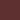  ) (   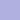))
> (color-variants-1 (color-variants-0 (solid-square 15 (rgb 128 128 128))))
(list (   ) ( 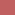 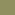 ) (   ) (   ))
> (map (section apply beside _)
       (color-variants-1 (color-variants-0 (solid-square 15 (rgb 128 128 128)))))
(list    )
> (apply above
         (map (section apply beside _)
              (color-variants-1 (color-variants-0 (solid-square 15 (rgb 128 128 128))))))

```

_Hint_: Use `map`.

c. Document, write two tests for, and write a procedure `(color-variants-1x stuff)`, that takes either a shape or a shape list as a parameter. If it receives a shape, it should return the result of applying `color-variants-0` to the shape. If it receives a shape list, it should apply `color-variants-1` to that list. 

```
;;; (color-variants-1x stuff) -> (any-of (list-of shape?) (list-of (list-of shape?)))
;;;   stuff : (any-of shape? (list-of shape?))
;;; Make variants of all the shapes in `stuff`.
```

```
> (color-variants-1x (solid-rectangle 10 20 (rgb 128 128 128)))
(list    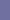)
> (color-variants-1x (color-variants-1x (solid-rectangle 10 20 (rgb 128 128 128))))
(list (   ) (   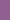) (   ) (   ))
```

You may assume that `color-variants-1x` receives either a shape or a shape list as a parameter. That is, if its parameter is not a shape, it must be a shape list.

Note that the `shape?` predicate lets you determine if a value is a shape.

d. Document and write a procedure, `(color-variants-2 stuff)`, that takes a slightly nested shape list as a parameter and applies `color-variants-1x` to each element.

By "slightly nested shape list", we mean a list that contains only

* shapes or
* lists of shapes.

Since we have only two options, you may assume that anything in the list that isn't a shape must be a shape list.

```
> (color-variants-2 (list (solid-square 10 (rgb 128 128 128))
                          (list (solid-rectangle 10 20 (rgb 128 128 128))
                                (solid-rectangle 20 10 (rgb 128 128 128)))))
(list (  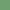 ) ((   ) (   )))
```

We've also provided a `slightly-nested-shape-list?` predicate.

```
;;; (slightly-nested-shape-list? val) -> boolean?
;;;   val : any?
;;; Determines whether `val` is a slightly-nested shape list. That is,
;;; either a shape or a shape list.
(define slightly-nested-shape-list?
  (list-of (any-of shape? (list-of shape?))))
```

```
> (slightly-nested-shape-list? red-narrow)
#f
> (slightly-nested-shape-list? (list red-narrow red-narrow))
#t
> (slightly-nested-shape-list? (list (list red-narrow red-narrow)
                                     blue-narrow))
#t
> (slightly-nested-shape-list? (list (list red-narrow red-narrow)
                                     (list blue-narrow blue-narrow)))
#t
> (slightly-nested-shape-list? (list (list red-narrow red-narrow)
                                     (list (list blue-narrow blue-narrow)
                                           purple-narrow)))
#f
```

Note that this returns a "doubly nested shape list". That's a list in which each element is either

* A shape or
* A slightly-nested shape list.

As you might expect, we've provided a `doubly-nested-shape-list` predicate.

```
;;; (doubly-nested-shape-list? val) -> boolean?
;;;   val : any?
;;; Determines whether `val` is a doubly-nested shape list. That is,
;;; a shape list, shape lists, and slightly-nested shape lists.
(define doubly-nested-shape-list?
  (list-of (any-of shape?
                   slightly-nested-shape-list)))
```

However, you are unlikely to need this predicate.

## Part 2: Transforming lists of shapes

a. Document, write at least three tests for, and write a procedure, `(shape->solid-isosceles-triangle shape)`, that takes a shape as a parameter and returns a solid isosceles triangle of the same width, height, and color.

Here and elsewhere, you may assume that the procedure is only given correct inputs.

```
> (shape->solid-isosceles-triangle red-narrow)

> (shape->solid-isosceles-triangle blue-medium)

> (shape->solid-isosceles-triangle purple-wide)

```

b. Document, write at least three tests for, and write a procedure `(shapes->solid-isosceles-triangles-0 shapes)`, that takes a shape list as a parameter and returns a shape of solid isosceles triangles that have the same width, height, and color.

```
> (shapes->solid-isosceles-triangles-0 (list red-narrow purple-medium blue-wide))
(list   )

> (shapes->solid-isosceles-triangles-0 (color-variants-0 (solid-rectangle 30 10 (rgb 128 128 128))))
(list    )
```

c. Document and write a procedure, `(shapes->solid-isosceles-triangles-1 shapes)`, that takes a slightly nested shape list as a parameter and converts each shape in the list into a solid isosceles triangle of the same widht, height, and color. See part 1 for ideas on how to write such a procedure.

```
> (shapes->solid-isosceles-triangles-1 (list red-narrow (list blue-medium purple-medium) red-wide))
(list  ( ) )

> (shapes->solid-isosceles-triangles-1 (color-variants-1 (color-variants-0 (solid-rectangle 10 25 (rgb 128 128 128)))))
(list (   ) (   ) (   ) (   ))
```

d. Document and write a procedure, `(shapes->solid-isosceles-triangles-2 shapes)`, that takes a doubly nested shape list as a parameter and converts each shape in the list into a solid isosceles triangle of the same widht, height, and color. See part 1 for ideas on how to write such a procedure.

```
> (shapes->solid-isosceles-triangles-2 (color-variants-2 (color-variants-1 (color-variants-0 (solid-rectangle 10 25 (rgb 128 128 128))))))
(list ((   ) (   ) (   ) (   )) 
  ((   ) (   ) (   ) (   )) 
  ((   ) (   ) (   ) (   ))
  ((   ) (   ) (   ) (   )))
```

Wow! That's a lot of triangles, isn't it? In the next part of the assignment, we'll find ways to combine them into a single image.

## Part 3: Combining images

As you've just seen, we can now build complex nested lists of images.  As you might expect, we'd like to be able to convert these nested lists to a single image.

a. Document and write a procedure, `(stack images)`, that takes a list of images as a parameter and returns a single image in which each image in the list is placed above the next.  In this case, your input list is not nested; it is the output from a procedure like `shapes->solid-isosceles-triangles-0`.

```
> (stack (list red-narrow purple-medium blue-wide))

> (stack (color-variants-0 (solid-rectangle 15 15 (rgb 128 128 128))))

> (stack (shapes->solid-isosceles-triangles-0 (color-variants-0 (solid-rectangle 15 15 (rgb 128 128 128)))))

```

b. Document and write a procedure, `(sequence images)`, that takes a list of images as a parameter and returns a single image in which each image in the list is placed next to the subsequent images.  Once again, in this case, your input list is not nested.

```
> (sequence (list red-narrow purple-medium blue-wide))
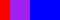
> (sequence (color-variants-0 (solid-rectangle 15 15 (rgb 128 128 128))))

> (sequence (shapes->solid-isosceles-triangles-0 (color-variants-0 (solid-rectangle 15 15 (rgb 128 128 128)))))

```

c. Document and write a procedure, `(stack-then-sequence stuff)`, that takes a slightly nested list of images as a parameter and returns an image in which each sublist is stacked and then the stacks are placed next to each other.  

```
> (stack-then-sequence (list (list red-narrow red-medium red-wide)
                             (list purple-wide purple-medium purple-narrow)
                             (list blue-narrow blue-medium blue-wide)))

> (stack-then-sequence (list red-narrow (list purple-narrow blue-narrow)
                             red-medium (list blue-medium purple-medium)
                             red-wide (list purple-wide red-wide)))

> (stack-then-sequence (color-variants-1 (color-variants-0 (solid-rectangle 30 15 (rgb 128 128 128)))))
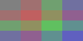
> (stack-then-sequence (shapes->solid-isosceles-triangles-1 (color-variants-1 (color-variants-0 (solid-rectangle 30 15 (rgb 128 128 128))))))

```

Note that, as in the previous parts you will likely want to write a helper procedure.  In this case, it should check whether the parameter is a image or not.  If it's an image, you can leave it as is.  If it's a list, you probably want to stack it.  After applying that helper to each element of `stuff`, you can put them beside each other.

d. Write a procedure, `(sequence-then-stack stuff)`, that takes a singly nested list of images as a parameter and returns an image in which each sublist is stacked and then the stacks are placed next to each other.  

```
> (sequence-then-stack (list (list red-narrow red-medium red-wide)
                             (list purple-wide purple-medium purple-narrow)
                             (list blue-narrow blue-medium blue-wide)))

> (sequence-then-stack (shapes->solid-isosceles-triangles-1 (list (list red-narrow red-medium red-wide)
                                                                  (list purple-wide purple-medium purple-narrow)
                                                                  (list blue-narrow blue-medium blue-wide))))
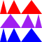
> (sequence-then-stack (list red-narrow (list purple-narrow blue-narrow)
                             red-medium (list blue-medium purple-medium)
                             red-wide (list purple-wide red-wide)))

> (sequence-then-stack (color-variants-1 (color-variants-0 (solid-rectangle 30 15 (rgb 128 128 128)))))

> (sequence-then-stack (shapes->solid-isosceles-triangles-1 (color-variants-1 (color-variants-0 (solid-rectangle 30 15 (rgb 128 128 128))))))

```

As in the case of `stack-then-sequence`, you'll find a helper procedure useful.

e. Write a procedure, `(sequence-then-stack-then-sequence stuff)`, that takes a doubly-nested list as input.  You should be able to guess what it should do.

```
>  (sequence-then-stack (list (list red-narrow blue-medium purple-wide)
                              (list blue-medium purple-wide red-narrow)
                              (list purple-wide red-narrow blue-medium)))
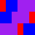
> (sequence-then-stack (list purple-wide
                             (list blue-medium red-medium)))

> (sequence-then-stack (list red-narrow blue-narrow purple-narrow blue-narrow red-narrow))
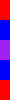
> (sequence-then-stack-then-sequence (list (list (list red-narrow blue-medium purple-wide)
                                                 (list blue-medium purple-wide red-narrow)
                                                 (list purple-wide red-narrow blue-medium))
                                           (list purple-wide
                                                 (list blue-medium red-medium))
                                           (list red-narrow blue-narrow purple-narrow blue-narrow red-narrow)))
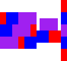
> (sequence-then-stack-then-sequence (shapes->solid-isosceles-triangles-2 (list (list (list red-narrow blue-medium purple-wide)
                                                                                      (list blue-medium purple-wide red-narrow)
                                                                                      (list purple-wide red-narrow blue-medium))
                                                                                (list purple-wide
                                                                                      (list blue-medium red-medium))
                                                                                (list red-narrow blue-narrow purple-narrow blue-narrow red-narrow))))
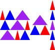
> (sequence-then-stack-then-sequence
   (shapes->solid-isosceles-triangles-2
    (color-variants-2
     (color-variants-1
      (color-variants-0
       (solid-rectangle 15 15 (rgb 128 128 128)))))))
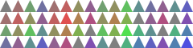
```

_We've written some fairly wide lines of code. You should avoid such wide linns._

f. Write a procedure, `(stack-then-sequence-then-stack stuff)`, that takeks a doubly-nested list as input.  You should be able to guess what it should do.

```
>  (stack-then-sequence (list (list red-narrow blue-medium purple-wide)
                              (list blue-medium purple-wide red-narrow)
                              (list purple-wide red-narrow blue-medium)))

> (stack-then-sequence (list purple-wide
                             (list blue-medium red-medium)))

> (stack-then-sequence (list red-narrow blue-narrow purple-narrow blue-narrow red-narrow))
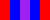
> (stack-then-sequence-then-stack (list (list (list red-narrow blue-medium purple-wide)
                                              (list blue-medium purple-wide red-narrow)
                                              (list purple-wide red-narrow blue-medium))
                                        (list purple-wide
                                              (list blue-medium red-medium))
                                        (list red-narrow blue-narrow purple-narrow blue-narrow red-narrow)))
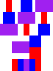
> (stack-then-sequence-then-stack
   (shapes->solid-isosceles-triangles-2 (list (list (list red-narrow blue-medium purple-wide)
                                                    (list blue-medium purple-wide red-narrow)
                                                    (list purple-wide red-narrow blue-medium))
                                              (list purple-wide
                                                    (list blue-medium red-medium))
                                              (list red-narrow blue-narrow purple-narrow blue-narrow red-narrow))))
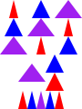
> (stack-then-sequence-then-stack
   (shapes->solid-isosceles-triangles-2
    (color-variants-2
     (color-variants-1
      (color-variants-0
       (solid-rectangle 15 15 (rgb 128 128 128)))))))
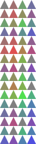
.
```

## Part 4: Freestyle

Using these procedures and any others you write, create an interesting image which you should call `freestyle`.

```
(define freestyle (stack-then-sequence-then-stack ...))
```

To earn an E, you will need to write your own variants of the procedures in parts 1, 2, and 3.

Grading rubric
--------------

### Redo or above

Submissions that lack any of these characteristics will get an N.

```
[ ] Displays a good faith attempt to complete every required part of the assignment.
```

### Meets expectations or above

Submissions that lack any of these characteristics but have all of the
prior characteristics will get an R.

```
[ ] Includes the specified file, `shapes-list.scm`.
[ ] Includes an appropriate header on all submitted files that includes the course, author, etc.
[ ] Code runs in Scamper without errors.
[ ] Documents and names all core procedures correctly.
[ ] Code generally follows style guidelines.
[ ] Code includes required tests.
[ ] Basic functionality of all core functions is present and correct:
    + `color-variants-0`.
    + `color-variants-1`.
    + `color-variants-1x`.
    + `color-variants-2`.
    + `shape->solid-isosceles-triangle`.
    + `shapes->solid-isosceles-triangles-0`.
    + `shapes->solid-isosceles-triangles-1`.
    + `stack`.
    + `sequence`.
    + `sequence-then-stack`.
    + `stack-then-sequence`.
[ ] Freestyle function is present and operational.
```

### Exemplary / Exceeds expectations

Submissions that lack any of these characteristics but have all the
prior characteristics will get an M.

```
[ ] Function documentation is complete and appropriately evocative of each function's behvaior.
[ ] Code follows style guidelines completely, with at most _three_ minor errors present.
[ ] Code is well-designed, avoiding repeated work through decomposition and appropriate language constructs.
[ ] Each set of tests includes at least one edge case (e.g., an empty list, if appropriate).
[ ] Implementation of all core functions is completely correct.
[ ] Freestyle implements variants of procedures found in previous parts:
    + Adds a new procedure akin to `color-variants`.  That is, adds a 
    procedure that takes a `shape-params?` as a parameter and creates
    a list of `shape-params?` (or list of lists of ....)`.
    + Adds a new procedure akin to `shape->solid-isosceles-triangles-1`.
    + Adds a new procedure akin to `stack` or `sequence`. That is,
    adds a procedure that combines a list of images into a single image.
    It might combine the images diagonally, or beside but bottom
    aigned, or overlay them, or ...
    + Adds a new procedure akin to `stack-then-sequence`, that works
    with a singly nested list.
```
