Please start with the [template code](../code/mps/shape-lists.rkt).

Please save all of your work as `shape-lists.rkt`.

## Introduction

By this point, you've considered a variety of procedures for making and manipulating some basic shapes, such as circles and squares (or, more generally, ellipses and rectangles). As you may have discovered, we can use the characteristics of one shape to make another shape.

Suppose we start with a few rectangles. We've tried to name them in such a way that describes their general characteristics.

```
(define red-narrow
  (solid-rectangle 10 20 "red"))

(define red-medium
  (solid-rectangle 20 20 "red"))

(define red-wide
  (solid-rectangle 30 20 "red"))

(define blue-narrow
  (image-recolor red-narrow "blue"))

(define blue-medium
  (image-recolor red-medium "blue"))

(define blue-wide
  (image-recolor red-wide "blue"))

(define purple-narrow
  (image-recolor red-narrow "purple"))

(define purple-medium
  (image-recolor red-medium "purple"))

(define purple-wide
  (image-recolor red-wide "purple"))
```

Now, let's write a procedure that converts almost any shape to an ellipse.

```
(define shape->ellipse
  (lambda (shape)
    (solid-ellipse (image-width shape) 
                   (image-height shape) 
                   (image-color shape))))
```

Using `map`, we can quickly make lists of shapes and convert them.

```
> narrow-shapes
'( 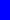 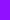)
> (map shape->ellipse narrow-shapes)
'(  )
> (apply beside (map shape->ellipse narrow-shapes))

```

We can even make somewhat slightly more complex shapes using that information.

```
(define thickly-outlined-ellipse
  (lambda (width height color)
    (overlay (outlined-ellipse width height "black" 10)
             (solid-ellipse width height color))))

(define shape->thickly-outlined-ellipse
  (lambda (shape)
    (thickly-outlined-ellipse (image-width shape)
                              (image-height shape)
                              (image-color shape))))
```

```
> (apply beside (map shape->thickly-outlined-ellipse narrow-shapes))

```

To make this a bit easier, we're going to write another helper procedure, `shape-params`, which grabs the width, height, and color from an image and puts them in a list.

```
;;; (shape-params shape) -> list?
;;;   shape : basic-image?
;;; Create a list of the width, height, and color of the image.
(define shape-params
  (lambda (img)
    (list (image-width img) (image-height img) (image-color img))))
```

What does that let us do? Well, here's one example.

```
(define something (o (cut (apply solid-isosceles-triangle <>)) shape-params))
```

Can you tell what that does, as strange as it is?

Try it out.

```
> (map something (list purple-narrow purple-medium purple-wide))
intentionally left for you to try
```

Of course, rather than creating lists like these on our own, we can write procedures that do so.  Here's one that takes a shape and creates five variants of varying widths and "shades". 

```
;;; (five-variants shape) -> (list-of basic-image?)
;;;   shape : basic-image?
;;; Create a list of five shapes based on the original shape.
;;;
;;; * The first shape is 1/3 the width and much darker.
;;; * The second shape is 1/3 the width and slightly darker.
;;; * The third shape is the same.
;;; * The fourth shape is 4/3 the width and slightly lighter.
;;; * The fifth shape is 5/3 the width and much lighter.
(define five-variants
  (lambda (shape)
    (apply five-variants/helper (shape-params shape))))

;;; (five-variants/helper width height color) -> (list-of shape?)
;;;   width : nonnegative-integer?
;;;   height : nonnegative-integer?
;;;   color : rgb?
;;; Create a list of five shapes based on `width`, `height`, and
;;; `color`. See `five-variants` for the details.
(define five-variants/helper
  (lambda (width height color)
    (list (solid-rectangle (* 1/3 width) height (rgb-darker (rgb-darker color)))
          (solid-rectangle (* 2/3 width) height (rgb-darker color))
          (solid-rectangle width height color)
          (solid-rectangle (* 4/3 width) height (rgb-lighter color))
          (solid-rectangle (* 5/3 width) height (rgb-lighter (rgb-lighter color))))))
```

We can quickly make lists of variants.

```
> (five-variants (solid-rectangle 10 20 "orange"))
'(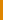 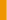   )
```

And, with the procedures we've been writing, we can make them different shapes.

```
> (map shape->ellipse (five-variants (solid-rectangle 10 20 "orange")))
'(    )
> (apply overlay (map shape->ellipse (five-variants (solid-rectangle 10 20 "orange"))))

```

As we've already learned, there's power in repeating actions.  So we could turn those five shapes descriptions into twenty-five with a call to map.

```
> (define twenty-five-things (map five-variants (five-variants (solid-rectangle 20 20 (rgb 128 64 192)))))
> twenty-five-things
'((    )
  (    )
  (    )
  (    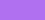)
  (    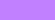))
```

Unfortunately, we can't convert those to images quite as easily.

```
> (map shape->ellipse twenty-five-things)
. . some error message
```

Our goal in this assignment is to write procedures that will help us deal with these nested (perhaps deeply nested) lists of shapes.

### Detour: Tests and testing

Up until this point, we have asked you to experiment with the functions that you write in the interactions window to check for correctness.  This has the upside of being fast, but if you change your code, you need manually type in all those tests again which is tedious (which in turn makes it less likely you'll recheck the correctness of your code).  A better solution is to *codify* your tests in your code so that you can rerun the tests at will.

During our unit on software engineering fundamentals, we'll introduce you to a library, `rackunit`, that makes test authoring and execution a breeze.  For now, we'll look at two basic RackUnit procedures

When we are developing predicates (procedures that return a Boolean) value, Racket (RackUnit) provides an important procedure to help us make that list of inputs/outputs and automatically check it for us: `(test-equal? DESCRIPTION EXP EXPECTED)`, which evaluates `EXP`, compares it to `EXPECTED`, and prints an error message only if it fails.

For example,

```
> (test-equal? "the square root of 3 squared is 3" (sqrt (sqr 3)) 3)
> (test-equal? "the square root of 4 squared is 4" (sqrt (sqr 4)) 4)
> (test-equal? "the square root of 100 squared is 100" (sqrt (sqr 100)) 100)
> (test-equal? "the square of the square root of 100 is 100" (sqr (sqrt 100)) 100)
> (test-equal? "the square of the square root of 4 is 4" (sqr (sqrt 4)) 4)
> (test-equal? "the square of the square root of 3 is 3" (sqr (sqrt 3)) 3)
--------------------
the square of the square root of 3 is 3
. FAILURE
name:       check-equal?
location:   31-interactions from an unsaved editor:22:2
actual:     2.9999999999999996
expected:   3
--------------------
```

As this suggests, if the test succeeds, you get no output.  However, if the test fails, you get a helpful FAILURE message.  (Please don't feel like a failure for getting such messages.  All of us get them from time to time.)

While we cannot normally use `test-equal?` to compare images, we can use it to cmpare characteristics of those images.  For example, consider the following procedure that is supposed to make a snowman of a certain height.

```
(define my-snowman
  (lambda (height)
    (above (solid-circle (* height 1/2) "black")
           (solid-circle (* height 2/3) "black")
           (solid-circle (* height 5/6) "black"))))
```

Here are a few tests we've written to see whether it works.  The first is what some folks call a "corner" or "corner case" (also "edge" or "edge case"): one with a strange but valid input.  In this case, we've made a zero-height snowman.

```
(test-equal? "zero height snowman" (image-height (my-snowman 0)) 0)
(test-equal? "normal snowman" (image-height (my-snowman 40)) 40)
(test-equal? "small snowman" (image-height (my-snowman 5)) 5)
(test-equal? "large snowman" (image-height (my-snowman 100)) 100)
```

This time, we're going to put the tests in the definitions pane and click "Run".  What do you think will happen?  Let's see ...

```
--------------------
normal snowman
. FAILURE
name:       check-equal?
location:   let-it-snow.rkt:13:0
actual:     80
expected:   40
--------------------
--------------------
small snowman
. FAILURE
name:       check-equal?
location:   let-it-snow.rkt:14:0
actual:     10
expected:   5
--------------------
--------------------
large snowman
. FAILURE
name:       check-equal?
location:   let-it-snow.rkt:15:0
actual:     200
expected:   100
--------------------
```

Whoops!  There's something wrong with our procedure.  Interestingly, it got the right height for the "zero height" snowman, but not for the rest.  If we look closely, we see that each result is twice as large as it should be.  

```
(define my-snowman
  (lambda (height)
    (above (solid-circle (* height 1/4) "outline")
           (solid-circle (* height 1/3) "outline")
           (solid-circle (* height 5/12) "outline"))))

(test-equal? "zero height snowman" (image-height (my-snowman 0)) 0)
(test-equal? "normal snowman" (image-height (my-snowman 40)) 40)
(test-equal? "small snowman" (image-height (my-snowman 5)) 5)
(test-equal? "large snowman" (image-height (my-snowman 100)) 100)
```

What happens when I click run this time?

```
Welcome to DrRacket, version 8.11.1 [cs].
Language: racket, with debugging; memory limit: 128 MB.
> 
```

Whoo!  No errors.  That suggests that I got the height right.

As this example suggests, we should put our tests immediately after our code in the definitions pane.  Then, when we click "Run", we'll quickly determine if there are any problems (and what those problems are).  If we see no reports, we can be sure that the code passed all of our tests.

Note that to use these procedures, one must require the `rackunit` library with `(require rackunit)`.

Now, on to the problems!

## Part 1: Making lists of shape parameters

Our `five-variants` procedure is nice, but it's a bit cumbersome to apply.  For example, what if we already have a nested list of `shape-params?` and we want to make five variants of each shape?  We can't just call `five-variants`; you may recall that in our example above, we had to use `map` once we had a list.  But if we have nested lists, `map` won't even work.

We'll do this with a sequence of steps.

First, let's start with a procedure that makes a different set of variants.

a. Document, create at least three tests for, and write a procedure, `(color-variants-0 shape)`, that takes a shape and makes a list of four shapes. (It's fine if you use rectangles for the shapes; they make a good starting point.)

* The first should be the original shape.
* The second should be a redder version of the original shape.
* The third should be a greener version of the original shape.
* The fourth should be a bluer version of the original shape.

You should use `rgb-redder`, `rgb-greener`, and `rgb-bluer` to make those variants.

```
> (color-variants-0 (solid-square 20 (rgb 128 128 128)))
'(   )
```

What will your tests look like? Here's one example.

```
(test-equal? "color-variants-0: Middle grey"
             (color-variants-0 (solid-rectangle 30 30 (rgb 128 128 128)))
             (list (solid-rectangle 30 30 (rgb 128 128 128))
                   (solid-rectangle 30 30 (color-redder (rgb 128 128 128)))
                   (solid-rectangle 30 30 (color-greener (rgb 128 128 128)))
                   (solid-rectangle 30 30 (color-bluer (rgb 128 128 128)))))
```


b. Document, write one test for, and write a procedure, `(color-variants-1 stuff)`, that takes a shape list as a parameter and applies `color-variants-0` to each of them.

```
;;; (color-variants-1 shapes) -> (list-of (list-of shape?))
;;;   shapes : (list-of shape?)
;;; Apply `color-variants-0` to each element of `shapes`.
```

```
> (color-variants-1 (list (solid-square 20 (rgb 128 128 128)) (solid-square 20 (rgb 64 64 64)) (solid-square 20 (rgb 192 192 192))))
'((   ) ( 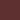  ) (   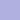))
> (color-variants-1 (color-variants-0 (solid-square 15 (rgb 128 128 128))))
'((   ) ( 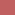 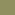 ) (   ) (   ))
> (map (cut (apply beside <>))
       (color-variants-1 (color-variants-0 (solid-square 15 (rgb 128 128 128)))))
'( 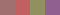  )
> (apply above
         (map (cut (apply beside <>))
              (color-variants-1 (color-variants-0 (solid-square 15 (rgb 128 128 128))))))

```

_Hint_: Use `map`.

c. Document, write two tests for, and write a procedure `(color-variants-1x stuff)`, that takes either a shape or a shape list as a parameter. If it receives a shape, it should return the result of applying `color-variants-0` to the shape. If it receives a shape list, it should apply `color-variants-1` to that list. 

```
;;; (color-variants-1x stuff) -> (any-of (list-of shape?) (list-of (list-of shape?)))
;;;   stuff : (any-of shape? (list-of shape?))
;;; Make variants of all the shapes in `stuff`.
```

```
> (color-variants-1x (solid-rectangle 10 20 (rgb 128 128 128)))
'(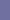   )
'(. . . .)
> (color-variants-1x (color-variants-1x (solid-rectangle 10 20 (rgb 128 128 128))))
'((   ) (   ) (   ) (   ))
```

You may assume that `color-variants-1x` receives either a shape or a shape list as a parameter. That is, if its parameter is not a shape, it must be a shape list.

Note that the `shape?` predicate lets you determine if a value is a shape.

d. Document and write a procedure, `(color-variants-2 stuff)`, that takes a slightly nested shape list as a parameter and applies `color-variants-1x` to each element.

By "slightly nested shape list", we mean a list that contains only

* shapes or
* lists of shapes.

Since we have only two options, you may assume that anything in the list that isn't a shape must be a shape list.

```
> (color-variants-2 (list (solid-square 10 (rgb 128 128 128))
                           (list (solid-rectangle 10 20 (rgb 128 128 128))
                                 (solid-rectangle 20 10 (rgb 128 128 128)))))
'((   ) ((   ) (   )))
```

We've also provided a `slightly-nested-shape-list?` predicate.

```
;;; (slightly-nested-shape-list? val) -> boolean?
;;;   val : any?
;;; Determines whether `val` is a slightly-nested shape list. That is,
;;; either a shape or a shape list.
(define slightly-nested-shape-list?
  (list-of (any-of shape? (list-of shape?))))
```

```
> (slightly-nested-shape-list? red-narrow)
#f
> (slightly-nested-shape-list? (list red-narrow red-narrow))
#t
> (slightly-nested-shape-list? (list (list red-narrow red-narrow)
                                     blue-narrow))
#t
> (slightly-nested-shape-list? (list (list red-narrow red-narrow)
                                     (list blue-narrow blue-narrow)))
#t
> (slightly-nested-shape-list? (list (list red-narrow red-narrow)
                                     (list (list blue-narrow blue-narrow)
                                           purple-narrow)))
#f
```

Note that this returns a "doubly nested shape list". That's a list in which each element is either

* A shape or
* A slightly-nested shape list.

As you might expect, we've provided a `doubly-nested-shape-list` predicate.

```
;;; (doubly-nested-shape-list? val) -> boolean?
;;;   val : any?
;;; Determines whether `val` is a doubly-nested shape list. That is,
;;; a shape list, shape lists, and slightly-nested shape lists.
(define doubly-nested-shape-list?
  (list-of (any-of shape?
                   slightly-nested-shape-list)))
```

However, you are unlikely to need this predicate.

## Part 2: Transforming lists of shapes

a. Document, write at least three tests for, and write a procedure, `(shape->solid-isosceles-triangle shape)`, that takes a shape as a parameter and returns a solid isosceles triangle of the same width, height, and color.

Here and elsewhere, you may assume that the procedure is only given correct inputs.

b. Document, write at least three tests for, and write a procedure `(shapes->solid-isosceles-triangles-0 shapes)`, that takes a shape list as a parameter and returns a shape of solid isosceles triangles that have the same width, height, and color.

c. Document and write a procedure, `(shapes->solid-isosceles-triangles-1 shapes)`, that takes a slightly nested shape list as a parameter and converts each shape in the list into a solid isosceles triangle of the same widht, height, and color. See part 1 for ideas on how to write such a procedure.

d. Document and write a procedure, `(shapes->solid-isosceles-triangles-2 shapes)`, that takes a doubly nested shape list as a parameter and converts each shape in the list into a solid isosceles triangle of the same widht, height, and color. See part 1 for ideas on how to write such a procedure.

## Part 3: Combining images

We can now build complex nested lists of images.  As you might expect, we'd like to be able to convert these nested lists to a single image.

a. Document and write a procedure, `(stack images)`, that takes a list of images as a parameter and returns a single image in which each image in the list is placed above the next.  In this case, your input list is not nested; it is the output from a procedure like `shapes->solid-isosceles-triangles-0`.

b. Document and write a procedure, `(sequence images)`, that takes a list of images as a parameter and returns a single image in which each image in the list is placed next to the subsequent images.  Once again, in this case, your input list is not nested.

c. Document and write a procedure, `(stack-then-sequence stuff)`, that takes a slightly nested list of images as a parameter and returns an image in which each sublist is stacked and then the stacks are placed next to each other.  

Note that, as in the previous parts you will likely want to write a helper procedure.  In this case, it should check whether the parameter is a image or not or not.  If it's an image, you can leave it as is.  If it's a list, you probably want to stack it.  After applying that helper to each element of `stuff`, you can put them beside each other.

d. Write a procedure, `(sequence-then-stack stuff)`, that takes a singly nested list of images as a parameter and returns an image in which each sublist is stacked and then the stacks are placed next to each other.  

e. Write a procedure, `(sequence-then-stack-then-sequence stuff)`, that takes a doubly-nested list as input.  You should be able to guess what it should do.

f. Write a procedure, `(stack-then-sequence-then-stack stuff)`, that takeks a doubly-nested list as input.  You should be able to guess what it should do.

## Part 4: Freestyle

Using these procedures and any others you write, create an interesting image which you should call `freestyle`.

```
(define freestyle (stack-then-sequence-then-stack ...))
```

To earn an E, you will need to write your own variants of the procedures in parts 1, 2, and 3.

Grading rubric
--------------

_Still under development._

### Redo or above

Submissions that lack any of these characteristics will get an I.

```
[ ] Passes all of the one-star autograder tests.
[ ] Includes the specified file, `shape-lists.rkt`.
[ ] Includes an appropriate header on the file that indicates the
    course, author, etc.
[ ] Acknowledges appropriately.
[ ] Code runs in DrRacket.
[ ] Most procedures are documented in some form.
```

### Meets expectations or above

Submissions that lack any of these characteristics but have all of the
prior characteristics will get an R.

```
[ ] Passes all of the two-star autograder tests.  For example,
    [ ] Correctly mplements `shape-params?`.
    [ ] Correctly implements `solid-ellipses-0`.
    [ ] Correctly implements `solid-ellipses-1`.
    [ ] Correctly implements `solid-ellipses-2`.
    [ ] Correctly implements `stack`.
    [ ] Correctly implements `sequence`.
    [ ] Correctly implements `stack-then-sequence`.
    [ ] Correctly implements `sequence-then-stack`.
    [ ] Correctly implements `stack-then-sequence`.
    [ ] Correctly implements `sequence-then-stack-then-sequence`.
    [ ] Correctly implements `stack-then-sequence-then-stack`.
[ ] Code is well-formatted with appropriate names and indentation.
[ ] Code has been reformatted with Ctrl-I before submitting.
[ ] Code generally follows style guidelines.
[ ] Documentation for all core procedures is correct / has the correct form.
[ ] Creates an image called `freestyle`.
```

### Exemplary / Exceeds expectations

Submissions that lack any of these characteristics but have all of the
prior characteristics will get an M.

```
[ ] Passes all of the three-star autograder tests.  For example,
    [ ] Correclty implements `color-variants-all`.
    [ ] Correctly implements `solid-ellipses`.
    [ ] Correctly implements `solid-right-triangles`.
    [ ] Correctly implements `boxed-solid-ellpises`.
    [ ] Correctly implements `outlined-solid-rectangles`.
    [ ] Correctly implements `stacked-ss`.
    [ ] Correctly implements `sequenced-ss`.
[ ] Adds a new procedure akin to `color-variants`.  That is, adds a 
    procedure that takes a `shape-params?` as a parameter and creates
    a list of `shape-params?` (or list of lists of ....)`.
[ ] Adds a new procedure akin to `solid-ellipse`, `solid-right-triangle`, etc.
    That is, adds a procedure that takes a nested list of `color-params?`
    as a parameter and creates a list of similar shapes.
[ ] Adds a new procedure akin to `stacked-ss` or `sequenced-ss` (e.g.,
    overlaying or combining diagonally).  That is, adds a procedure that
    takes a nested-shape list as a parameter and builds an image
    from them (other than by using `stacked-ss` or `sequenced-ss`).
[ ] Style is impeccable (or nearly so).
[ ] Avoids repeated work.
[ ] Documentation for all procedures is correct / has the correct form.
```

## Q&A

_Forthcoming._
