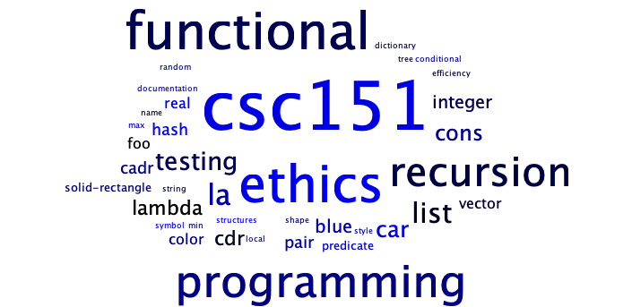
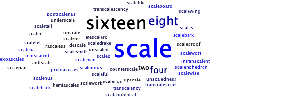
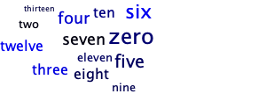
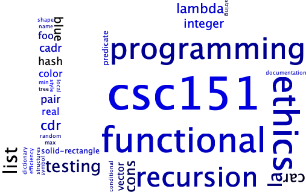
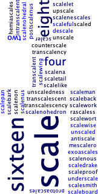
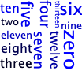
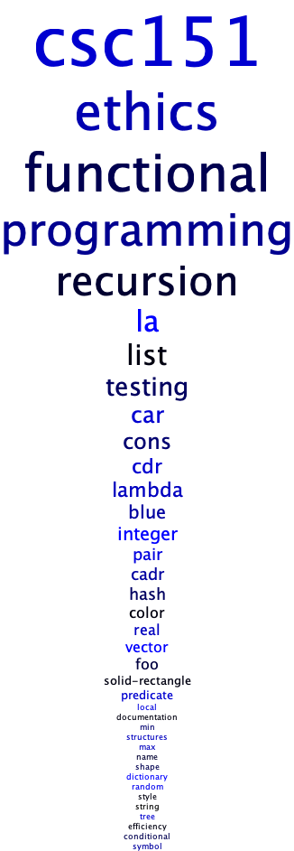
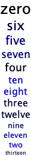
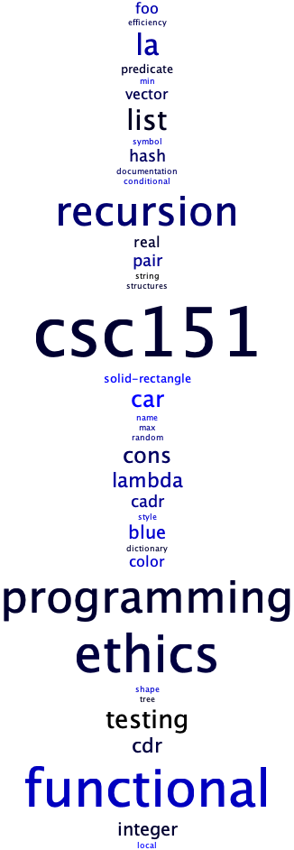

Note: This assignment is intentionally more open-ended than most. Have
fun! Be creative!

The assignment
--------------

As you may know, a "word cloud" (also ["tag cloud"](https://en.wikipedia.org/wiki/Tag_cloud)) is a visual representation of the most common words in a text (usually ignoring "common words", such as "a", "an", and "the").  The words are grouped in an approximately oval shape, with the size of a word representing the approximate frequency (percentage of times) in which the word appears in the text.

Note that in order for a word size to represent the approximate frequency, it should grow with the square root of the frequency. That is, if word A appears four times as many times as word B, it should have twice the font size. (Since both the width and the height scale with the font size, when we double the font size, we square the overall area.)

Some analysts promote word clouds because they provide a visually stimulating way to get an overview of the topics in a text.  Others note that word clouds may promote inappropriate conclusions, since we tend to assume nearby words are related, but most word-cloud algorithms do not use proximity in the text to compute proximity in the image.

Your assignment is to write a procedure, `(word-cloud text)`, that builds a word cloud for the given string.  That is, it reads all the words from the file, computes their frequencies (_hint_: a dictionary!), generates an appropriate-sized word image for each of the top 50, and puts them together into a single image.

We strongly recommend that you decompose the problem into smaller pieces. (You are required to do so to earn an M.)

You *must* build a dictionary with words as keys and frequencies as values. You can refer to the [letter inventory lab](../code/labs/letter-inventory.scm) for how to do so.

You can earn an M if you use a straightforward algorithm to put them together into a single image, such as stacking the words on top of each other.  (No, that's not much of a "cloud".)  To earn an E, you will need to develop a more sophisticated algorithm.

Save your code in the file `word-cloud.scm`.  Also include a file, `sample.png`, that shows a particularly successful cloud you generated. Recall that you can right-click an image in scamper to save it to disk. Your word cloud should be from a plain text file of at least 1,000 words. You should include the file in your submission, too.  Make sure to include a comment in `word-cloud.scm` that explains how you generated that cloud (e.g., the source text).

Reading from files
------------------

Because Scamper operates in a web browser, reading files is surprisingly non-trivial to do!
Scamper abstracts away this nastiness with the function `(with-file func)`.
`with-file` outputs a button that, when pressed, opens a file chooser dialog.
Scamper then runs `func` on the contents of that file, outputting whatever value
`func` produces.

For example, here is a code snippet that simply reports the number of characters in the file.
Feel free to throw different text files at it!

<pre class="scamper source">
(with-file
  (lambda (text)
    (string-append "The length is: " (number->string (string-length text)))))
</pre>

In `word-cloud.scm`, you should include a top-level call to `with-file` that invokes your `word-cloud` function directly.
Feel free to use the `title` and `description` functions from the `lab` module to describe your program and what it does!

Rendering text
--------------

The CSC 151 library has a few basic procedures for making images of text.

The `(text string size color)` procedure creates an image of the text of the string in the given size and color.

<pre class="scamper source">
(import image)

(text "Hello World" 30 "blue")
(text "This is text" 20 (rgb 200 10 100))
</pre>

Since the procedure returns an image, you can use it like any other image. For example, you can rotate it or stack it on another image.

<pre class="scamper source">
(import image)
(rotate 45 (text "Please turn me" 20 (rgb 0 100 200)))
(rotate 180 (text "Upside down" 50 (rgb 255 0 0)))
(beside (text "Big" 50 (rgb 0 0 0))
        (rotate 90 (text "small" 15 (rgb 128 128 128))))
</pre>

You can also create text in different fonts. To do so, you must first build a font.

<pre class="scamper source-only">
;;; (font face system-face bold? italic?) -> font?
;;;   face: string? A valid font name
;;;   system-face: string? A generic font family name (optional, default "sans-serif")
;;;   bold?: boolean? (optional, default #f)
;;;   italic?: boolean? (optional, default #f)
;;; Returns a new font value with the given arguments. The system-face name is drawn
;;; from one of the possible system font families, a list can be found on MDN (font-family).
</pre>

Once you've created a font, you can make text in that font by adding that as an additional parameter to the `text` procedure.

<pre class="scamper source">
(import image)
(text "Roman" 20 (rgb 0 0 0) (font "Times New Roman" "serif" #f #f))
(text "Roman Italic" 20 (rgb 0 0 0) (font "Times New Roman" "serif" #f #t))
(text "Roman bold italic" 20 (rgb 0 0 0) (font "Times New Roman" "serif" #t #f))
; Note: here we do not provide a font face and instead use the system "cursive" font!
(text "Cursive" 20 (rgb 0 0 0) (font "" "cursive" #f #f))
</pre>

You may want to spend a bit of time playing with combinations to get fonts that you find appropriate. Or you can stick to the default font.

Examples
--------

Here are the results of one version of `word-cloud` working on a few of the files that we will use for grading.

Using the file [`words-csc151.txt`](../files/word-clouds/words-csc151.txt), which contains words relevant to CSC-151.

Using the file [`words-scaling.txt`](../files/word-clouds/words-scaling.txt), which is used for scaling tests.

Using the file [`words-few.txt`](../files/word-clouds/words-few.txt), which is used for tests of files with a few words.

And here are the same three files versions using a simpler "randomly place above and beside" (more or less).

`words-csc151.txt`

`words-scaling.txt`

`words-few.txt`

And here's what we might get for the basic M-level cloud, just a stack of words.

`words-csc151.txt`

`words-few.txt`

Here are the CSC-151 words, one last time, in a randomized stack. _Even though this stack is a bit more "interesting" than the ordered stack, it would still be considered an M-level solution._

Grading rubric
--------------

### Redo or above

Submissions that lack any of these characteristics will get an N.

+ Displays a good faith attempt to complete every required part of the assignment.

### Meets expectations or above

Submissions that lack any of these characteristics but have all the
prior characteristics will get an R.

+   Includes the specified file, `word-cloud.scm`.
+   Includes an appropriate header on all submitted files that includes the course, author, etc.
+   **Correctness**
    +   Code runs without errors.
    +   Core functions are present and correct (except for non-obvious corner cases, when present)
        *   `(word-cloud text)`
    +   Code includes a top-level call to `with-file` that invokes `word-cloud`.
    +   Submission includes `sample.png` and the plain text file of at least 1,000 words that was used to generate it.
    +   Submission explains in a comment how `sample.png` was created.
+   **Design**
    +   Documents and names all core procedures correctly.
    +   Code generally follows style guidelines.
    +   `word-cloud` has been appropriately decomposed into at least three subprocedures.

### Exemplary / Exceeds expectations

Submissions that lack any of these characteristics but have all the
prior characteristics will get an M.

+   **Correctness**
    - Implementation of all core functions is completely correct.
    - Removes the most common words in English (e.g., "The", "A").
    - Ensures that various capitalized versions of the same word are treated
    as identical (e.g., "ahoy", "Ahoy", "AHOY").
    - Can handle files with thousands of words in a reasonable timeframe.
    - Chooses the font sizes appropriately based on the percentage of
    appearances rather than the number of appearances.  For example,
    if "example" appears 100 times in a text of 1,000 words (10% of
    the time), it would be much bigger than if it appeared 100 times in 
    a text of 10,000 words (1% of the time). 
+   **Design**
    - Function documentation is complete and appropriately evocative of each function's behavior.
    - Code follows style guidelines completely, with at most _three_ minor errors present.
    - Code is well-designed, avoiding repeated work through decomposition and appropriate language constructs.

### Kudos!

These additional characteristics won't affect your grade, but may be worth considering.

*   Handles files with fewer than 50 unique words.
*   Uses color or typeface to indicate some additional characteristic
    of the word.  (Should be explained in the documentation.)
