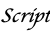

Note: This assignment is intentionally more open-ended than most. Have
fun! Be creative!

The assignment
--------------

As you may know, a "word cloud" (also ["tag cloud"](https://en.wikipedia.org/wiki/Tag_cloud)) is a visual representation of the most common words in a text (usually ignoring "common words", such as "a", "an", and "the").  The words are grouped in an approximately oval shape, with the size of a word representing the approximate frequency (percentage of times) in which the word appears in the text.

Note that in order for a word size to represent the approximate frequency, it should grow with the square root of the frequency. That is, if word A appears four times as many times as word B, it should have twice the font size. (Since both the width and the height scale with the font size, when we double the font size, we square the overall area.)

Some analysts promote word clouds because they provide a visually stimulating way to get an overview of the topics in a text.  Others note that word clouds may promote inappropriate conclusions, since we tend to assume nearby words are related, but most word-cloud algorithms do not use proximity in the text to compute proximity in the image.

Your assignment is to write a procedure, `(word-cloud filename)`, that builds a word cloud for the given file.  That is, it takes a filename (a string) as input, reads all the words from the file and computes their frequences (hint: hash tables), generates an appropriate-sized word image for each of the top 50, and puts them together into a single image.

We strongly recommend that you decompose the problem into smaller pieces. (You are required to do so to earn an M.)

Note that the `(file->words filename)` procedure (in the CSC-151 library) will give you a list of all the words in a file (as strings).

You *must* build a hash table with words as keys and frequencies as values. You can refer to the [hash table lab](../code/labs/hash-tables.rkt) for how to do so.

You can earn an M if you use a straightforward algorithm to put them together into a single image, such as stacking the words on top of each other.  (No, that's not much of a "cloud".)  To earn an E, you will need to develop a more sophisticated algorithm.

Save your code in the file `word-cloud.rkt`.  Also include a file, `sample.png`, that shows a particularly successful cloud you generated. Your word cloud should be from a plain text file of at least 1,000 words. You should include the file in your submission.  Make sure to include a comment in `word-cloud.rkt` that explains how you generated that cloud (e.g., the source text).

Working with text
-----------------

The CSC-151 library has a few basic procedures for making images of text.

The `(text string size color)` procedure creates an image of the text of the string in the given size and color.

```
> (text "Hello World" 30 "blue")

> (text "This is text" 20 (rgb 200 10 100))

```

Since the procedure returns an image, you can use it like any other image. For example, you can rotate it or stack it on another image.

```
> (rotate (text "Please turn me" 20 (rgb 0 100 200)) 45)

> (rotate (text "Upside down" 50 (rgb 255 0 0)) 180)

> (beside (text "Big" 50 (rgb 0 0 0))
          (rotate (text "small" 15 (rgb 128 128 128)) 90))

```

You can also create text in different fonts. To do so, you must first build a font.

```
;;; (font face family style weight underline?)
;;;   face : (any-of string? false?)
;;;   family : (one-of "default" "decorative" "roman" "script"
;;;                    "swiss" "modern" "symbol" "system")
;;;   style :  (one-of "normal" "italic")
;;;   weight : (one-of "normal" "bold" "light")
;;;   underline? : boolean?
;;; Create a font value for use in building text.
```

At present, the `font` procedure does not work well if you give it a face other than `#f`, but you can play with the other aspects. Once you've created a font, you can make text in that font by adding that as an additional parameter to the `text` procedure.

```
> (text "Roman" 20 (rgb 0 0 0) (font #f "roman" "normal" "normal" #f))

> (text "Roman Italic" 20 (rgb 0 0 0) (font #f "roman" "italic" "normal" #f))

> (text "Roman bold italic" 20 (rgb 0 0 0) (font #f "roman" "italic" "bold" #f))

> (text "Script" 20 (rgb 0 0 0) (font #f "script" "normal" "normal" #f))

```

Not all combinations work. For example, bold script and script seem to be the same (at least on my computer).

```
> (text "Bold script" 20 (rgb 0 0 0) (font #f "script" "normal" "bold" #f))

```

You may want to spend a bit of time playing with combinations to get fonts that you find appropriate. Or you can stick to the default font.

Grading rubric
--------------

### Redo or above

Submissions that lack any of these characteristics will get an I.

```
[ ] Passes all of the **R** autograder tests.
[ ] Includes the specified file, `word-cloud.rkt`.
[ ] Includes an appropriate header on the file that indicates the
    course, author, etc.
[ ] Acknowledges appropriately.
[ ] Code runs in DrRacket.
[ ] The procedure `word-cloud` takes a filename as input and generates
    an image.
[ ] Includes the file `sample.png`.
[ ] Includes a plain text file.
```

### Meets expectations or above

Submissions that lack any of these characteristics but have all of the
prior characteristics will get an R.

```
[ ] Passes all of the **M** autograder tests.
[ ] Code is well-formatted with appropriate names and indentation.
[ ] Code has been reformatted with Ctrl-I before submitting.
[ ] Code generally follows style guidelines.
[ ] All procedures are documented in the correct form.
[ ] `word-cloud` has been appropriatelly decomposed into at least three 
    subprocedures.
[ ] Explains how `sample.png` was generated.
[ ] The plain text file includes at least 1,000 words and was used to
    generate `sample.png`.
```

### Exemplary / Exceeds expectations

Submissions that lack any of these characteristics but have all of the
prior characteristics will get an M.

```
[ ] Passes all of the **E** autograder tests.
[ ] Style is impeccable (or nearly so).
[ ] Avoids repeated work. In particular, avoids identical recursive calls.
[ ] Uses a non-trivial algorithm to build the cloud _and_ explains how
    the algorithm works.
[ ] Removes the most common words in English (e.g., "The", "A").
[ ] Ensures that various capitalized versions of the same word are treated
    as identical (e.g., "ahoy", "Ahoy", "AHOY").
[ ] Can handle files with thousands of words in a reasonable timeframe.
[ ] Chooses the font sizes appropriately based on the percentage of
    appearances rather than the number of appearances.  For example,
    if "example" appears 100 times in a text of 1,000 words (10% of
    the time), it would be much bigger than if it appeared 100 times in 
    a text of 10,000 words (1% of the time).
```

### Extra praise

These additional characteristics won't affect your grade, but may be worth considering.

```
[ ] Handles files with fewer than 50 unique words.
[ ] Uses color or typeface to indicate some additional characteristic
    of the word.  (Should be explained in the documentation.)
```

Questions and answers
---------------------

I'm struggling with an algorithm to build the word cloud.

> You could look for some of the ones on the Interweb.

> You could think about building smaller blocks and putting them together
  (perhaps arranging them by size in a hash table).

> You might explore with how you place images on each other.

> For **M**, you can just stack the words on top of each other.

I'd like a sample file for testing.

> How about the text of this assignment?

> You can find lots of public domain texts at [Project Gutenberg](https://www.gutenberg.org).

What does "explain how the algorithm works" mean? In the documentation? As a comment?

> As a comment in the documentation.  You can put it before the `word-cloud` procedure (or one of its helpers).  You can put it at the top of the file.  I'd prefer the latter.

Can we use any filename?

> Your procedure should work as long as it's a valid filename for a file containing text.

Can we use any file?

> We'd prefer that your content is not in bad taste.  And no slurs allowed.

Is there a cadr equivalent for hash tables? A way to compare two elements of a hash table within a recursive function, such as when implementing min or max?

> There is not a `cadr` equivalent for hash tables.  There's not even a `car`.

> However, you can get a list of all the keys or a list of all the key/value
  pairs.

> I'd also suggest that you review [the lab on hash tables](../code/labs/hash-tables.rkt).

The rubric makes it sound like recursion is required.  Where?

> That part of the rubric comes from the previous assignment.  But I
  assume you'll need to recurse over a list of words or a list of the
  images you've built from those words.

Can I see some examples?

> We're working on some examples.

How should we combine the word images into a single image?

> That's part of your goal to figure out. There are a variety of strategies. You could use beside and above repeatedly. You could create a large image and place the words in different ways on the image. You could try to combine similar-size words together into groups, and then combine those groups. The options are (nearly) endless.

How might I include randomness in my `word-cloud` procedure?

> It depends a lot on how you decide to implement the procedure. If you are gradually building an image, you can randomly choose which word to add next. You can also randomize the color or font of the image you use for a word when you make that image.

Are we supposed to build `sample.png` by hand?

> Definitely not. You should use something like `(image-save (word-cloud "file.txt") "sample.png")`.

Does the text need to be English?

> We're not sure how `file->words` does with non-European text. You can try.

Are any resources off limits for finding a word-cloud algorithm?

> You may not use ChatGPT, Microsoft Copilot, or anything similar.

> You may not refer to solutions students have written in the past.

> You must cite any resources you use (other than this page).
