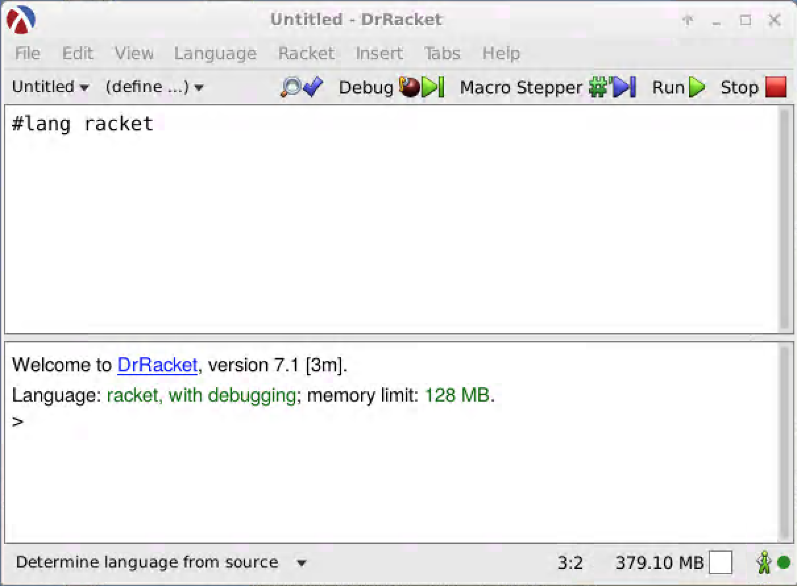

## Introduction: Program-development environments

As we've noted previously, while the core of computer science is the
design of algorithms and data structures, one needs to express those
algorithms in a form understandable to the computer (and, one hopes, to
human beings).  We call this endeavor _programming_.  We refer to the
algorithms so expressed as both _programs_ and _code_.

While it is possible to create programs in almost any text editor, more
programmers develop their programs in what is normally called a
program-development environment or integrated development environment
(IDE).  These environments not only permit you to write programs, but
also provide mechanisms for testing small parts of the programs,
formatting the code for easy readability, obtaining documentation, and
more.  In general, development environments support the other activities
associated with program development.

In this course, you will use the _DrRacket_ program-development environment.
DrRacket was designed to support the teaching of programming, which
means that it has many features that make it particularly amenable to
novice programmers.

## Obtaining DrRacket


Download your copy of DrRacket from [https://racket-lang.org/download/](https://racket-lang.org/download/).
Follow the standard approach to downloading and installing software. If you encounter difficulty, ask a question on Teams.

## An overview of the DrRacket user interface

When you start DrRacket, you will find that DrRacket is similar to most
applications.  For example, it has a **File** menu that lets you open
and save files and an **Edit** menu that permits you to cut, copy, and
paste text.  Like many applications, DrRacket usually starts with a
window for a new, untitled, document.  Here's what DrRacket's primary
window looks like.



You may note that this window has two parts, which we'll call "panes".
The top pane is called the _Definitions Pane_ or _Definitions Window_
and the bottom pane is called the _Interactions Pane_ or _Interactions
Window_.  As the names suggest, the top pane is used for writing
"definitions" of procedures and values and the bottom pane lets you
interact with Racket.

After a few brief detours, we will explore the interactions pane.

## Configuring DrRacket

DrRacket supports a variety of programming languages.  We will configure
DrRacket so that it's easy for us to tell it which language to use. In
the **Language** menu, select **Choose Language ...**. In the dialog box
that appears, click on the radio button next to **The Racket Language**.
Then click **OK**.  Finally, click **Run**.

The other important configuration step is to configure your copy of
DrRacket to use the `csc151` libraries.  From the **File** menu, select
**Install Package ...**.  In the window that appears, enter
[https://github.com/grinnell-cs/csc151.git#main](https://github.com/grinnell-cs/csc151.git).
Click **Install**.  Eventually, a **Close** button should appear. Click
that button.  It will be your only notification that the installation
succeeded.
After setting the language and installing the `csc151` library, you should be nearly ready to go!

Note that we will ask you throughout the semester to update your local installation of this library.
To do so, from the file menu, select **Package Manager...** then select the **Currently Installed** tab, search for and select the entry for `csc151`, and then press the `Update` button.

## Getting started with Racket

Racket has a fairly simple syntax, but one that is different than most
other programming languages.  Parentheses play an important role in
DrRacket.  To tell DrRacket to apply a procedure to some arguments, you
write an open (left) parenthesis, the name of the procedure, the
arguments separated by spaces, and a close (right) parenthesis.  For
example, here's how you would add 1, 2, and 3.

```drracket
> (+ 1 2 3)
6          
```

The angle bracket (greater-than sign) is the DrRacket "prompt", the
way it tells you that it wants you to enter an expression.  You type
your expression on the line and then ask DrRacket to evaluate it.

## The interactions pane

As we noted, the Interactions pane is where you most frequently interact
with DrRacket, entering Scheme expressions and seeing their values.  The
DrRacket prompt tells you that DrRacket is ready for the next
expression.  Once you've entered that expression, you type the <kbd>Enter</kbd>
or <kbd>Return</kbd> key.  (If the cursor is in the middle of the expression,
DrRacket interprets that as "move to a new line"; to get it to evaluate
the expression, you must use <kbd>Ctrl</kbd>-<kbd>Enter</kbd>.)  Here are a few
examples, including a few that show off a variety of Scheme numeric
operations.  You may be able to figure out the meaning from context.

```drracket
> (+ 1 2 3)                                        
6                                                  
> (sqrt 144)                                       
12                                                 
> (floor 3.5)                                      
3.0                                                
> (ceiling 3.5)                                    
4.0                                                
> (expt 2 3)                                       
8                                                  
> (expt 3 2)                                       
9                                                  
> (string-length "All mimsy were the borogoves")   
28                                                 
> (string-split "All mimsy were the borogoves" " ")
'("All" "mimsy" "were" "the" "borogoves")          
```

This style of interaction may feel a bit like a calculator with a
strange user interface and a log of what you've done.  And, in some
sense, that's one purpose of DrRacket's interactions pane.  However,
DrRacket also provides a variety of features that may not be easily
available in most calculators, such as support for values other than
numbers (*e.g.*, the strings above), the ability to name values, and the
capability for you to write your own operations (aka procedures).

Here's a quick example of naming in Racket, which we do with the
`define` keyword.

```drracket
> (define add +)   
> (add 1 2 3)      
6                  
> (define three 3) 
> (sqrt three)     
1.7320508075688772 
> (add three three)
6                  
```

When you want to edit a previous expression, you can use
<kbd>Ctrl</kbd>-<kbd title="up arrow">&uarr;</kbd> or <kbd>Esc</kbd>-<kbd>P</kbd>
to scroll upward through a history of expressions and you can use
<kbd>Ctrl</kbd>-<kbd title="down arrow">&darr;</kbd> or
<kbd>Esc</kbd>-<kbd>N</kbd> to scroll downward.

Note: Mac users should use the <kbd>Command</kbd> or <kbd title="cloverleaf">&#8984;</kbd> key rather
than the <kbd>Ctrl</kbd> key.

## The definitions pane

The interactions pane is intended to be ephemeral.  You do a series of
computations (or, more precisely, ask DrRacket to do a series of
computations), You examine the results.  But you should not plan for
them to exist indefinitely.  You can save them to a file, but most
people do not. You can always clear the interactions pane by clicking
the **Run** button or hitting <kbd>Ctrl</kbd>-<kbd>r</kbd>.

While the interactions pane is ephemeral, there are often parts of your
program or your configuration that you want to save.  Those parts belong
in the definitions pane, at the top of the screen.  You will almost
always begin that pane with the line

```drracket
#lang racket
```

After that, you will typically enter a series of definitions (hence the
name) using the `define` keyword.  In the near future, we will see how
to use `define` to name functions.  For the time being, we will define
things to add clarity; a name may tell you what something does without
you having to understand exactly how it works.

Consider the following definitions, not all of which will make sense.

```drracket
(define sample-text "All mimsy were the borogoves")
(define word-containing-e #px"[a-z]*e[a-z]*")      
(define word-containing-s #px"[a-z]*s[a-z]*")      
(define trial01 11.2)                              
(define trial02 12.5)                              
(define trial03 8.5)                               
(define trial04 10.6)                              
```

Let's see how we can use those in the interactions pane once we've
clicked the **Run** button.

```drracket
> (* 1/4 (+ trial01 trial02 trial03 trial04))      
10.75                                              
> (* 1/3 (- (+ trial01 trial02 trial03 trial04)    
            (min trial01 trial02 trial03 trial04)))
11.5                                               
> sample-text                                      
"All mimsy were the borogoves"                     
> (string-length sample-text)                      
28                                                 
> (regexp-match* word-containing-e sample-text)    
'("were" "the" "borogoves")                        
> (regexp-match* word-containing-s sample-text)    
'("mimsy" "borogoves")                             
```

Even if we have no idea what `#px"[a-z]*e[a-z]*"` represents, we can
probably interpret `word-containing-e`, particularly from the context it
is used.

## Saving and restoring definitions

We noted that the definitions pane is intended for the work that you
intend to be permanent, or at least less ephemeral than the work you do
in the interactions pane.  Hence, we will regularly save the contents of
the definitions pane to a file.  We can then restore those definitions
at a later time.

By custom, we save Racket files with a suffix of `.rkt`.  If you do not
provide a suffix, or choose a bad suffix such as `.jpg`, DrRacket is
happy to allow you to violate conventions.  However, if you violate
conventions, then you will then find it much harder to work with the
file in a future session.

Once you know that your definitions are safely stored in a file, you can
quit DrRacket, go off and do other work, and then restart DrRacket to
reload the definitions.  As you might expect, you can load old
definitions by using **Open...** or **Open Recent** from the **File**
menu.

Text files that contain programs like our `.rkt` files are frequently called *source files* as they contain the *source code* for our programs.
You will frequently hear us refer to the contents of the definitions pane and its associated file as a source file.

## Self Checks

You have now learned enough to interact with DrRacket.  In the
forthcoming lab, you will have the opportunity to ground those abstract
instructions in concrete exercises.  Before you do so, you will find it
useful to take a few quick notes on some issues.

### Check 1: What is DrRacket?

In your own words, explain what DrRacket is and why we use it in this
course.

### Check 2: File suffixes

What suffix should you use for your Racket files?
