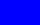
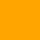
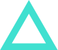
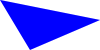
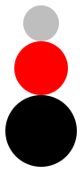

## Introduction

In addition to supporting "standard" data types, such as numbers and
strings, Racket also includes libraries that support a number of more
sophisticated data types, including a type that the designers call
"images".  The image data type supports the creation, combination, and
manipulation of a variety of basic shapes.  Readers of an earlier
generation might consider Racket's picture type an extension of the
ColorForms that they played with as children.

In considering a new data type (and images are effectively a new data type), we should ask ourselves the standard set of five questions: 

What is the _name_ of the type? 
  : "image". 

What is the _purpose_ of the type?
  : To allow people to make interesting images.  

How do you _express_ values in this type?
  : We've seen a few ways, including the `solid-circle` and `solid-rectangle` procedures.  There are more.  

How does DrRacket _display_ values?
  : As the "expected" images.  
  
What _procedures_ are available?  
  : We've seen that we can use `above` and `beside`. Once again, there are more.

There's also one other question to ask for this type, since it's not a standard type: 

How does one _gain access to_ the type?  
  : The answer is straightforward: You add the following line to the top of your
definitions pane.

```drracket
(require csc151)
```

## Basic shapes

You've already seen a few procedures for creating basic shapes:

* `(solid-circle diameter color)` creates a solid circle,
* `(outlined-circle diameter color pen-width)` creates the outline of a circle,
* `(solid-rectangle width height color)` creates a solid rectangle, and
* `(outlined-rectangle width height color pen-width)` creates the outline of a rectangle. 

```drracket
> (outlined-circle 40 "red" 1)

> (solid-rectangle 40 25 "blue")

```

As you have likely seen, we can choose the width of an outline.

```drracket
> (outlined-circle 40 "red" 5)

> (outlined-circle 40 "red" 10)

> (outlined-circle 40 "red" 15)

```

As the examples suggest, the diameter given is of the inner circle.

There are also ellipses, diamonds, squares, equilateral triangles, isosceles triangles, and even generalized polygons, each in a solid and an outlined form.

```drracket
> (solid-ellipse 40 30 "purple")

> (outlined-diamond 40 30 "green" 5)

> (solid-square 50 "orange")

> (outlined-equilateral-triangle 50 "turquoise" 10)

> (solid-isosceles-triangle 100 20 "pink")

```

Polygons are a bit more complicated. We won't discuss all the details yet, but a few examples might be of interest. Note that `(pt x y)` creates an x/y point on an upside-down coordinate system.

```drracket
> (solid-polygon (list (pt 0 0) (pt 100 20) (pt 30 50)) "blue")

> (solid-polygon (list (pt 0 0) (pt 100 20) (pt 50 50) (pt 100 70) (pt 0 100))
                 "red")

```

The designers of our image library decided that the shape is more important than the position. Hence, even if all the points have a positive x value, it still ends up at the left margin.  (You'll find something similar for y values.)

```drracket
> (solid-polygon (list (pt 50 0) (pt 150 20) (pt 80 50)) "blue")

> (solid-polygon (list (pt 0 -20) (pt 100 0) (pt 30 30)) "blue")

```

You can (eventually) find information on more ways to make images in the [CSC-151 library reference](https://rebelsky.cs.grinnell.edu/Courses/CSC151/reference/). (If you want others, and ask Prof. Rebelsky nicely, he might implement them.)

## Combining images

By themselves, the basic images (ellipses, rectangles, etc.) do not
permit us to create much.  However, as some of the examples above
suggest, we gain a great deal of power by combining existing images into
a new image.  You're already seen three basic mechanisms for combining
images.

* `beside` places images side-by-side.  If the images have different
  heights, their vertical centers are aligned.
* `above` places images in a stack, each above the next.  If the images
  have different widths, their horizontal centers are aligned.
* `overlay` places images on top of each other.  The first image is on
  top, then the next one, and so on and so forth.  Images are aligned
  according to their centers.

```drracket
> (define small-gray (solid-circle 20 "gray"))
> (define medium-red (solid-circle 30 "red"))
> (define large-black (solid-circle 40 "black"))
> (beside small-gray medium-red large-black)

> (above small-gray medium-red large-black)

> (overlay small-gray medium-red large-black)

```

When overlaying images, order matters. The first is on top of the second, the second is on top of the third, and so on and so forth.

```drracket
> (overlay large-black medium-red small-gray)

```

What if we don't want things aligned on centers?  The Racket iamge library provides alternatives to these three that provide a bit more control.

* `(beside/align alignment i1 i2 ...)` allows you to align
  side-by-side images at the top or bottom (using `"top"` and
  `"bottom"`).  You can also align at the center, mimicking `beside`,
  using `"center"` 
* `(above/align alignment i1 i2 ...)` allows
  you to align vertically stacked images at the left, right, or middle
  (using   `"left"`, `"right"`, and `'middle`). 
* `(overlay/align halign valign i1 i2 ...)` allows you to
  align overlaid images.

```drracket
> (define small-gray (solid-circle 20 "gray"))
> (define medium-red (solid-circle 30 "red"))
> (define large-black (solid-circle 40 "black"))
> (beside/align "top" small-gray medium-red large-black)

> (beside/align "bottom" small-gray medium-red large-black)

> (above/align "left" small-gray medium-red large-black)

> (above/align "right" small-gray medium-red large-black)

> (overlay/align "left" "top" small-gray medium-red large-black)

> (overlay/align "left" "center" small-gray medium-red large-black)

> (overlay/align "left" "bottom" small-gray medium-red large-black)

> (overlay/align "right" "top" small-gray medium-red large-black)

> (overlay/align "right" "top" large-black medium-red small-gray)

```

As the overlay examples suggest, the alignment is based on the "bounding box" of each image, the smallest rectangle that encloses the image.

You can (eventually) find information on more ways to combine images in the [CSC-151 library reference](https://rebelsky.cs.grinnell.edu/Courses/CSC151/reference/). (If you want others, and ask Prof. Rebelsky nicely, he might implement them.)

## Colors

While we often think of colors by name (e.g., "red", "violet", or
"burnt umber"), one of the great advantages of computational image
making is that it is possible to describe colors that do not have a
name. Moreover, it is often better to use a more precise definition than
is possible with a name. After all, we may not agree on what precisely
something like "springgreen" or "burlywood" means. (One color scheme
that we've found has both "Seattle salmon" and "Oregon salmon". Would
you know how those two colors relate?)

In fact, it may not only be more accurate to represent colors
non-textually, it may also be more _efficient_, since color names may
require the computer to look up the name in a table.

The most popular scheme for representing colors for display on the
computer screen is RGB. In this scheme, we build each color by combining
varying amounts of the three primary colors, red, green, and blue.
(What, you think that red, yellow, and blue are the primary colors? It
turns out that primary works differently when you're transmitting light,
as on the computer screen, than when you're reflecting light, as when
you color with crayons on paper.)

So, for example, purple is created by combining a lot of red, a lot of
blue, and essentially no green. You get different purple-like colors by
using different amounts of red and blue, and even different ratios of
red and blue.

When we describe the amount of red, green, and blue, we traditionally
use integers between 0 and 255 to describe each component color. Why do
we start with 0? Because we might not want any contribution from that
color. Why do we stop with 255? Because 255 is one less than 28 (256),
and it turns out that numbers between 0 and 255 are therefore easy to
represent on computers. (For those who learned binary in high school or
elsewhere, if you have exactly eight binary digits, and you only care to
represent positive numbers, you can represent exactly the integers from
0 to 255. This is akin to being able to count up to 999 with three
decimal digits.)

If there are 256 possible values for each component, then there are
16,777,216 different colors that we can represent in standard RGB. Can
the eye distinguish all of them? Not necessarily. Nonetheless, it is
useful to know that this variety is available, and many eyes can make
very fine distinctions between nearby colors.

In DrRacket's image model, you can use the `rgb` procedure to create RGB colors.  `(rgb 0 255 0)` makes a bright green, `(rgb 0 128 128)` makes a blue-green color, and `(rgb 64 0 64)` makes a relatively dark purple.

```drracket
> (beside (solid-circle 40 (rgb 0 255 0))
          (solid-circle 40 (rgb 0 128 128))
          (solid-circle 40 (rgb64 0 64)))

```

The `rgb` procedure has an _optional_ fourth parameter, which is often called the "alpha" value, and which you can think of as the _opacity_ of the color. A color with an opacity of 0 is transparent; a color with an opacity of 255 obscures anything below it. Less opaque colors also appear lighter.

```drracket
> (beside
    (solid-rectangle 25 40 (rgb 0 0 255 255))
    (solid-rectangle 25 40 (rgb 0 0 255 191))
    (solid-rectangle 25 40 (rgb 0 0 255 127))
    (solid-rectangle 25 40 (rgb 0 0 255 63)))

```

Opacity will be especially important as we start to overlay shapes.

```drracket
> (define circles
    (beside
      (solid-circle 20 (rgb 255 0 0 255))
      (solid-circle 20 (rgb 255 0 0 191))
      (solid-circle 20 (rgb 255 0 0 127))
      (solid-circle 20 (rgb 255 0 0 63))))
> (above
    (overlay circles (solid-rectangle 60 20 (rgb 0 0 255 255)))
    (overlay circles (solid-rectangle 60 20 (rgb 0 0 255 191)))
    (overlay circles (solid-rectangle 60 20 (rgb 0 0 255 127)))
    (overlay circles (solid-rectangle 60 20 (rgb 0 0 255  63))))

```

## Self Checks

### Check 1: A simple checkerboard

Write instructions for making a two-by-two checkerboard.

### Check 2: Iconic images

Write instructions for making a simple smiley face.

## Acknowledgements

Even though we no longer use the HtDP library, this section draws upon [The DrRacket HtDP/2e Image Guide](https://docs.racket-lang.org/teachpack/2htdpimage.html).  

The discussion of colors is based on [a reading from the 2017 spring section of Grinnell's CSC 151](https://www.cs.grinnell.edu/~rebelsky/Courses/CSC151/2017S/readings/rgb-early-reading.html).
