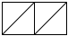

## Detour: Symbols

Before we explore pairs, we'll take a quick detour to remind you of one
of Scheme's other key data types, the symbol. Symbols look a lot like
words (and perhaps even strings), except that they don't have quotation
marks around them. Internally, Scheme uses symbols for all of the names
that you write in your program. Many Scheme programmers find them useful
when they just need a simple, readable, value to pass around.

You write symbols with a single quote mark (`'`, which we also call
a "tick mark") and the word you want to serve as a symbol. For
example, `'aardvark` is a symbol that corresponds to the word
"aardvark" and `'zebra` is a symbol that corresponds to the word
"zebra".

When some versions of Scheme print out symbols, they do not give you
the single quote symbol. Fortunately, DrRacket is a bit nicer.

```
> (quote aardvark)
'aardvark
> (list (quote aardvark) (quote zebra))
'(aardvark zebra)
> aardvark
reference to undefined identifier: aardvark
```

Symbols are atomic. Unlike strings (which symbols seem to resemble),
symbols do not support procedures, like `string-ref` or `substring`,
that extract some part of the symbol.

Hence, there are only a few procedures applicable to symbols:
`symbol?` checks whether a value is a symbol and both `eq?` and `equal?`
can be used to compare symbols.

Why would we use symbols, if those are the only available procedures?
Because they're simple and sometimes a bit more fun than numbers.
Why do we remind you of them now? Because they're also nice to use
in diagrams, and we have a lot of diagrams in this reading.

## Box-and-pointer diagrams

As we have seen, Scheme uses `cons` to build lists.
As you may recall, `cons` takes two arguments.
Up to this point, we've expected that the first element has been a value and the second has been a list.
When you call `cons`, Scheme (Racket, DrRacket, something like that) builds a structure in memory with two parts, one of which refers to the first argument to `cons` and the other of which refers to the second.
This structure is called a "cons cell" or a "pair".

Let us now consider a graphical way to represent the result of a call to `cons`.
The basic idea is to use a rectangle, divided in half,
to represent the result of the `cons`. From the first half of the
rectangle, we draw an arrow to the first element of a list, its car;
from the second half of the rectangle, we draw an arrow to the rest
of the list, its cdr. When the cdr is null (the empty list), we draw a
diagonal line through the right half of the rectangle to indicate that
the list stops at that point.

For instance, the value of the expression `(cons 'a null)` would be
represented in this notation as follows:


Since the value of the expression `(cons 'a null)` is the list `'(a)`,
this diagram represents `'(a)` as well.

Now consider the value of the expression `(cons 'b (cons 'a null))`,
or in other words, the list `(b a)`. Here, we draw another rectangle,
where the head points to `b` and the tail points to the representation of
`(a)` that we already have seen. The result is:


Similarly, the list `'(d c b a)` is the value of the expression `(cons
'd (cons 'c (cons 'b (cons 'a null))))` and would be drawn as follows:

![Four rectangles, side by side.  Each is split into two squares.  For
the first three rectangles, the right square has an arrow pointing to
the next rectangle.  For the last rectangle, the right square has a slash
through it.  The left square of the first rectangle has an arrow pointing
downward to the symbol `'d`.  The left square of the second rectangle has
an arrow pointing downward to the symbol `'c`.  The left square of the third
rectangle has an arrow pointing downward to the symbol `'b`.  The left
square of the fourth rectangle has an arrow pointing downward to the
symbol `'a`.](../images/pairs-3.png)

A similar approach may be used for lists that have other lists as
elements. For example, consider the list `'((a) b (c d) e)`. This
list contains four components, so, at the top level, we will need four
rectangles, just as in the previous example for the list `'(d c b
a)`. Here, however, the first component designates the list `'(a)`, which
itself involves the box-and-pointer diagram already discussed. Similarly,
the list `'(c d)` has two boxes for its two components (as in the diagram
for `'(b a)` above). The resulting diagram is:

![Seven rectangles arranged in two rows.  The first row has four rectangles.
The second row has three rectangles, which are below the first, third, and
fourth rectangles in the first row.  Each rectangle is broken up into
two squares.  In the first row, the right boxes in the first three rectangles
have arrows to the subsequent rectangle.  The right box in the last rectangle
on the first row has  a slash through it.  The left box of the first
rectangle in the first row has an arrow downward to the first rectangle
in the second row.  The left box of the second rectangle in the first row
has an arrow pointing downward to the symbol `'b`.  The left box of the
third rectangle in the first row has an arrow pointing to the second rectangle
in the second row.  The left box of the fourth rectangle in the first
row has an arrow pointing downward to the symbol `'e`.  The first rectangle
in the second row i a rectangle that represents the list `'(a)`.  The left
box of that rectangle has an arrow pointing downward to the symbol `'a`.
The right box of that rectangle has a slash through it.  The left box
of the second rectangle in the second row has an arrow pointing downward
to the symbol `'c`.  The right box of the second rectangle in the second
row has an arrow pointing to the right to the third rectangle in the
second row.  The left box of the third rectangle in the second row has
an arrow pointing downward to the symbol`'d`.  The right box of the third
rectangle on the second row has a slash through it.](../images/pairs-4.png)

Throughout these diagrams, the empty list is represented by a null
pointer, a diagonal line. Thus, the list containing the empty list,
`(())` -- that is, the value of the expression `(cons null null)` --
is represented by a rectangle with lines through both halves:



## Pairs that are not lists

While we consistently have discussed `cons` in the context of lists,
Scheme allows `cons` to be applied even when the second argument is not
a list. For example, `(cons   'a 'b)` is a legal expression; its value
is represented by the following box-and-pointer diagram:


You may have noticed that some of your lists ended with a dot before the last character. In fact, whenever Scheme is asked to print out a sequence of linked pairs that don't end with null, it uses dot notation, as in `(a .  b)`. Here, the dot indicates that cons has been applied, but the second argument is not a list. Similarly, the value of `(cons 1 'a)` is the pair `(1 . a)`, and the value of `(cons "Steele" "Sussman")` is `("Steele"   . "Sussman")`. Using a box-and-pointer representation, this last result would be drawn as follows:


The `car` and `cdr` procedures can be used to recover the halves of one
of these improper lists:

```
> (car (cons 'a 'b))
'a
> (cdr (cons 'a 'b))
'b
```

Note that the `cdr` of such a structure is not a list.

When Scheme tries to print out a pair structure, it uses what we might
call an optimistic assumption. If the next thing is null or a pair,
it assumes that it's a list, and therefore uses a space before the next
object. When it hits the end and finds no null, it inserts the dot there,
but not earlier.

## A pair predicate

The `pair?` predicate returns `#t` when it is given any structure that is printed as a dotted pair, or indeed any structure that `cons` can return as its value. (Basically, `pair?` determines whether the object it is given is one of those two-box rectangles.)

## Recursion with pairs

Just as lists can be nested within lists, so pairs can be nested within
pairs, as deeply as you like. For instance, here is a pair structure
that contains the first eight natural numbers:

![A drawing of seven rectangles, each split horizontally into two squares.
The rectangles are arranged in three rows.
There is one rectangle in the first row, two in the second row, and four
in the third row.  An arrow from the left box of the rectangle
in the first row leads to the first rectangle in the second row.  An
arrow from the right box of the rectangle in the first row leads to the second
rectangle of the second row.  An arrow in the left box of the
first rectangle in the second row leads to the first rectangle in the
third row.  An arrow in the right box of the first rectangle in the
second row leads to the second rectangle in the third row.  An arrow
in the left box of the second rectangle in the second row leads to the
third rectangle in the third row.  An arrow in the right box of the
second rectangle in the second row leads to the fourth rectangle in the
third row.
An arrow from the left box of the first rectangle in the third row leads to the integer 0.
An arrow from the right box of the first rectangle in the third row leads to the integer 1.
An arrow from the left box of the second rectangle in the third row leads to the integer 2.
An arrow from the right box of the second rectangle in the third row leads to the integer 3.
An arrow from the left box of the third rectangle in the third row leads to the integer 4.
An arrow from the right box of the third rectangle in the third row leads to the integer 5.
An arrow from the left box of the fourth rectangle in the third row leads to the integer 6.
An arrow from the right box of the fourth rectangle in the third row leads to the integer 7.](../images/pairs-8.png)

To build this structure in Scheme, we can use repeated calls to `cons`, thus:

```
(cons (cons (cons 0 1)
            (cons 2 3))
      (cons (cons 4 5)
            (cons 6 7)))
```

or we can use the dotted-pair notation inside a literal constant beginning with a quote:

```
'(((0 . 1) . (2 . 3)) . ((4 . 5) . (6 . 7)))
```

or

```
'(((0 . 1) 2 . 3) (4 . 5) 6 . 7)
```

(As we've said previously, we'd prefer that you use `cons` rather than
quote to build structures.)

If we have a pair structure that is constructed by repeated invocations of
`cons`, starting from constituents of some simple type such as numbers
or strings, we call such a structure a *tree*. (We often prefix the
word tree with the type from which the tree is built, such as number
tree; alternately we suffix the word tree with of and then the type,
as in tree of numbers.) We will look at trees in some more depth in the
reading on deep recursion. For now, let's consider a basic approach.

In particular, when we are dealing with a tree, we can use *pair
recursion*, which adapts the shape of the computation to the shape of
the particular pair structure on which we operate. In pair recursion,
the base cases are the non-pair values, those that must therefore
be operated on directly. For the non-base cases -- those that are pairs
-- we invoke the procedure recursively twice (once for the `car`, once
for the `cdr`) and combine the values of the recursive calls to get the
final result of the operation.

For instance, here is how we'd find the sum of the numbers in a pair
structure like the one diagrammed above.

```
;;; (sum-of-number-tree ntree) -> integer?
;;;   ntree : treeof number?
;;; Sums all the numbers in a number tree.
(define sum-of-number-tree
  (lambda (ntree)
    (if (pair? ntree)
        (+ (sum-of-number-tree (car ntree))
           (sum-of-number-tree (cdr ntree)))
        ntree)))
```

```
> (sum-of-number-tree (cons (cons (cons 0 1)
                                  (cons 2 3))
                            (cons (cons 4 5)
                                  (cons 6 7))))
28
```

When this procedure is applied to a base case -- that is, just a number
rather than a collection of numbers fitted into a pair structure --
it returns the number unchanged:

```
> (sum-of-number-tree 19)
19
```

There is no such thing as an empty pair analogous to an empty list. Every
pair has exactly two components, and it is always valid to take the `car`
and the `cdr` of a pair. So the base case for a pair recursion is just
any value that is not itself a pair.

You can find a full trace of the more complicated sum at the end of
this reading.

## Why pay attention to pairs

You may be wondering why we pay so much attention to these pair
things. (You'll probably be wondering why we ask *you* to pay so much
attention after doing the lab). There are a few reasons. First, we find
that students better understand lists (and related structures) if they
have an understanding of what's going on behind the scenes. Second,
there are many instances in which we are better off building trees (like
those above) than lists. Third, pair structures provide an additional
mechanism for thinking about recursion.

The pair structures also reveal a bit about Scheme terminology. In the
first computers on which LISP (the forerunner of Scheme) was implemented,
there was an underlying memory structure that had two cells, which made
it a convenient way to implement pairs. On that computer, the operations
used to remove values from the structure were `car` (shorthand for
"contents of address register") and `cdr` (shorthand for "contents
of decrement register", even though some people mistakenly claim it
stands for "contents of data register").

## Abbreviated pair procedures

Once you start working with more complex pair structures, you will find yourself writing things like

```racket
(car (car (cdr (cdr thing))))
```

For readability and concision, most implementations of Scheme provide shorthands for nested calls to `car` and `cdr`.
For example, `(cadr x)` is a shorthand for `(car (cdr x))` (that is, element 1 of the list), `(caddr)` is a shorthand for `(car (cdr (cdr x)))` (that is, element 2 of the list)`, `(caar list)` is a shorthand for `(car (car list))`, and `(caaddr thing)` is a shorthand for the long expression from the start of this section.

Some of us try to think of the d's as representing "drop" and the a's as representing "access first".
And, as in the case of composition, we read from right to left.
For example, `caddr` means "drop two elements and then take the first remaining element.

Why would you want two `car` operations in a row?  For lists, it might be that you are working with a list of lists.

Some of us find it easiest to think of the compound procedures as taking the nested calls and "squishing them together", eliminating the intervening r's and c's.

The pronunciation of these procedures varies.  Some refer to `cadr` as "cad-er".
Some refer to "cddr" as "cuh-did-er".
Some, presumably from the Boston area, refer to `caar` as `caaaah`, with a drawn-out "a".
Most often, people pronounce these operations by reading the letters, pronouncing `caddr` as "see eh dee dee are".  Fortunately, all of these letters require only one syllable.

In any case, you will quickly find it easier to read (and write) these shorthands than it is to read (and write) the nested calls.

## Self checks

### Check 1: Pair structure processing (‡)

The way we have drawn pair structures above makes it easy to think about
`car` and `cdr` operation. Reading from the inside out, you simply
follow the arrow from the left side of the pair for `car` or the arrow
from the right side of the pair for `cdr`.

a. Using this strategy, find the values corresponding to the following
commands applied to the structure repeated below.

![Seven rectangles arranged in two rows.  The first row has four rectangles.
The second row has three rectangles, which are below the first, third, and
fourth rectangles in the first row.  Each rectangle is broken up into
two squares.  In the first row, the right boxes in the first three rectangles
have arrows to the subsequent rectangle.  The right box in the last rectangle
on the first row has  a slash through it.  The left box of the first
rectangle in the first row has an arrow downward to the first rectangle
in the second row.  The left box of the second rectangle in the first row
has an arrow pointing downward to the symbol `'b`.  The left box of the
third rectangle in the first row has an arrow pointing to the second rectangle
in the second row.  The left box of the fourth rectangle in the first
row has an arrow pointing downward to the symbol `'e`.  The first rectangle
in the second row i a rectangle that represents the list `'(a)`.  The left
box of that rectangle has an arrow pointing downward to the symbol `'a`.
The right box of that rectangle has a slash through it.  The left box
of the second rectangle in the second row has an arrow pointing downward
to the symbol `'c`.  The right box of the second rectangle in the second
row has an arrow pointing to the right to the third rectangle in the
second row.  The left box of the third rectangle in the second row has
an arrow pointing downward to the symbol`'d`.  The right box of the third
rectangle on the second row has a slash through it.](../images/pairs-4.png)

- `caar`
- `cadr`
- `caaddr`

b. Using an analog of the visual strategy, what sequence of commands
would you need to extract the `'e` and `'d`, respectively?

### Check 2: Pair recursion

a. How does the base case test for pair recursion differ from the base
case test for other types of recursion you have seen?

b. Why are there two calls to `sum-of-number-tree` in its recursive case?

## Tracing `sum-of-number-tree`

Just in case you weren't sure how `sum-of-number-tree` works, we'll
explore a trace of the example.

Here's the procedure again.

```
(define sum-of-number-tree
  (lambda (ntree)
    (if (pair? ntree)
        (+ (sum-of-number-tree (car ntree))
           (sum-of-number-tree (cdr ntree)))
        ntree)))
```

And here's the exprssion we promised to trace.

```
    (sum-of-number-tree (cons (cons (cons 0 1)
                                    (cons 2 3))
                              (cons (cons 4 5)
                                    (cons 6 7))))

    ; We have a pair, so we use the consequent
--> (+ (sum-of-number-tree (cons (cons 0 1)
                                 (cons 2 3)))
       (sum-of-number-tree (cons (cons 4 5)
                                 (cons 6 7))))

    ; Evaluating the first recursive call.  Once again, we have a pair
--> (+ (+ (sum-of-number-tree (cons 0 1))
          (sum-of-number-tree (cons 2 3)))
       (sum-of-number-tree (cons (cons 4 5)
                                 (cons 6 7))))

    ; Evaluating the innermost recursive call.  Still using the pair case.
--> (+ (+ (+ (sum-of-number-tree 0)
             (sum-of-number-tree 1))
          (sum-of-number-tree (cons 2 3)))
       (sum-of-number-tree (cons (cons 4 5)
                                 (cons 6 7))))

    ; Evaluating the innermost recursive call.  Finally, a base case!
--> (+ (+ (+ 0
             (sum-of-number-tree 1))
          (sum-of-number-tree (cons 2 3)))
       (sum-of-number-tree (cons (cons 4 5)
                                 (cons 6 7))))

    ; Evaluating the innermost recursive call.  Another a base case.
--> (+ (+ (+ 0
             1)
          (sum-of-number-tree (cons 2 3)))
       (sum-of-number-tree (cons (cons 4 5)
                                 (cons 6 7))))

    ; Something easy: Add two numbers
--> (+ (+ 1
          (sum-of-number-tree (cons 2 3)))
       (sum-of-number-tree (cons (cons 4 5)
                                 (cons 6 7))))

    ; Back to a recursive call.  Pair case.
--> (+ (+ 1
          (+ (sum-of-number-tree 2)
             (sum-of-number-tree 3)))
       (sum-of-number-tree (cons (cons 4 5)
                                 (cons 6 7))))

    ; The innermost recursive call is the base case
--> (+ (+ 1
          (+ 2
             (sum-of-number-tree 3)))
       (sum-of-number-tree (cons (cons 4 5)
                                 (cons 6 7))))
    ; The innermost recursive call is the base case
--> (+ (+ 1
          (+ 2
             3))
       (sum-of-number-tree (cons (cons 4 5)
                                 (cons 6 7))))

    ; Addition!
--> (+ (+ 1
          5)
       (sum-of-number-tree (cons (cons 4 5)
                                 (cons 6 7))))

    ; More addition!
--> (+ 6
       (sum-of-number-tree (cons (cons 4 5)
                                 (cons 6 7))))

    ; We've completed the first subtree.  Now we need to handle the
    ; recursion on the second subtree.  Once again, we have the pair case.
--> (+ 6
       (+ (sum-of-number-tree (cons 4 5))
          (sum-of-number-tree (cons 6 7))))

    ; Recurse on the innermost subtree.  Another pair case.
--> (+ 6
       (+ (+ (sum-of-number-tree 4)
             (sum-of-number-tree 5))
          (sum-of-number-tree (cons 6 7))))

    ; A base case.
--> (+ 6
       (+ (+ 4
             (sum-of-number-tree 5))
          (sum-of-number-tree (cons 6 7))))

    ; Another base case.
--> (+ 6
       (+ (+ 4
             5)
          (sum-of-number-tree (cons 6 7))))

    ; Addition
--> (+ 6
       (+ 9
          (sum-of-number-tree (cons 6 7))))

    ; We're getting close.  But we still have another pair case.
--> (+ 6
       (+ 9
          (+ (sum-of-number-tree 6)
             (sum-of-number-tree 7))))

    ; A base case.
--> (+ 6
       (+ 9
          (+ 6
             (sum-of-number-tree 7))))

    ; Our last base case (I hope).
--> (+ 6
       (+ 9
          (+ 6
             7)))

    ; Addition
--> (+ 6
       (+ 9
          13))

    ; Addition
--> (+ 6
       22)

    ; Addition
--> 28
```

Wasn't that fun?

If we're willing to do operations in parallel, it's a bit simpler.

```
    (sum-of-number-tree (cons (cons (cons 0 1)
                                    (cons 2 3))
                              (cons (cons 4 5)
                                    (cons 6 7))))

--> (+ (sum-of-number-tree (cons (cons 0 1))
                                 (cons 2 3))
       (sum-of-number-tree (cons (cons 4 5)
                                 (cons 6 7))))

--> (+ (+ (sum-of-number-tree (cons 0 1))
          (sum-of-number-tree (cons 2 3)))
       (+ (sum-of-number-tree (cons 4 5)
          (sum-of-number-tree (cons 6 7))))

--> (+ (+ (+ (sum-of-number-tree 0)
             (sum-of-number-tree 1))
          (+ (sum-of-number-tree 2)
             (sum-of-number-tree 3)))
       (+ (+ (sum-of-number-tree 4)
             (sum-of-number-tree 5))
          (+ (sum-of-number-tree 6)
             (sum-of-number-tree 7))))

--> (+ (+ (+ 0
             1)
          (+ 2
             3))
       (+ (+ 4
             5)
          (+ 6
             7)))

--> (+ (+ 1
          5)
       (+ 9
          13))

--> (+ 6
       22)

--> 28
```

Perhaps a bit easier to follow, even without the narration.
