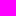

Introduction
------------

In our [initial exploration of images](../readings/images), you learned about how to make images using simple shapes.  In our initial work, we limited ourselves to named colors.  However, one of the great advantages of computational image making is that it is possible to describe colors that do not have a name.  In fact, it is often better to use a more precise definition than is possible with a name.  After all, we may not agree on what precisely something like "springgreen" or "burlywood" means.  (One color scheme that we've found has both "Seattle salmon" and "Oregon salmon".  Would *you* know how those two colors relate?)

In fact, it may not only be more accurate to represent colors non-textually, it may also be more *efficient*, since the computer will often need to look up color names in a table to convert them to an underlying representation.

Representing colors
-------------------

The most popular scheme for representing colors for display on the computer screen is RGB.  In this scheme, we build each color by combining varying amounts of the three primary colors, red, green, and blue.  (What, you think that red, yellow, and blue are the primary colors?  It turns out that primary works differently when you're transmitting light, as on the computer screen, than when you're reflecting light, as when you color with crayons on paper.)

So, for example, purple is created by combining a lot of red, a lot of blue, and essentially no green.  You get different purple-like colors by using different amounts of red and blue or even different ratios of red and blue.

When we describe the amount of red, green, and blue, we traditionally use integers between 0 and 255 to describe each component color.  Why do we start with 0?  Because we might not want any contribution from that color.  Why do we stop with 255?  Because 255 is one less than 2<superscript>8</superscript> (256), and it turns out that numbers between 0 and 255 are therefore easy to represent on computers.  (For those who learned binary in high school or elsewhere, if you have exactly eight binary digits, and you only care to represent positive numbers, you can represent exactly the integers from 0 to 255. This is akin to being able to count up to 999 with three decimal digits.)

If there are 256 possible values for each component, then there are 16,777,216 different colors that we can represent in standard RGB.  Can the eye distinguish all of them?  Not necessarily.  Nonetheless, it is useful to know that this variety is available, and many eyes can make very fine distinctions between nearby colors.

Racket usually adds a fourth component to colors: an _alpha_ value.  We will ignore that for the time being.  But you may see an extra 255 being added to the end of colors you create, at least when you view them in numeric form.

Relevant procedures
-------------------

Let us now turn to the primary procedures we will use to work with RGB colors.

We build a new color with the `(rgb red-component green-component blue-component`)` procedure.  We can also set the opacity of the color by adding a fourth component, typically referred to as the _alpha channel_ or just _alpha_. With with the other components, the alpha channel is between 0 and 255.

Here are a few colors.

```
> (rgb 255 0 0)

> (rgb 0 255 0)

> (rgb 0 128 0)

```

```
> (rgb 255 0 255)

> (rgb 191 0 191)

> (rgb 127 0 127)

> (rgb 127 0 192)

> (rgb 192 0 127)

```

```
> (rgb 0 0 255)

> (rgb 0 0 255 255)

> (rgb 0 0 255 192)

> (rgb 0 0 255 128)

> (rgb 0 0 255 64)

> (rgb 0 0 255 0)

```

Can you explain why we chose each set of examples?

Color names
-----------

You may note that we often prefer to use color names. We can convert a color name to an RGB color using `(color-name->rgb name)`.

```
> (color-name->rgb "purple")

> (color-name->rgb "salmon")

> (color-name->rgb "yellow")

```

If you give `color-name->rgb` something other than a color name, it will return the special value `#f`, which represents "false".

```
> (color-name->rgb "csc151")
#f
```

But what color names are available? The procedure `(all-color-names)`, which takes no parameters, gives you all the valid color names.

```
> (all-color-names)
'("aliceblue"
  "antiquewhite"
  "aqua"
  "aquamarine"
  "azure"
  ...
  "whitesmoke"
  "yellow"
  "yellow green"
  "yellowgreen")
```

There are 181 name, including the with/without space equivalents, such as `"yellow green"` and `"yellowgreen"`.

Since you may not want to peruse the full list, there's also a `find-colors` procedure.

```
> (find-colors "violet")
'("blue violet" "blueviolet" "darkviolet" "medium violet red" 
  "mediumvioletred" "palevioletred" "violet" "violet red" "violetred")
```

It returns an empty list when you give it something that's not a color name.

```
> (find-colors "ugly")
'()
```

Extracting color components
---------------------------

Obviously, just seeing a color on the screen doesn't let you compute with it. Hence, there are procedures to extract the red, green, blue, and alpha components of any RGB color.

```
> (color-name->rgb "palevioletred")

> (rgb-red (color-name->rgb "palevioletred"))
219
> (rgb-green (color-name->rgb "palevioletred"))
112
> (rgb-blue (color-name->rgb "palevioletred"))
147
> (rgb-alpha (color-name->rgb "palevioletred"))
255
```

We won't always know which color representation we're using, so there are also similar `color-red`, `color-green`, `color-blue`, and `color-alpha` procedures.

```
> (color-red "palevioletred")
219
> (color-green "palevioletred")
112
> (color-blue "palevioletred")
147
> (color-red (rgb 100 10 255))
100
> (color-green (rgb 100 10 255))
10
> (color-blue (rgb 100 10 255))
255
```

Why would we ever use the procedures with a `rgb-` prefix when we have similar procedures with a `color-` prefix? Because they are fractionally faster. We won't notice when we're using one or two colors. But when we're processing tens of thousands of colors (as we will in manipulating some images), we'll notice a difference. Hence, when we know we're working with an RGB color, we'll use the `rgb` variants.

[Design detour] Computing with color: Complementary colors
----------------------------------------------------------

In creating works, many artists and visual designers consider the applications of *complementary colors*.  A pair of colors is complementary if the sum of the two colors is a kind of grey (including black or white).  What does it mean to sum two colors?  Well, it turns out that complementarity is really defined only for a different representation of colors (hue, saturation, and value, or HSV).  Nonetheless, we can come close to simulating it in RGB, so we will call complementary colors defined using their RGB values *pseudo-complementary colors*.

In RGB, we can add the colors by adding the corresponding components (capping the sum at 255) or by averaging the corresponding components.  We'll use the former technique, because it can be a bit easier to analyze capping.

For example, the pseudo-complement of green (0/255/0) is magenta (255/0/255) because when we add them together, we get 255/255/255, which is white.

```
> (rgb 0 255 0)

> (rgb 255 0 255)

```

Depending on what you accept as the definition of "grey", colors can have many pseudo-complements.  For example, consider the color 128/0/0, which is similar to maroon.  One logical pseudo-complement to that color is 127/255/255 (a color for which there is no name, but which seems to be similar to aquamarine), since when we add the two colors together, we get 255/255/255, which is still white.  However, one might also consider 0/128/128 (a color similar to teal) as a pseudo-complement, since when we add the two together, we get 128/128/128, a nice medium grey.

```
> (rgb 128 0 0)

> (rgb 127 255 255)

```

```
> (rgb 128 0 0)

> (rgb 0 128 128)

> (rgb 128 128 128)

```

In general, when we say "pseudo-complementary color", we mean the one which, when we add the RGB components to those of the first color, we get white.  When we ask for multiple pseudo-complements for the same color, we'll mean those that, when added, give us a color in which all three components are the same (that is, a version of grey).

Transforming colors
-------------------

As the design detour suggests, we will often want to build new colors from prior colors.  For example, given a color, we might want to complete the pseudo-complement of that color.  Rather than doing it by hand, we can have the computer do the computation for us.

How?  The algorithm should be fairly straightforward.

* The red component of the pseudo-complement of `c` is 255 minus the
  red component of `c.
* The green component of the pseudo-complement of `c` is 255 minus the
  green component of `c.
* The blue component of the pseudo-complement of `c` is 255 minus the
  blue component of `c.
* We can combine those three newly-computed complements with `rgb`.

```
;;; (color-pseudo-complement c) -> color?
;;;   c : color?
;;; Compute the pseudo-complement of a color
(define color-pseudo-complement
  (lambda (c)
    (rgb (- 255 (color-red c))
         (- 255 (color-green c))
         (- 255 (color-blue c)))))
```

Let's give it a try.

```
> (color-pseudo-complement (rgb 255 0 255))

> (rgb-red (color-pseudo-complement (rgb 255 0 255)))
0
> (rgb-green (color-pseudo-complement (rgb 255 0 255)))
255
> (rgb-blue (color-pseudo-complement (rgb 255 0 255)))
0
```

We can, of course, write color transformations that do a wide variety of things.  For example, if we want to simulate the experience of people who cannot readily distinguish red and green, we can set both the red and green components to something closer to the average of the red and green components of the original.  (This approach doesn't really give you the experience of red-green color-blind people, but it may give some sense.)

```
;;; (color-merge-red-green c) -> color?
;;;   c : color?
;;; Make both the red and green components closer to the average of the
;;; two components.
(define color-merge-red-green
  (lambda (c)
    (rgb (quotient (+ (color-red c) (color-red c) (color-green c)) 3)
         (quotient (+ (color-red c) (color-green c) (color-green c)) 3)
         (color-blue c))))
```

Let's try it out.

```
> (color-merge-red-green (rgb 0 0 0))

> (color-merge-red-green (rgb 255 0 0))

> (color-merge-red-green (rgb 0 255 0))

> (color-name->rgb "violet")

> (color-merge-red-green (color-name->rgb "violet"))

```

It certainly did _something_.  We probably need more context to see if it achieved our goals.

From color transformations to image transformations
---------------------------------------------------

One way to get more context is to use the color transformations on complete images.  The procedure `(pixel-map color-transformation image)` does just that.

First, we load an image with `(image-load filename)`.  For this procedure to work, the file must be in the same directory as the program.  For now, we'll use an image that became the standard image for previous versions of the course.

```
> (image-load "kitten.jpg")

```

We can now compute the complement of every pixel in the image.  (More about pixels in a subsequent reading.)

```
> (pixel-map color-pseudo-complement kitten)

```

Sure, that looks a bit like a color negative, right?  (Have you ever seen a color negative?  Has the author of this piece dated themselves?)

How about our other procedure?

```
> (image-map color-merge-red-green kitten)

```

Fewer differences there, but we do see something happening.

Self checks
-----------

### Check 1: Components

What value do you expect for each of these expressions?


a. `(color-red (rgb 200 100 50))`

b. `(color-green (rgb 200 100 50))`

c. `(color-blue (rgb 200 100 50))`

d. Check your answers experimentally.

### Check 2: Components, revisited (‡)

What value do you expect for each of these expressions?  (Please guess about the components on a-f; it's fine if you are not quite right.)

a. `(color-red (color-name->rgb "red"))`

b. `(color-green (color-name->rgb "red"))`

c. `(color-blue (color-name->rgb "red"))`

d. `(color-red (color-name->rgb "darksalmon"))`

e. `(color-green (color-name->rgb "darksalmon"))`

f. `(color-blue (color-name->rgb "darksalmon"))`

g. Check your answers experimentally.

### Check 3: Removing the blue component (‡)

Write a procedure, `(remove-blue color)`, that takes an `rgb` color as a parameter and removes the blue component of the color, setting it to 0 in the new color.

```
> (remove-blue (color-name->rgb "white"))

> (remove-blue (color-name->rgb "blue"))

> (remove-blue (color-name->rgb "purple"))

> (remove-blue (rgb 255 0 255))

```

---

## Acknowledgements

The kitten image was downloaded from <http://public-photo.net/displayimage-2485.html>.  Unfortunately, the site behind that URL has disappeared.  Nonetheless, the kitten image lives on.
