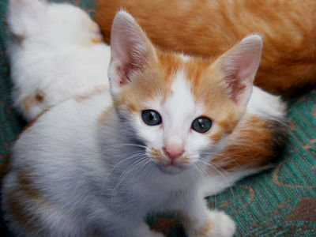
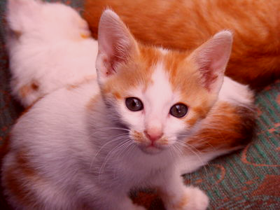

## From transforming colors to transforming images

You may have been asking why we have been focusing on transforming individual colors, other than that using the transformations helps us better understand the underlying representation. Here's one reason: Many image filters are written by applying a transformation to each color in the image.

So, how do we write image filters? That is, how do we generalize color transformations to image filters? The `csc151` library includes a helpful procedure, `(pixel-map colortrans image)`, that builds a new image by setting the color at each position in the new image to the result of applying the given color transformation to the color at the corresponding position in the original image.

Using `pixel-map` and the color transformations we learned in [the previous reading](../readings/transforming-rgb), we can now transform images in a few basic ways: we can lighten images, darken images, complement images (and perhaps even compliment the resulting images), and so on and so forth.

Let's consider a few examples. We'll start with this public domain image of a kitten, which we will refer to as `kitten`.


Here are two variants of the image.

```
> (pixel-map rgb-redder kitten)

> (pixel-map rgb-darker kitten)

```

## Composing transformations

But what if we want more interesting filters, ones that can't be described with just a single built-in transformation? One thing that we can do is to combine transformations. There are two ways to transform an image using more than one transformation: You can do each transformation in sequence, or you can use function composition, an old mathematical trick that you learned how to do in Scheme in the last reading.  Consider, for example, the problem of lightening an image and then increasing the red component. We can certainly write the following sequence of definitions.

```
> (define intermediate-picture (pixel-map rgb-redder picture))
> (define modified-picture (pixel-map rgb-darker intermediate-picture))
```

However, it is not necessary to name the intermediate image. We can instead choose to *nest* the calls to `pixel-map`, using something like this definition.

```
> (define modified-picture (pixel-map rgb-darker (pixel-map rgb-redder picture))
```

However, even this more concise instruction still creates the intermediate (redder but not lighter) version of the picture. Can we make each color in the image both redder and lighter?

In a recent reading, we learned that we can define a new transformation by combining other transformations with the composition function, `compose` (or its shorthand, `o`). Using that function, we can write the following instructions.

```
> (define rgb-fun (o rgb-lighter rgb-redder))
> (define modified-picture (pixel-map rgb-fun picture))
```

But even that is a bit verbose. Do we really want to name `rgb-fun` when we only use it once? No. Fortunately, Scheme lets us use the function created by `compose` without naming it, just as it lets us use most expressions without naming them.

```
> (define modified-picture (pixel-map (o rgb-darker rgb-redder) picture))
```

Let's try this on our kitten.

```
> (pixel-map (o rgb-darker rgb-redder) kitten)

```

What's the difference between this instruction and the nested calls to `pixel-map`? In effect, we've changed the way you sequence operations. That is, rather than having to write multiple instructions, in sequence, to get something done, we can instead insert information about the sequencing into a single instruction. By using composition, along with nesting, we can then express our algorithms more concisely and often more clearly. It is also likely to be a bit more efficient, since we make one new image, rather than two.

## Detour: Saving images

It's useful to be able to load images so that we can manipulate them.  It's even more useful to be able to save images that we've created.  The procedure `(image-save image filename)` saves an image to a specified file. You should provide the full path name to the file, surrounding it by double-quotation marks. For example, you might use something like `"/home/student/images/masterpiece.png"`. The suffix you give to the file name determines the type of file that is saved - jpg, gif, png, and so forth.

Here's a simple sequence of operations to make and save a strange version of our kitten.

```
> (define pic (image-load "/home/rebelsky/Desktop/kitten.jpg"))
> pic
> (define strange (pixel-map pic (compose rgb-complement rgb-rotate)))
> strange
> (image-save strange "/home/student/Desktop/strange-kitten.png")
```

Note that you can use `image-save` with any image we make, whether it's created with `image-load`, `pixel-map`, the varous drawing tools, or any of the other image-making and image-modifying commands we will learn.

## Mapping binary color procedures with `cut`

So far, so good. We know how to load images with `image-load`. We know how to make new versions of existing images using `pixel-map`. We know how to save the result using `image-save`. Are we missing anything?

It turns out that we're missing a few things. Right now, the only way we can make a variant of an image is using one of the *unary* (single-parameter) procedures, either the built-in procedures, such as `rgb-redder`, or ones we create with the composition operator, `compose`. But we know other procedures transforming colors, such as `rgb-subtract` or `rgb-average`, that are not unary. (In case you haven't encountered these procedures, you can find them at the end of the reading.) How do we use such procedures?

It doesn't make sense to write `(rgb-subtract pic (rgb 0 0 255))`, since `picture` is not an RGB color. Hopefully, we'll get an error message if we try.

```
> (define pic (image-load "/home/rebelsky/Desktop/kitten.jpg"))
> (rgb-subtract pic (rgb 0 0 255))
> (rgb-subtract pic (rgb 0 0 255))
. . rgb-subtract: expects rgb? for parameter 1 (c1), received #(struct:object:image% ... ...)
```

It also doesn't make sense to use `rgb-subtract` as the first parameter to `pixel-map`, as in `(pixel-map rgb-subtract pic)`, because we don't have a place to specify the color we are subtracting. Once again, the Scheme interpreter should issue an error message.

```
> (define pic (image-load "/home/rebelsky/Desktop/kitten.jpg"))
> (pixel-map rgb-subtract pic)
. . rgb-subtract: arity mismatch;
 the expected number of arguments does not match the given number
  expected: 2
  given: 1
```

Not the most helpful error message, but an error message nonetheless.

We might be tempted to write something like `(pixel-map pic (rgb-subtract (rgb 0 0 255))`. However, that will also cause problems, since it looks like we are calling `rgb-subtract` on a single value, and not the two values it is supposed to take.

```
> (pixel-map (rgb-subtract (rgb 0 0 255)) pic)
. . rgb-subtract: arity mismatch;
 the expected number of arguments does not match the given number
  expected: 2
  given: 1
```

It's probably good that we get an error message here, since it's not clear whether `(rgb 0 0 255)` is supposed to be the first or second parameter to `rgb-subtract`---are we subtracting `(rgb 0 0 255)` from each color, or are we subtracting each color from `(rgb 0 0 255)`?

To handle situations like this, the `csc151` library includes a special procedure, `cut`, that lets you fill in some parameters to a function. It takes the form `(cut (procedure param-info ...))`. When we want to fill in a particular parameter, we write the value we want.  When we want to leave a parameter blank, we write the special symbol `<>`. For example, here's a function that subtracts the blue component from every color.

```
> (define rgb-subtract-blue (cut (rgb-subtract <> (rgb 0 0 255))))
> (pixel-map rgb-subtract-blue pic))

```

If, instead, we want to subtract the current color from white (which is how we computed the pseudo-complement), we can swap the place that we put the special symbol.

```
> (define rgb-sub-from-white (section rgb-subtract (rgb 255 255 255) <>))
> (pixel-map rgb-sub-from-white pic)

```

As in the case of unary functions created with `compose`, we don't have to name the function we create. Here's an instruction that will make a somewhat bluer version of the kitten.

```
> (pixel-map (section rgb-average (rgb 0 0 255) <>) pic)

```

## Self checks

### Brief preparation 

a. If you have not already done so, update your `csc151` library.

b. Load the kitten image from the reading.

### Check 1: Fade to grey

a. Without using a `lambda`, write a procedure, `(average-with-grey c)`, that everages `c` with `(rgb 127 127 127)`.

b. What do you expect to happen if you transform the image with `average-with-grey`?

c. Check your answer experimentally.

d. What do you expect to happen if you twice transform the image with `average-with-grey`?

e. Check your answer experimentally.

## Binary RGB procedures

Here are the binary RGB procedures mentioned above in the discussion of cutting.

```
;;; (rgb-subtract c1 c2) -> rgb?
;;;   c1 : rgb?
;;;   c2 : rgb?
;;; Create a new RGB color by subtracting each component of `c2` from
;;; the corresponding component of `c1`.
(define rgb-subtract
  (lambda (c1 c2)
    (rgb (- (rgb-red c1) (rgb-red c2))
         (- (rgb-green c1) (rgb-green c2))
         (- (rgb-blue c1) (rgb-blue c2))
         (rgb-alpha c1))))

;;; (rgb-average c1 c2) -> rgb?
;;;   c1 : rgb?
;;;   c2 : rgb?
;;; Create a new RGB color by averaging the corresponding components of
;;; c1 and c2.
(define rgb-average
  (lambda (c1 c2)
    (rgb (* 1/2 (+ (rgb-red c1) (rgb-red c2)))
         (* 1/2 (+ (rgb-green c1) (rgb-green c2)))
         (* 1/2 (+ (rgb-blue c1) (rgb-blue c2)))
         (* 1/2 (+ (rgb-alpha c1) (rgb-alpha c2))))))
```

