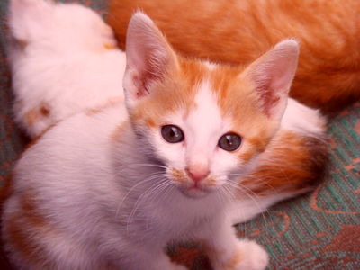
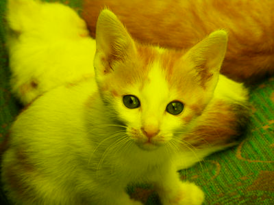

## From transforming colors to transforming images

You may have been asking why we have been focusing on transforming individual colors, other than that using the transformations helps us better understand the underlying representation. Here's one reason: Many image filters are written by applying a transformation to each color in the image.

So, how do we write image filters? That is, how do we generalize color transformations to image filters? The `csc151` library includes a helpful procedure, `(pixel-map colortrans image)`, that builds a new image by setting the color at each position in the new image to the result of applying the given color transformation to the color at the corresponding position in the original image.

Using `pixel-map` and the color transformations we learned in [the previous reading](../readings/transforming-rgb), we can now transform images in a few basic ways: we can lighten images, darken images, complement images (and perhaps even compliment the resulting images), and so on and so forth.

Let's consider a few examples. We'll start with this public domain image of a kitten, which we will refer to as `kitten`.

This image can be loaded via the `with-image-from-url` function.
`(with-image-from-url url fn)` takes two arguments:

+   The _uniform resource locator_, _i.e._, URL, of an image.
    URLs are used to specify the location of a file on the internet.
+   A callback function `fn` that takes the image Scamper loads from the URL as input.
    The output of `fn` is then rendered to the output pane.

The URL of the `kitten` image is:

+   <https://scamper.cs.grinnell.edu/images/kitten.jpg>

(_Note_: For security reasons related to running within a web browser, Scamper currently cannot load images not found on `scamper.cs.grinnell.edu`!)

For example, here are two uses of the function.
The first use simply outputs the image unmodified.
The second applies a transformation via `pixel-map`.

~~~
(with-image-from-url "https://scamper.cs.grinnell.edu/images/kitten.jpg"
  (lambda (img)
    img))
~~~


~~~
(with-image-from-url "https://scamper.cs.grinnell.edu/images/kitten.jpg"
  (lambda (img)
    (pixel-map rgb-redder img)))
~~~



## Composing transformations

But what if we want more interesting filters, ones that can't be described with just a single built-in transformation? One thing that we can do is to combine transformations. There are two ways to transform an image using more than one transformation: You can do each transformation in sequence, or you can use function composition, an old mathematical trick that you learned how to do in Scheme in the last reading.  Consider, for example, the problem of lightening an image and then increasing the red component. We can certainly write the following sequence of definitions.

```
> (define intermediate-picture (pixel-map rgb-redder picture))
> (define modified-picture (pixel-map rgb-darker intermediate-picture))
```

However, it is not necessary to name the intermediate image. We can instead choose to *nest* the calls to `pixel-map`, using something like this definition.

```
> (define modified-picture (pixel-map rgb-darker (pixel-map rgb-redder picture))
```

However, even this more concise instruction still creates the intermediate (redder but not lighter) version of the picture. Can we make each color in the image both redder and lighter?

In a recent reading, we learned that we can define a new transformation by combining other transformations with the composition function, `compose` (or its shorthand, `o`). Using that function, we can write the following instructions.

```
> (define rgb-fun (o rgb-lighter rgb-redder))
> (define modified-picture (pixel-map rgb-fun picture))
```

But even that is a bit verbose. Do we really want to name `rgb-fun` when we only use it once? No. Fortunately, Scheme lets us use the function created by `compose` without naming it, just as it lets us use most expressions without naming them.

```
> (define modified-picture (pixel-map (o rgb-darker rgb-redder) picture))
```

Let's try this on our kitten.

```
(with-image-from-url "https://scamper.cs.grinnell.edu/images/kitten.jpg"
  (lambda (img)
    (pixel-map (o rgb-darker rgb-redder) kitten)))
```


What's the difference between this instruction and the nested calls to `pixel-map`? In effect, we've changed the way you sequence operations. That is, rather than having to write multiple instructions, in sequence, to get something done, we can instead insert information about the sequencing into a single instruction. By using composition, along with nesting, we can then express our algorithms more concisely and often more clearly. It is also likely to be a bit more efficient, since we make one new image, rather than two.

## Detour: Saving images


It's useful to be able to load images so that we can manipulate them.  It's even more useful to be able to save images that we've created. Luckily, since Scamper operates in the browser, the images we see in the output are genuine images that we simply download!
To download an image that you create, right-click on the image and select "Save image as..." (or the equivalent in your browser).

## Mapping binary color procedures with `section`

So far, so good. We know how to load images with `image-load`. We know how to make new versions of existing images using `pixel-map`. We know how to save the result using `image-save`. Are we missing anything?

It turns out that we're missing a few things. Right now, the only way we can make a variant of an image is using one of the *unary* (single-parameter) procedures, either the built-in procedures, such as `rgb-redder`, or ones we create with the composition operator, `compose`. But we know other procedures transforming colors, such as `rgb-subtract` or `rgb-average`, that are not unary. (In case you haven't encountered these procedures, you can find them at the end of the reading.) How do we use such procedures?

It doesn't make sense to write `(rgb-subtract pic (rgb 0 0 255))`, since `picture` is not an RGB color. Hopefully, we'll get an error message if we try.

```
> (with-image-from-url "https://scamper.cs.grinnell.edu/images/kitten.jpg"
  (lambda (img)
    (rgb-subtract img (rgb 0 0 255))))
Runtime error [10:5-10:36]: (rgb-subtract) expected an RGB value, received object
```

It also doesn't make sense to use `rgb-subtract` as the first parameter to `pixel-map`, as in `(pixel-map rgb-subtract pic)`, because we don't have a place to specify the color we are subtracting. Once again, Scamper should issue an error message.

```
> (with-image-from-url "https://scamper.cs.grinnell.edu/images/kitten.jpg"
  (lambda (img)
    (pixel-map rgb-subtract img))
Runtime error [8:5-8:32]: (pixel-map) wrong number of arguments to rgb-subtract provided. Expected 2, received 1.
```

Not the most helpful error message, but an error message nonetheless.

We might be tempted to write something like `(pixel-map pic (rgb-subtract (rgb 0 0 255))`. However, that will also cause problems, since it looks like we are calling `rgb-subtract` on a single value, and not the two values it is supposed to take.

```
> (with-image-from-url "https://scamper.cs.grinnell.edu/images/kitten.jpg"
  (lambda (img)
    (pixel-map (rgb-subtract (rgb 0 0 255)) img)))
Runtime error [8:16-8:43]: (rgb-subtract) wrong number of arguments to rgb-subtract provided. Expected 2, received 1.
```

It's probably good that we get an error message here, since it's not clear whether `(rgb 0 0 255)` is supposed to be the first or second parameter to `rgb-subtract`---are we subtracting `(rgb 0 0 255)` from each color, or are we subtracting each color from `(rgb 0 0 255)`?

To handle situations like this, scamper includes a special form, `section`, that lets you fill in some parameters to a function. It takes the form `(section procedure arg1 arg2 ...))`. In other words the syntax is like a function call `(procedure arg1 arg2 ...)` except with `section` at the front!

When we want to fill in a particular parameter, we write the value we want.  When we want to leave a parameter blank, we write the special symbol `_`. For example, here's a function that subtracts the blue component from every color.

```
(define rgb-subtract-blue (section rgb-subtract _ (rgb 0 0 255)))

(with-image-from-url "https://scamper.cs.grinnell.edu/images/kitten.jpg"
  (lambda (img)
    (pixel-map rgb-subtract-blue img)))
```


If, instead, we want to subtract the current color from white (which is how we computed the pseudo-complement), we can swap the place that we put the special symbol.

```
(define rgb-subtract-from-white (section rgb-subtract (rgb 255 255 255) _))

(with-image-from-url "https://scamper.cs.grinnell.edu/images/kitten.jpg"
  (lambda (img)
    (pixel-map rgb-subtract-from-white img)))
```


As in the case of unary functions created with `compose`, we don't have to name the function we create. Here's an instruction that will make a somewhat bluer version of the kitten.

```
(with-image-from-url "https://scamper.cs.grinnell.edu/images/kitten.jpg"
  (lambda (img)
    (pixel-map (section rgb-average (rgb 0 0 255) _)
               img)))
```


## Self checks

### Check 1: Fade to grey

a. Without using a `lambda`, write a procedure, `(average-with-grey c)`, that everages `c` with `(rgb 127 127 127)`.

b. What do you expect to happen if you transform the image with `average-with-grey`?

c. Check your answer experimentally.

d. What do you expect to happen if you twice transform the image with `average-with-grey`?

e. Check your answer experimentally.

## Binary RGB procedures

Here are the binary RGB procedures mentioned above in the discussion of cutting.

```
;;; (rgb-subtract c1 c2) -> rgb?
;;;   c1 : rgb?
;;;   c2 : rgb?
;;; Create a new RGB color by subtracting each component of `c2` from
;;; the corresponding component of `c1`.
(define rgb-subtract
  (lambda (c1 c2)
    (rgb (- (rgb-red c1) (rgb-red c2))
         (- (rgb-green c1) (rgb-green c2))
         (- (rgb-blue c1) (rgb-blue c2))
         (rgb-alpha c1))))

;;; (rgb-average c1 c2) -> rgb?
;;;   c1 : rgb?
;;;   c2 : rgb?
;;; Create a new RGB color by averaging the corresponding components of
;;; c1 and c2.
(define rgb-average
  (lambda (c1 c2)
    (rgb (* 1/2 (+ (rgb-red c1) (rgb-red c2)))
         (* 1/2 (+ (rgb-green c1) (rgb-green c2)))
         (* 1/2 (+ (rgb-blue c1) (rgb-blue c2)))
         (* 1/2 (+ (rgb-alpha c1) (rgb-alpha c2))))))
```

