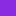
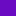
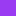
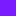
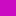
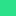
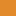
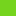
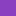

## Introduction

We have just started to learn about RGB colors, and so the operations we might do on images and colors are somewhat basic.  How will we expand what we can do, and what we can write?  In part, we will learn new Scheme techniques, applicable not just to image computation, but to any computation.  In part, we will learn new functions in Scamper that support more complex image computations.  In part, we will write our own more complex functions.

For now, we will focus on transforming color images.  One common algorithmic approach to images is the construction of <emphasis>filters</emphasis>, algorithms that systematically convert one image to another image.  Complex filters can do a wide variety of things to an image, from making it look like the work of an impressionist painter to making it look like the image has been painted onto a sphere.  However, it is possible to write simple filters with not much more Scheme than you know already.

In readings and labs, we will consider filters that are constructed by transforming each color in an image using an algorithm that converts one RGB color to another.  In this reading, as well as some followups, we will consider some basic approaches for transforming images, including some basic operations for transforming colors and ways to combine them into more complex transformations.

## Some basic transformations

Rather than writing every transformation from scratch, we will start with a few basic transformations in the `image` library.

### Making colors lighter and darker

The simplest transformations are `rgb-darker` and `rgb-lighter`. These operations make a color a little bit darker and a little bit lighter. If you apply them repeatedly, you can darker and darker (or lighter and lighter) colors, eventually reaching black (or white).

~~~
> (color-name->rgb "blueviolet")
~~~

~~~
> (rgb->string (color-name->rgb "blueviolet"))
"138/43/226"
~~~

~~~
> (rgb-darker (color-name->rgb "blueviolet"))
~~~

~~~
> (rgb->string (rgb-darker (color-name->rgb "blueviolet")))
"122/27/210"
~~~

~~~
> (rgb-darker (rgb-darker (color-name->rgb "blueviolet")))
~~~

~~~
> (rgb->string (rgb-darker (rgb-darker (color-name->rgb "blueviolet"))))
"106/11/194"
~~~

~~~
> (rgb-lighter (color-name->rgb "blueviolet"))
~~~

~~~
> (rgb->string (rgb-lighter (color-name->rgb "blueviolet")))
"154/59/242"
~~~

Note that these are *pure* procedures. When you compute a darker or lighter version of a color, the purpose is to create a new color. Hence, the original color is unchanged.

### Transforming components

In addition to making the color uniformly darker or lighter, we can also
increase individual components using `rgb-redder`, `rgb-greener`, and
`rgb-bluer`.

~~~
> (color-name->rgb "blueviolet")
~~~

~~~
> (rgb->string (color-name->rgb "blueviolet"))
"138/43/226"
~~~

~~~
> (rgb-redder (color-name->rgb "blueviolet"))
~~~

~~~
> (rgb-greener (color-name->rgb "blueviolet"))
~~~

~~~
> (rgb-bluer (color-name->rgb "blueviolet"))
~~~

~~~
> (rgb->string (rgb-redder (color-name->rgb "blueviolet")))
"170/27/210"
> (rgb->string (rgb-greener (color-name->rgb "blueviolet")))
"122/75/210"
> (rgb->string (rgb-bluer (color-name->rgb "blueviolet")))
"122/27/255"
~~~

As the examples suggest, for some people, making a color slightly redder, greener, or bluer is hard to detect. Sometimes it's easier to see the changes if we make the transformations a few times. (Since the first call to `rgb-bluer` increases the blue component to its largest value, we may not see further increases.)

~~~
> (rgb-redder (rgb-redder (color-name->rgb "blueviolet")))
~~~

~~~
> (rgb-greener (rgb-greener (color-name->rgb "blueviolet")))
~~~

~~~
> (rgb-bluer (rgb-bluer (color-name->rgb "blueviolet")))
~~~

~~~
> (rgb->string (rgb-redder (rgb-redder (color-name->rgb "blueviolet"))))
"202/11/194"
> (rgb->string (rgb-greener (rgb-greener (color-name->rgb "blueviolet"))))
"106/107/194"
> (rgb->string (rgb-bluer (rgb-bluer (color-name->rgb "blueviolet"))))
"106/11/255"
~~~

### Other simple transformations 

The `rgb-rotate` procedure rotates the red, green, and blue components of a color, setting red to green, green to blue, and blue to red. It is intended mostly for fun, but it can also help us think about the use of these components.

~~~
> (color-name->rgb "blueviolet")
~~~

~~~
> (rgb->string (color-name->rgb "blueviolet"))
"138/43/226"
~~~

~~~
> (rgb-rotate-components (color-name->rgb "blueviolet"))
~~~

~~~
> (rgb->string (rgb-rotate-components (color-name->rgb "blueviolet")))
"43/226/138"
~~~

~~~
> (rgb-rotate-components (rgb-rotate-components (color-name->rgb "blueviolet")))
~~~

~~~
> (rgb->string (rgb-rotate-components (rgb-rotate-components (color-name->rgb "blueviolet"))))
"226/138/43"
~~~

The `rgb-phaseshift` procedure is another procedure with less clear uses. It adds 128 to each component with a value less than 128 and subtracts 128 from each component with a value of 128 or more. While this is somewhat like the computation of a pseudo-complement, it also differs in some ways. Hence, the `image` library also provides a `rgb-pseudo-complement` procedure that computes the pseudo-complement of an RGB color.

~~~
> (color-name->rgb "blueviolet")
~~~

~~~
> (rgb->string (color-name->rgb "blueviolet"))
"138/43/226"
~~~

~~~
> (rgb-phaseshift (color-name->rgb "blueviolet"))
~~~

~~~
> (rgb->string (rgb-phaseshift (color-name->rgb "blueviolet")))
"10/171/98"
~~~

~~~
> (rgb-pseudo-complement (color-name->rgb "blueviolet"))
~~~

~~~
> (rgb->string (rgb-pseudo-complement (color-name->rgb "blueviolet")))
"117/212/29"
~~~

## Writing your own color transformations

At the beginning of this reading, you learned a few basic procedures for transforming colors. Are these the only ways that you can transform colors? *Certainly not!* You are free to write your own color transformations. For example, you might decide that `rgb-greener` should use a more complicated formula for making colors greener, scaling multiplicatively rather than additively.

~~~
(define greener
  (lambda (c)
    (rgb (* 9/10 (rgb-red c))
         (+ 8 (* 11/10 (rgb-green c)))
         (* 9/10 (rgb-blue c))
         (rgb-alpha c))))
~~~

Let's see how well that works.

~~~
> (color-name->rgb "blueviolet")
~~~

~~~
> (greener (color-name->rgb "blueviolet"))
~~~

~~~
> (greener (greener (color-name->rgb "blueviolet")))
~~~

~~~
> (greener (greener (greener (color-name->rgb "blueviolet"))))
~~~

~~~
> (greener (greener (greener (greener (color-name->rgb "blueviolet")))))
~~~

~~~
> (greener (greener (greener (greener (greener (color-name->rgb "blueviolet"))))))
~~~

~~~
> (rgb->string (color-name->rgb "blueviolet"))
"138/43/226"
> (rgb->string (greener (color-name->rgb "blueviolet")))
"124/55/203"
> (rgb->string (greener (greener (color-name->rgb "blueviolet"))))
"112/68/183"
> (rgb->string (greener (greener (greener (color-name->rgb "blueviolet")))))
"101/83/165"
> (rgb->string (greener (greener (greener (greener (color-name->rgb "blueviolet"))))))
"91/99/148"
~~~

Of course, this is not the only way to define a procedure like `greener`. We could also define it in terms of the existing procedures.  For example, since `rgb-greener` seems to increment the green component by 32 and `rgb-darker` seems to decrement all three components by 16, we could try something like

~~~
(define greener2
  (lambda (c)
    (rgb-greener (rgb-greener (rgb-darker (rgb-darker c))))))
~~~

~~~
> (color-name->rgb "blueviolet")

~~~

~~~
> (rgb->string (color-name->rgb "blueviolet"))
"138/43/226"
~~~

~~~
> (greener2 (color-name->rgb "blueviolet"))
~~~

~~~
> (rgb->string (greener2 (color-name->rgb "blueviolet")))
"74/75/162"
~~~

There are also color transformations you cannot build (at least not easily) from the basic transformation. For example, suppose you want to eliminate extreme colors. You might choose to bound each component so that it is at least 64 and no more than 192. 

~~~
;;; (bound val lower upper) -> number?
;;;   val : number?
;;;   lower : number?
;;;   upper : number?
;;; "Bounds" `val`, ensuring that the result is `lower` if `val` is
;;; less than `lower` and `upper` if `val` is greater than `upper`.
(define bound
  (lambda (val lower upper)
    (max lower (min upper val))))

;;; (bound-component component) -> integer?
;;;   component : integer?
;;; Bounds a component to a value between 64 and 192.
(define bound-component
  (lambda (component)
    (bound component 64 192)))

;;; (rgb-bound c) -> rgb?
;;;   c : rgb?
;;; Bound all of the components of `c`.
(define rgb-bound
  (lambda (c)
    (rgb (bound-component (rgb-red c))
         (bound-component (rgb-green c))
         (bound-component (rgb-blue c))
         (rgb-alpha c))))
~~~

Let's try it out.

~~~
> (color-name->rgb "blueviolet")
~~~

~~~
> (rgb->string (color-name->rgb "blueviolet"))
"138/43/226"
~~~

~~~
> (rgb-bound (color-name->rgb "blueviolet"))
~~~

~~~
> (rgb->string (rgb-bound (color-name->rgb "blueviolet")))
"138/64/192"
~~~

~~~
> (color-name->rgb "black")
~~~

~~~
> (rgb->string (color-name->rgb "black"))
"0/0/0"
~~~

~~~
> (rgb-bound (color-name->rgb "black"))
~~~

~~~
> (rgb->string (rgb-bound (color-name->rgb "black")))
"64/64/64"
~~~

~~~
> (color-name->rgb "whitesmoke")
~~~

~~~
> (rgb->string (color-name->rgb "whitesmoke"))
"245/245/245"
~~~

~~~
> (rgb-bound (color-name->rgb "whitesmoke"))
~~~

~~~
> (rgb->string (rgb-bound (color-name->rgb "whitesmoke")))
"192/192/192"
~~~

## Self checks

### Check 1: Repeated transformations

We've seen that applying `rgb-darker` multiple times makes a color much darker.  What do you expect to happen if we apply each of the following two times?

+ `rgb-bound`
+ `rgb-pseudo-complement`
+ `rgb-phaseshift`

### Check 2: Inverse transformations (‡)

`rgb-lighter` and `rgb-darker` seem to be inverses of each other. That is, if we make a color darker and then lighter, we seem to end up with the same color.

~~~
> (rgb-darker (rgb-lighter (rgb 100 100 100)))
~~~

~~~
> (rgb->string (rgb-darker (rgb-lighter (rgb 100 100 100))))
"100/100/100"
~~~

Are there any colors for which `(rgb-darker (rgb-lighter c))` gives a different color?

### Check 3: Writing new transformations

Write a procedure, `(rgb-grey c)`, that takes an RGB color as input and produces a greyscale color, one in which the red, green, and blue components are the same (and equal to the average of the components in `c`).